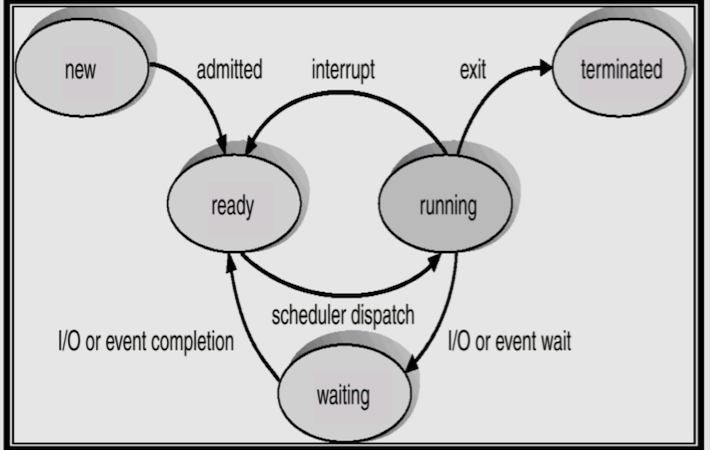
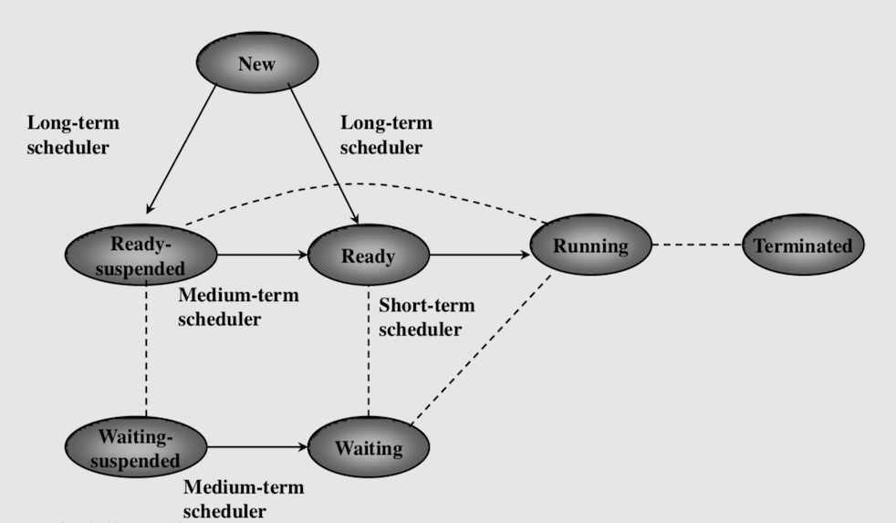

[gimmick: math]()

# COMP 346 Midterm Preparation

## OS - System Stack

|Abstract view of computer system|Elements|
|--------------------------------|--------|
|Application Software|User facing applications|
|System Software|<ul class="innerlist"><li>Compiler</li><li>Assembler</li><li>Linker</li><li>etc...</li></ul>|
|Operating System|<ul class="innerlist"><li>Manages and allocates resources</li><li>Controls program execution</li></ul>|
|Hardware|<ul class="innerlist"><li>Bus</li><li>Control Unit</li><li>ALU</li><li>FPU+SIMD</li><li>Registers</li><li>Memory,Cache,TLB</li><li>Mode bit</li><li>MMU</li><li>IO/Networking</li><li>Timer</li><li>Clock</li><li>Interrupt Controller</li></ul>|

<dl><dt>Mode bit</dt><dd>OS code executes in privileged mode, user code in unprivileged mode.</dd><dt>IO protection</dt><dd>All IO instructions are privileged and managed through syscalls.</dd><dt>Memory Protection</dt><dd>The MMU limits range of valid memory addresses to disallow illegal accesses</dd><dt>CPU Protection</dt><dd>Uses a timer to interrupt programs after fixed time slice.</dd></dl>

- - - -

## OS - Categories

|OS Type|Implementation Elements|Characteristics|
|-------|---------------|-----------------------|
|Multiprogrammed Batch|<dl><dt>Resident Monitor</dt><dd>Controls scheduling, interpretation, IO, memory from kernel space.</dd><dt>Non-resident Monitor</dt><dd>Runs in user space and loads routines on request.</dd></dl>|<ul class="innerlist"><li>Multiple jobs loaded in memory</li><li>Jobs interrupted due to error or IO operation</li></ul>|
|Time Sharing|<dl><dt>Dumb terminals</dt><dd>Used to communicate with a central computer</dd></dl>|<ul class="innerlist"><li>Each user is given a fixed time slice</li><li>Interrupted users wait in a queue</li></ul>|
|Client-Server|<ul class="innerlist"><li>Uses full computers instead of terminals</li><li>Uses networking rather than serial I/O</li></ul>|Allows information to be shared between client(s) and server|
|Multiprocessing|<dl><dt>Symmetrical Multiprocessing</dt><dd>Each processor executes a copy of the kernel</dd><dt>Asymmetrical Multiprocessing</dt><dd>The OS executes on a single processor, which manages the tasks executed by the others</dd></dl>|Not the same as multitasking.|
|Distributed|<dl><dt>Load balancing</dt><dd>Execution is transparently balanced between multiple similar systems</dd></dl>|Systems are independent and not client-server|
|Personal| &nbsp; | <ul class="innerlist"><li>Usually single-user</li><li>Includes some functionality of larger systems</li></ul>|
|Real-Time|<dl><dt>Hard real-time</dt><dd>If time deadline is not met: **failure**</dd><dt>Soft real-time</dt><dd>Application proceeds even if deadline has expired</dd></dl>|<ul class="innerlist"><li>Deterministic and predictable</li><li>Often managed only a single application</li><li>Often used to interface with real-world equipment</li></ul>|
|Mobile| &nbsp; | <ul class="innerlist"><li>Tablets,smartphones</li><li>Favors wireless communication</li></ul>|
|Pedagogic|<dl><dt>MINIX</dt><dd>Early versions based on UNIXv7, developed by Andrew Tanenbaum, who wrote a much better OS design book than the one we use.</dd><dt>NACHOS</dt><dd>Developed at UCB, simulates a MIPS processor</dd><dt>OSP</dt><dd>Written at SUNY Stony Brook</dd></dl> |<ul class="innerlist"><li>Intended for demonstrative purposes to teach OS design</li></ul>|
|Virtualization|<dl><dt>Hypervisor</dt><dd>Virtual machine manager, runs guest OSes.</dd><dt>Virtualization</dt><dd>Allows OSes to run as applications instead of on bare metal</dd><dt>Emulation</dt><dd>Allows an application for a different architecture/CPU type to be run</dd></dl>| &nbsp; |
|Cloud computing|<dl><dt>SaaS</dt><dd>Software as a service (e.g. Google Docs)</dd><dt>PaaS</dt><dd>Platform as a service (e.g. a LAMP stack)</dd><dt>IaaS</dt><dd>Infrastructure as a Service (e.g. Amazon Glacier)</dd></dl> |<ul class="innerlist"><li>Virtualizes many instances to provide services across WAN/Internet.</li></ul>|

- - - -

## OS - Component Definitions

<dl><dt>Process</dt><dd>An abstract environment created by the OS to control execution of programs.</dd><dt>Resources</dt><dd>Any entity that a process may need to execute successfully</dd></dl>

<table><tr><th>Protection</th><th>Security</th></tr><tr><td><ul class="innerlist"><li>Control access by processes and users to shared resources</li><li>Ensures <b>reliability</b> of system</li></ul></td><td><ul class="innerlist"><li>Ensures resources are accessed by authorized entities</li><li>Ensures <b>coherency and integrity</b> of system</li></ul></td></tr><tr><td colspan=2 style="text-align:center"><ul class="innerlist"><li>Detect illegal/malicious access</li><li>Enforce mechanisms to keep system running</li><li>Apply appropriate limits to different resource types</li></ul></td></tr></table>

- - - -

## OS - Structures

|Structure|Implementation Elements|Characteristics|
|---------|-----------------------|---------------|
|Layered|<ul class="innerlist"><li>Separated into well-defined layers</li></ul>|<ul class="innerlist"><li>Each layer requests services only from lower-level layers</li></ul>|
|Monolithic| &nbsp; | <ul class="innerlist"><li>OS procedures in a single executable module</li><li>No protection and data encapsulation</li></ul>|
|Microkernel| <dl><dt>Inter Process Communication</dt><dd>Individual user-mode 'servers' talk to each other via the kernel and IPC</dd></dl> | <ul class="innerlist"><li>Splits off as much as possible from the core kernel into user space 'servers'</li><li>Can be more stable. If a component crashes, the whole kernel doesn't</li><li>Can be more secure</li><li>According to prof, performs faster. This is a lie.</li></ul>|
|Hybrid|<dl><dt>Android</dt><dd>Runs on Linux kernel with a Java runtime environment and minimal C stdlib. Not a hybrid kernel (lol)</dd><dt>iOS</dt><dd>Actually a hybrid kernel. Fuses BSD + Mach microkernel.</dd></dl>| Mash some shit together and see what works.|

- - - -

## Processes - Management

- A **program** is a passive entity.
- A **process** is an active entity (i.e. executing)
- A process includes
    - code
    - data
    - stack
    - descriptors

|State|Characteristics|Causes|
|-----|---------------|------|
|New|Every process is created by another, except for the first OS process|<ul class="innerlist"><li>System call, e.g. `fork`</li><li>Submission of batch jobs</li><li>User login</li><li>Execution of OS service</li><li>Application paralleism</li></ul>|
|Terminated|Resources used by process are deallocated|<ul class="innerlist"><li>`exit` system call</li><li>User action</li><li>Signal received, e.g. `SIGABRT`,`SIGKILL`</li><li>OOM error</li><li>Protection fault</li><li>Exception, timeout</li></ul>|
|Ready|In ready queue|Process has allocated all resources and is waiting for CPU.|
|Running| Follows context switch| <ul class="innerlist"><li>CPU allocates time to process</li><li>Selected in the ready queue by the scheduler</li></ul>|
|Waiting|In waiting queue|<ul class="innerlist"><li>Waiting for IO operation to complete</li><li>Waiting for a signal from kernel/another process</li><li>Request of an unavilable service</li></ul>|

- - - -

## Processes - Description

<dl><dt>PID</dt><dt>Owner</dt><dt>Process State</dt><dt>PPD</dt><dd>Parent process descriptor. Pointer to parent.</dd><dt>List of child PDs</dt><dt>List of reusable/consumable resources</dt><dd>A pointer to alist of allocated resourced, and the quantity of units allocated</dd><dt>List of FDs</dt><dd>Pointer to list of file descriptors opened by the process</dd><dt>Message Queue</dt><dt>Protection Domain</dt><dd>Description of access rights held by process</dd><dt>CPU Registers content</dt><dd>Content of program counter, status, base, limit, and relocation registers for process</dd><dt>General Register content</dt><dt>Accounting Information</dt><dd>Statistical information about the process</dd><dt>Scheduling Information</dt><dd>Information needed for scheduling the process, like priority/niceness</dd><dt>Stack pointer</dt></dl>

- - - -

## Processes - Resources

<dl><dt>Resource hiding and generalization</dt><dd>Hides complexity from users and programmers. Offers a common interface for resources.</dd><dt>Space multiplexed resource sharing</dt><dd>A resource is divisible among concurrent processes, and can be divided to serve them.</dd><dt>Time multiplexed resource sharing</dt><dd>Not divisible; has to be entirely allocated to the process for a short time</dd></dl>

- - - -

## Processes - Resource relationships

|Relationship|Characteristics|
|------------|---------------|
|Hierarchical|<ul class="innerlist"><li>Linked in parent-child relationship</li><li>Parents control execution of children</li><li>Children may share some parent resources (e.g address space)</li><li>May communicate between each other</li></ul>|
|Independence|<ul class="innerlist"><li>May not be affected by each other</li><li>Cannot share resources</li><li>Cannot communicate with each other</li></ul>|
|Cooperation|<ul class="innerlist"><li>Execute a common task</li><li>Share resources</li><li>Communicate with each other</li></ul>|

- - - -

## Processes - Threads

<dl><dt>Thread</dt><dd>Process that executes in a light environment. Depends on a controlling process.</dd><dt>Thread environment</dt><dd>Shares code, data &amp; with controlling process</dd><dd>Does <b>not</b> share stack, data, &amp; and descriptor.</dd></dl>

- Advantages:
    - Responsiveness (less impact for context switching)
    - Resource sharing
    - Economy of time/space
    - Parallelism

|Thread type|Pros|Cons|
|-----------|----|----|
|User|<ul class="innerlist"><li>Fast context switching</li><li>Portability</li></ul>|<ul class="innerlist"><li>No real parallelism, because not perceived by kernel</li><li>Blocking of a thread blocks whole program</li></ul>|
|Kernel|<ul class="innerlist"><li>Real parallelism</li><li>Blocking threads do not block whole application</li><li>Concurrent execution with other threads</li></ul>|<ul class="innerlist"><li>Slow context switching</li></ul>|

|Combined thread model|Characteristics|
|---------------------|---------------|
|Many-to-one|<ul class="innerlist"><li>**Many** user threads -> **one** kernel thread</li><li class="list_con">Thread management in **userspace**</li><li class="list_con">Thread blocking blocks **entire process**</li><li class="list_con">No real parallelism</li></ul>|
|One-to-one|<ul class="innerlist"><li>**One** user thread -> **one** kernel thread</li><li class="list_pro">Blocking of thread **does not** block entire process. </li><li class="list_pro">Possibility of real parallelism</li></ul>|
|Many-to-Many|<ul class="innerlist"><li>Many user threads muxed together to a <= number of kernel threads.</li><li>A kernel thread can run any of the user threads.</li></ul>|

- - - -

## Processes - Models

|Model|States|Creation|Termination|Attributes|
|-----|------|--------|-----------|------------|
|Unix |<ul class="innerlist"><li>New</li><li>Ready</li><li>Running</li><li>Blocked</li><li>Terminated</li><li>Zombie</li></ul>|<ol class="innerlist"><li>`fork`</li><li>Process table entry created</li><li> Unique PID assigned</li><li>Parent address space copied</li><li>Reference counts of parent++</li><li>PID returned to the parent </li></ol>|<ol class="innerlist"><li>`exit`,`abort`</li><li>Child exit status returned to parent</li><li>Child resources deallocated</li><li>Child becomes **zombie**</li><li>Parent receives child exit status, zombie -> **terminated**</li><li>Child ptable entry removed</li></ol>|<ul class="innerlist"><li>**User**: data,stack,shared memory</li><li>**System**: process table entry, page table, kstack</li><li>**Registers**: CPU registers </li><li>**Process Structure**:<ul class="innerlist"><li>State</li><li>Size, Memory state</li><li>UID/EUID,GID/EGID,PID,PPID</li><li>Priority</li><li>Pending signals &amp; timers</li><li>Pointers to next entry in ready queue</li></ul></li><li>**User Area**:<ul class="innerlist"><li>User/kernel times</li><li>Signal handlers</li><li>FD table</li><li>Limit field for processes/sizes</li><li>Permission modes for new files</li></ul></li></ul><ul class="innerlist"><li>**Hierarchical Relationship**:<ul class="innerlist"><li>Receives duplicates of parent resources</li><li>Shares open files</li><li>Sync/async execution</li></ul></li><li>Independence Relationship</li><li>**Cooperation Relationship**:<ul class="innerlist"><li>Files</li><li>Pipes</li><li>FIFOs</li><li>Shared memory</li><li>Message queues</li><li>Sockets</li></ul></li></ul>|
|WinXP|<ul class="innerlist"><li>**Runnable**:<ul class="innerlist"><li>Ready</li><li>Standby</li><li>Running</li></ul></li><li>**Not Runnable**:<ul class="innerlist"><li>Transition</li><li>Waiting</li><li>Terminated</li></ul></li></ul>|<ol class="innerlist"><li>Subsystem requests new process from Executive.</li><li>Executive creates, returns new process</li><li>New process,thread info returned to client.</li><li>Access rights checked only during `open`.</li></ol>| &nbsp; | **Process**:<ul class="innerlist"><li>PID</li><li>Security descriptor</li><li>Priority &amp; processor affinity</li><li>Quota limits</li><li>Execution time</li><li>I/O,VM counters</li><li>Exception/debugging ports</li><li>Exit status. </li></ul>**Thread**<ul class="innerlist"><li>Thread ID, context</li><li>Priority &amp; affinity</li><li>Thread execution time</li><li>Alert status</li><li>Suspension count</li><li>Impersonation token</li><li>Termination port</li><li>Thread exit status</li></ul>|
|Java|<ul class="innerlist"><li>Runnable</li><li>Waiting</li><li>Sleeping</li><li>Blocked (IO,Sync)</li><li>Running</li><li>Dead</li></ul>|<ol class="innerlist"><li>Derive from `Thread` class</li><li>Implement `Runnable` Interface</li><li>Override `run()`,`start()` methods</li></ol>| &nbsp; | &nbsp; |

- - - -

## Scheduling - Basics

<dl><dt>Preemptive scheduling</dt> <dd>The scheduler can interrupt a running process</dd><dt>Nonpreemptive scheduling</dt> <dd>The process voluntarily releases the CPU</dd></dl>

|Type|Responsibility|
|----|--------------|
|Short-term|<ul class="innerlist"><li>Select process from ready queue. </li><li>Allocate CPU to selected process. </li><li>Context switch</li><li>Mode change</li><li>Program start</li></ul>|
|Medium-term|Select processes to be swapped in/out from main memory.|
|Long-term|Select processes to be admitted in the system and insert to ready queue|

- - - -

## Scheduling - Non-preemptive

|Type|Implementation|Performance|
|----|--------------|-----------|
|**First come, First served**|<ul class="innerlist"><li>Uses a FIFO queue </li><li>Uses a timestamp for arrival time </li></ul>|<ul class="innerlist"><li class="list_pro">Simple to implement </li><li class="list_con">Long average waiting time</li><li class="list_con">CPU bound processes favored over IO bound ones</li></ul>|
|**Shortest Job First**|<ul class="innerlist"><li>CPU allocated to process with lowest service time</li><li>Equal service times are FIFO</li></ul>|<ul class="innerlist"><li class="list_pro">Minimal average wait time</li></ul>|
|**External Priority**|<ul class="innerlist"><li>Priority level assigned based on UID,process type/size</li><li>Allocate CPU to highest priority process</li></ul>|<ul class="innerlist"><li class="list_con">Lower priority processes can block indefinitely </li><li>Aging solves indefinite blocking</li></ul>|
|**Deadline**|<ul class="innerlist"><li>Process removed from queue when deadline expires</li><li>Useful for hard RT systems.</li></ul>| <ul class="innerlist"><li class="list_pro">Guaranteed maximal waiting time before service</li></ul>|

- - - -

## Scheduling - Preemptive

|Type|Implementation|Performance|
|----|--------------|-----------|
|**Round-robin**|<ul class="innerlist"><li>Timeslice assigned to each running process using timer</li><li>Process interrupted at end of slice</li><li>Interrupted process returns to ready queue</li><li>Circular ready queue with FIFO order</li></ul>|<ul class="innerlist"><li>**Infinite quantum**: -> becomes FCFS</li><li>**Long quantum**:-> Bad for short processes. Wait++, TAT--</li><li>**Short quantum**: Good response time. TAT++, Wait--</li></ul>|
|**Shortest remaining time first**|<ul class="innerlist"><li>Processes with lowest remaining times preempt ones with higher time</li><li>Equal svc times are FCFS</li><li>Estimatino based on avg previous CPU bursts</li></ul>|<ul class="innerlist"><li class="list_pro">Avg wait time is minimal.</li></ul>|
|**Internal Priority**|<ul class="innerlist"><li>Process assigned an initial priority level</li><li>Priority of all the processes is recalculated via priority field in PD</li><li>Processes with higher priority levels execute first</li><li>Higher priorities preempt lower ones</li></ul>|<ul class="innerlist"><li class="list_pro">Processes with lower priority levels do not block indefinitely</li></ul>| 
|**Multilevel Queues**|<ul class="innerlist"><li>Ready queue partitioned into multiple separate queues</li><li>Processes on each scheduled independently</li><li>Queues synchronized by scheduling algorithm</li><li>**PQ**: Each queue assigned a priority, higher priority scheduled first</li><li>**Time**: Each queue assigned a timeslice, higher priority queues have longer time. Round-robin scheduling algorithm between queues.</li><li>**Multilevel feedback**: Processes migrate on the queues according to priority, CPU burst, I/O burst, wait time.</li></ul>| &nbsp; |

- - - -

## Scheduling - Formulae

### Shortest Job First,Shortest Remaining Time First:

$$ \tau\_{n+1} = \alpha t\_n + (1-\alpha)\tau\_{n} $$

- \\(\tau_{n+1}\\): Next svc time
- \\(\alpha\\): Weight of last CPU burst
- \\(t_n\\): Time of last CPU burst
- \\(\tau_n\\): Avg svc time

- - - -

### Quantum Measurement:

$$ q = \frac{(T-nC)}{n} $$

- \\(q\\): Quantum
- \\(T\\): Time interval
- \\(n\\): Number of ready processes
- \\(C\\): Context switch time

- - - -

## Scheduling - Implementations

|Operating System|Scheduling Algorithm|Priority Classes|Scheduler|
|----------------|--------------------|----------------|---------|
|4.3 BSD|<ul class="innerlist"><li>32 multilevel feedback queues</li><li>Preemptive priority scheduling among queues</li><li>Round-robin scheduling within queue</li></ul>|<ul class="innerlist"><li>User processes</li><li>character, block I/O control</li><li>file manipulation</li><li>swapper</li></ul>|<ul class="innerlist"><li>Time quantum of 100 ms</li><li>Priorities recalculated every 1s</li><li>Priority level is inversely proportional to the priority value</li></ul>|
|SVR4|<ul class="innerlist"><li>160 multilevel priority queues</li><li>Preemptive priority scheduling among queues</li><li>Round-robin scheduling within queue</li></ul>|<ul class="innerlist"><li>**Realtime**: \\([159-100]\\)</li><li>**Kernel**: \\([99-60]\\)</li><li>**Timesharing**: \\([59-0]\\)</li></ul>|<ul class="innerlist"><li>**Timesharing quantum**: 10-100 ms</li><li>**Realtime quantum**: Fixed</li><li>A kernel flag indicates a waiting RT process</li></ul>|
|WinXP/7|<ul class="innerlist"><li>32 multilevel feedback queues</li><li>Preemptive priority scheduling among queues</li><li>Round-robin scheduling within queue</li><li>Threads may have a processor/core affinity</li></ul>|<ul class="innerlist"><li>**Realtime**: \\([16-31]\\)</li><li>**Variable**: \\([1-15]\\)</li><li>**System**: \\(0\\)</li></ul>|<ul class="innerlist"><li>**Variable quantum**: 20-200ms, based on cpufreq</li><li>RT threads have **external** priority</li><li>Variable threads have **internal** priority</li><li>Threads have \\(\pm 2\\) priority to their base process priority</li></ul>|
|Java| Host OS|<ul class="innerlist"><li>MAX_PRIORITY = **10**</li><li>NORM_PRIORITY = **5**</li><li>MIN_PRIORITY = **1**)</li><li>`setPriority(int)`,`getPriority()` of `Thread` class used to change, query priority</li><li>New threads inherit priority of creating thread</li></ul>|Host OS|

## Synchronization - Basics

<dl><dt>Critical Section</dt><dd>A segment of code that accesses shared variables and that must execute atomically</dd><dt>Mutual Exclusion</dt><dd>Requirement that one thread never enters its critical section at the same time as another concurrent thread</dd><dt>Deadlock</dt><dd>A state in which each thread is waiting for another thread to take action, which is waiting on another thread to take action, etc.</dd><dt>Bounded Waiting</dt><dd>Processes should wait only after a finite number of other processes to enter their critical section</dd></dl>

Required conditions for deadlock (all):
- Mutex: Resources involved must be unshareable
- Hold-and-wait: A process is currently holding resource(s) and requesting additional resources by other processes
- No preemption: A resource can be released only voluntarily by the process holding its
- Circular wait: There is a circular set of processes each waiting on the next for an resource to be released.

## Synchronization - Proposed Solutions
Solutions to sync problems:
    - Dekker's/Peterson's algorithm
    - Use of a lock variable (semaphore)
    - 1  CPU : Disabling interrupts 
    - 2+ CPUs: Hardware instructions (atomic)

Semaphores:
    - ADT defining operations for entry/exit of critical section
    - P operation (wait): 
        - If S == 0; block;
        - If S > 0; S--; continue;
    - V operation (signal): 
        - S++;

## Semaphores - Readers/Writers:

- Readers/writers compete to access a shared resource.

### Solution 1:
    
- Reader may proceed if:
    - There are other readers
    - No writer in critical section
- Writer may proceed if:
    - There are no requests from the readers
- A writer must be alone in the critical section. 

### Solution 2:
    
- Writer may proceed if:
    - The last reader has exited from critical section.
- A writer must be alone in the critical section. 
- Reader may proceed if:
    - There are no requests from the writers
    - No writer in critical section

## Semaphores - Dining Philosophers

- 5 philosophers eat around a table. Each has a fork at their side.
- Each philosopher needs **2** forks to eat (one on either side)
- Each philosopher can pick up only **1** fork at a time.
- Only 2 philosophers can eat at a time.

## Monitors

- ADT consisting of a **mutex** and **condition variables**.
    + Handles both synchronization and critical section.
- A queue holds processes requesting unavilable monitors.

## Monitors - Producter/Consumer Problem

== fill ==

## Interprocess Communication (IPC)

### IPC - Message passing
- Messages sent/received through mailboxes.
- A bunch of **completely** useless information! Thanks Titus.

### IPC - Signals

- Software interrupt to notify user processes about events.
- Signal delivered {sync,async} to receiving process.
- Receiver is interrupted, and can catch or ignore the signal.
- A signal handler is executed.

## Unix

<dl><dt>Shared Memory</dt><dd>Syscall interface for shared memory operations in `sys/shm.h`,`sys/ipc.h`</dd><dt>Pipe</dt><dd>Unidirectional FIFO queue between two processes. 'Streams' data from one process to another.</dd><dt>Socket</dt><dd>Abstract object used to send/receive messages. See Socket Domains, Types</dd><dt>Signal</dt><dd>A message sent by the `kill` syscall or the OS.</dd></dl>

#### Sockets - Domains, Types

|Socket Domain|Name|Properties|
|-------------|----|----------|
|`AF_UNIX`|Unix| Specified as FS pathnames|
|`AF_INET`|TCP/IP| 32bit host,port addresses |
|`AF_NS`| &nbsp; | Xerox network services |

|Socket Type|Properties|
|----|----------|
|`SOCK_STREAM`| Used to implement pipes, TCP |
|`SOCK_SEQPACKET`| Preserves message boundaries. Supported in `AF_NS`|
|`SOCK_DGRAM`|Connectionless. Used to implement UDP|

#### Sockets - Operations

- Creation
- Address binding
- Connection
- Listen
- Accept
- Close
- Data transfer
- Connectionless transmission/reception
- A ton of other useless shit about sockets!

#### Signals

- A list of syscall numbers from an outdated, proprietary UNIX released 13 years ago.

## Windows XP/7

<dl><dt>Dispatcher</dt><dd>Used to synchronize shared access. Can be *signaled* or *nonsignaled*. Threads block on access to nonsignaled object</dd><dt>Pipe</dt><dd>Named or anonymous. Unlike Unix, communication is bidirectional.</dd><dt>Local procedure call</dt><dd>Message passing to communicate privately between processes. </dd></dl>

|Object|Signaled when?|
|------|--------------|
|**Process**|Termination of last thread|
|**Thread**|Terminates execution|
|**Semaphore**|Value is decremented|
|**Mutex**|Mutex lock is released|
|**Timer**|Timer expires|
|**File**|IO operation terminates|
|**Queue**|Item inserted in queue|

## Java

- All Java objects have a *monitor* and a *monitor lock*. Only one thread can hold the monitor lock at a time.
- `synchronized` keyword guarantees mutual exclusion for a block or method.
    - Nonstatic synchronized methods lock on object, static ones on class, respectively. 
        - Therefore parallelism issues can occur between nonstatic &amp; static methods.

### Monitor 

|Method|Result|
|------|------|
|`.wait()`|Calling thread gives up monitor and waits|
|`.notify()`|Wakes up one thread that called `wait()`|
|`.notifyAll()`|Wakes up all threads, but only the highest priority is allowed to proceed|
