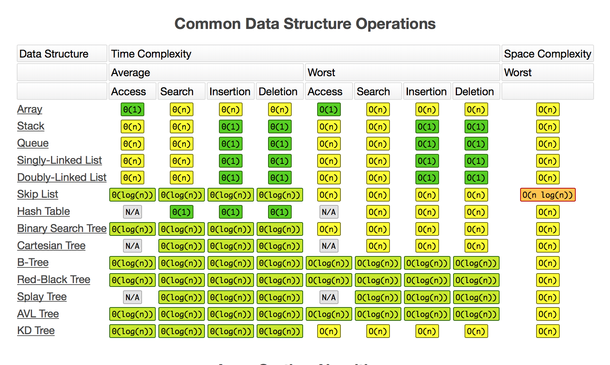

# COMP 352 Data Structures

## General Data Structure Operation Complexity


## Fundamental Structures

### Arrays 

- Sequenced collection of variables all of the same type, organized by index.

- Advantages:
	- Random access is instantaneous
	- Memory usage is minimal

- Disadvantages:
	- Fixed size
	- Addition/Removal to front requires `O(n)` movements of array elements.
		- This can be mitigated with a **circular array**.

### Singly linked list

- Sequenced collection of **nodes** containing:
	1. a data element
	2. link to the next node.

- Advantages:
	- Can grow arbitrarily
	- Memory usage is minimal
	- Additional/Removal at front is `O(1)`

- Disadvantages:
	- All access is sequential, and therefore random access is `O(n)`
	- Addition/Removal from indices other than head are `O(n)` due to traversal requirement.
		- Some implementations also explicitly define a `tail` node to reduce insertion at the end to `O(1)`.
		- However, removal at the tail is infeasible, because there is no `O(1)` way to update the tail to point to the previous node.


- Common techniques:
	- Insertion at head:
		1. Allocate a new node with an element
		2. Have new node point to old `head`
		3. Update `head` reference to point to new node 
	- Removal at head:
		1. Update `head` to point to `head.next`
		2. Either explicitly `free` former first node or let GC do it.
	- Insertion at the tail
		1. Allocate a new node with an element
		2. Have new node point to null
		3. Traverse list to until `node.next` == null
		4. Insert new element at `node.next`

- Used to implement:
	- **Stack**
		- The top `t` element is stored in the `head` node
		- Each Stack operation is `O(1)`, memory usage is `O(n)`.
	- **Queue**
		- The front `f` element is stored in the `head` node.
		- The rear `r` element is stored at the `tail` node 
		- Each Queue operation is `O(1)`, memory usage is `O(n)`.

### Doubly Linked List

- Sequenced collection of **nodes** containing:
	1. a data element
	2. link to the next node.
	3. link to the previous node.

- Often, special header/trailer nodes are used to simplify implementation.
	- [header] ⇋ [][first][] ⇋ [][second][] ⇋ ... ⇋ [trailer]

- Advantages:
	- Random access is not possible, but relative access is.
	- Memory usage is minimal : `O(n)`

- Disadvantages:
	- All access is sequential, and therefore random access is `O(n)`

- Common techniques:
	- Insert after element in position `p`:
		1. Allocate a new node `q` with an element
		2. link `q` to its predecessor: `q.prev = p`
		3. link `q` to its successor: `q.next = p.next`
		4. link `p`s old successor to `q` : `p.next.prev = q`
		5. link `p` to its new successor `q` : `p.next = q`
	- Removal
		1. Make `p`s predecessor link to its successor: `p.prev.next = p.next`
		2. Make `p`s successor link to its predecessor: `p.next.prev = p.prev`
		3. Remove the links from `p`: `p.prev = null ; p.next = null`

- Used to implement:
	- NodeList
		- Nodes implement Position.


## Linear Abstract Data Types

### Stack

- Insertions/deletions follow the **Last In, First Out** scheme.
- All operations have time complexity O(1).
- Supported methods:
	- `push(obj)` : Inserts element on the stack.
	- `obj pop()` : removes and returns the last inserted element.
	- `obj top()` : returns the last element **without** removing it.
	- `int size()`: number of elements in the stack
	- `bool isEmpty()` : Indicates if size is 0.

#### Implementations

##### Array based Stack

1. Add elements left to right.
2. A variable keeps track of the index of the top element.

Warning: Since an array is being used, there is a risk of not having enough space to push new elements.

##### Linked list (preferred)

- `push()` adds new node at the tail of the list.
- `pop()` removes the tail node.

#### Common uses

##### Reverse an array

```java
void stackRev(int[] a) {

	Stack s = new ArrayStack(a.length);
	for(int i = 0; i < a.length; i++)
		s.push(a[i]);
	for(int i = 0; i < a.length; i++)
		a[i] = s.pop();
}
```

##### Matching parentheses

```java
void stackMatchParens(String s, int n) {
	
	Stack s = new ArrayStack(n);
	
	for(int i = 0; i < a.length; i++) {
		char c = s.charAt(i);
		switch(c) {
			case '(':
			case '{':
			case '[':
				s.push(c);
				break;
			case ')':
			case '}':
			case ']':	
				if(s.isEmpty())
					return false; // no matching paren
				char match = s.pop();
				if(match == '(' && c != ')' )
					break;
				if(match == '{' && c != '}' )
					break;
				if(match == '[' && c != ']' )
					break;	
				
				return false;
			}
		}
		
		if(S.isEmpty()) // everything matched
			return true; 
		else return false;
	}
}
```	

### Queues

- Very similar to Stacks, except with a **First In, First Out** (FIFO) scheme.
- Insertions are at the rear; removals are at the front.
- Supported Methods:
	- `enqueue(obj)` : inserts obj at the end
	- `obj dequeue()` : removes and returns obj at the front
	- `obj front()` : returns the first element without removing it

#### Implementations

##### Circular array based Queue

1. Use an array `Q[n]`.
2. Start two indices `f`,`r` in the middle of the array.
	- Insertion happens at `Q[r]`, then increment: `r = (r+1) % n`.
	- Removal happens at `Q[f]`, then increment: `f = (f+1) % n`.

Warning: Since an array is being used, there is a risk of not having enough space to push new elements.

##### Linked list

### Deque

- Combines features of Stack and Queue.
- Supports insertion and deletion at both ends.
- Common methods are `O(1)` in time complexity.
- Supported Methods:
	- `addFirst(e)`
	- `addLast(e)`
	- `e removeFirst()`
	- `e removeLast()`
	
### Array List

- Extends the Array concrete data type by storing a sequence of **arbitrary** objects.
- Access, insertion, removal is done by **index**.
- Supported Methods:
	- `get(i)` : returns element at `i` without removing it
	- `set(i,e)` : replaces content of index `i` with element `e`
	- `add(i,e)` : insert a new element `e` at index `i` (displacing whatever was there)
	- `remove(i)` : remove and return element at `i`

#### Implementations

##### Array based Array List

1. Use an array `A[n]`.
2. A variable `count` keeps track of the size of the list.
	- `get`,`set` are implemented in `O(1)` time.
	- `add`,`remove` are implemented in `O(n)` time, due to shifting contents back or forward.
	- Avoid out of bounds by transparently replacing the array with one of doubled size when full.

##### Circular array based Array List

- Same implementation as the flat Array based one, but allows `add`,`remove` operations on the first element to be `O(1)`.

Warning: Since an array is being used, there is a risk of not having enough space to push new elements.

### Node List

- Uses a `Position` ADT internally, allowing elements to be accessed by their **relative position**.
- `Position` supports `element()`.

- Supported methods: 
	- `first()`: returns the position of first element
	- `last()`: returns the position of the last element
	- `prev(p)`: returns the position preceding position `p` 
	- `next(p)`: returns the position following position `p`
	- `set(p,e)`: Replace element at position `p` with `e`
	- `addFirst(p,e)`: insert `e` at first position 
	- `addLast(p,e)`: insert `e` at last position 
	- `addBefore(p,e)`: insert new element `e` before position `p`, and return the Position.
	- `addAfter(p,e)`: insert new element `e` after position `p`, and return the Position.
	- `remove(p)`: remove and return element at position `p`, invalidate Position `p`.

### Sequence

- Combines the qualities of:
	- Deque
	- Array List
	- Node List
- Useful for basic, general purpose data storage of an ordered collection.

- Elements can be accessed by **index**	, or **position**.

- ArrayList-based:
	- `get(i)`, `set(i,e)`, `add(i,e)`, `remove(i)`

- NodeList-based:
	- `first()`,`last()`,`prev(p)`,`next(p)`,`set(p,e)`,`addBefore(p,e)`,`addAfter(p,e)`,`addFirst(e)`,`addLast(e)`,`remove(p)`

- Additionally:
	- `p atIndex(i)` : Return the Position at index `i`
	- `i indexOf(p)` : Return the index at Position `p`

#### Implementation

##### Doubly Linked List

- Nodes implement Position ADT.
- Time complexity:
	- NodeList/Position based methods: **O(1)**
	- Deque based methods: **O(1)**
	- ArrayList/index based methods: **O(n)**

##### Circular Array based Implementation (preferred)

1. Use an array storing each position.
2. Define a Position ADT to hold :
	- An index
	- Element associated with the position.

- This scheme allows us to easily scan through the rest of the array to update the index variable after an addition or removal. 

- Time complexity:
	- `add`,`addFirst`,`addBefore`,`addAfter`,`remove` methods : **O(n)**
	- All other methods: **O(1)**

### Favorites List

- Models a collection of elements, while keeping track of **how many times** each element is accessed.
- Useful for:
	- Top Sites in a web browser

- Supported methods:
	- `access(e)` : Access the element `e` and increment its access count.
	- `remove(e)` : Remove element `e`.
	- `top(k)` : returns a list of `k` most accessed elements.

## Non-Linear Abstract Data Types

### Trees

#### Definitions

|Term|Meaning|
|----|-------|
|depth| number of ancestors a node has|
|height of tree| maximum depth of any note
|siblings|Nodes that share a parent|
|Ordered|If there is a linear ordering defined for the children of each node|
|Root|Node at the top|
|Internal|Having at least one child|
|Leaf/External|Having no children|

- Supported methods:
	- `node root()`
	- `node parent(p)`
	- `bool isInternal(p) / bool isExternal(p)`

#### Binary Trees

- Every node has **at most two children**.
- Recursive definition:
	- **Base case**: A tree consisting of a single node
	- **Recursive case**: A tree whose root has an ordered pair of children, each of which is a binary tree.

- Uses:
	- Sorting comparable elements
	- Arithmetic expression evaluation
		- Internal nodes : **operators**
		- External nodes : **operands**

##### Properties of Binary Trees

|Property|Notation|
|----------|--------|
|Number of nodes| \((n\))|
|Height| \((h\))|
|Number of external nodes| \((e\))|
|Number of internal nodes| \((i\))|

- \(( e = i + 1 \))
- \(( n = 2e - 1 = 2i + 1 \))
- \(( h \leq i \))
- \(( h \leq (n-1)/2 \))
- \(( e \leq 2^h \))
- \(( h \geq log_2(e) \))
- \(( h \geq log_2(n+1) - 1 \))

- All operations except complete traversal are O(1).

#### Traversal


##### Preorder

- RESULT : \\(1 \rightarrow 2 \rightarrow 4 \rightarrow 5 \rightarrow 3\\)

- Root -> Left -> Right.
- **First node** visited is always the **root** of the tree/subtree.
- i.e., a node is visited before its descendents. 

###### Implementation

1. Check if node is empty/null
2. Access data part of current node
3. Traverse the left subtree by recursively calling the preorder function.
4. Traverse the right subtree by recursively calling the preorder function.

##### Postorder

- RESULT : \\(4 \rightarrow 5 \rightarrow 2 \rightarrow 3 \rightarrow 1\\)
- Left -> Right -> Root.
- **First node** visited is always the leaf on the bottom left.
- Root node is counted last.

###### Implementation
1. move right until no more children
2. Move up one level
3. go back to deepest level and continue

##### Inorder 

- RESULT : \\(4 \rightarrow 2 \rightarrow 5 \rightarrow 1 \rightarrow 3\\)
- A node is visited after its left subtree, and before its right subtree. 
- Left -> Root -> Right.
- **First node** visited is the leaf on the bottom left.

##### Level numbering

- RESULT : \\(1 \rightarrow 2 \rightarrow 3 \rightarrow 4 \rightarrow 5\\)
- Visits all nodes on one level before moving on to the next. 
- i.e. visit left to right on depth `d`, then proceed to depth `d+1`, etc.

##### Euler Tour 

- Runs in **O(n)**
- Walks around the tree and visits each node **three times**
	- On the left (preorder)
	- From below (inorder)
	- On the right (postorder)
- In the case of a leaf, all three visits happen at the same time.

###### Example Usage

Calculate number of decendants of a node `n`

1. Initialize a counter to 0
2. Counter value when `n` is visited on the left -> `i`
3. Counter value when `n` is visited on the right -> `j`
4. Number of descendants = \((j - i + 1 \))

#### Implementation

##### Linked Structure

- A node implements the Position ADT, and stores:
	- Element
	- Reference to parent
	- Sequence of child nodes (or references to L/R nodes, in the case of a binary tree)

##### Array-based *(Binary Tree only)*

- Nodes are stored in an array `A`, using level numbering.
- Node `v` is stored at `A[rank(v)]`
	- `rank(root) = 1`
	- If **left child**:
		- `rank(node) = 2*rank(parent(node))`
	- If **right child**:
		- `rank(node) = 2*rank(parent(node)) + 1`

### Priority Queue	

- Useful for storing a collection of **prioritized elements**, referred to as values.
- Can insert arbitrary insertions, but removals are done in order of priority. Exposes no notion of positions.
- Each entry in a PQ is a **key,value pair**

- Supported methods:
	- `insert(k,v)`: Insert an entry with `k,v` into PQ, and return the entry storing them.
	- `removeMin()`: remove and return the entry with smallest key (first priority)

#### Total Order Relations

- Keys can be of arbitrary type, as long as they can be compared.
- Two distinct entries can **collide**, and we need to deal with that.
- A comparison \(( \leq \)) must define a **total order relation** to be robust enough to deal with collisions.

|Property|Expression|
|--------|----------|
| Reflexive| \(( k \leq k \)) |
| Antisymmetric | \(( k_1 \leq k_2 \land k_2 \leq k_1 \rightarrow k_1 = k_2 \)) |
| Transitive | \(( k_1 \leq k_2 \land k_2 \leq k_3 \rightarrow k_1 \leq k_3 \)) |

- PQ uses two special kinds of objects
	- The **entry** : a key-value pair
	- The **comparator** : like a proper implementation of `Comparable`

#### Implementations

##### Sequence-based (unsorted list)

- `insert` operation takes **O(1)**
- `removeMin` takes **O(n)**, because we need to traverse to find the smallest key

##### Sequence-based (sorted list)

- `insert` operation is **O(n)**, since we have to traverse to find where to insert the item
- `removeMin` takes **O(1)**, since the smallest key is at the beginning


### Heaps

- Insertion and removal are \((O(log(n))\)).

- A binary tree storing key-value pairs as nodes, such that `key(v)` \(( \geq \)) `key(parent(v))`
	- This has the consequence of having the minimum key always stored at the top of the heap.
	
#### Complete binary tree

- let `h` be the height of the heap
- for `i = 0, ..., h-1` there are \(( 2^i \)) nodes of depth \(( i \))
- There is **at most** one child, and this child must be a **left child**
- The **last node** is the **rightmost node of maximum depth**

- A heap `T` with height `h` is a complete bintree if `i=0,...,h-1` has the maximum possible number of entries, and at least one entry at the last depth (`h`).
	
	
- \(( n \geq 2^h \))

#### Common methods

##### `insert(k,x)`

1. Find the new insertion node `z` (the new last node)
2. store key `k` at `z`
3. Restore the heap-order property: (**Upheap**)
	1. Swap k along an upward path from the insertion node. \(( (O(log(n)) \))
	2. Upheap terminates when `k` reaches the root, or a node whose parent has a key \(( \leq \)) `k`.
	
##### `removeMin()`

1. Return the root entry
2. Replace the root entry with the **last node**
3. Remove the last node
4. Restore the heap-order property: (**Downheap**)
	1. Swap `k` along downward path from the root.
	2. If heap has **no right child**, swapping starts at the left child.
	3. If heap has **both left and right** children, swap with the one with a **smaller key.**
	4. Downheap terminates when `k` reaches a leaf or a node whose child have keys \(( \geq \)) `k`.

##### Finding the last node

- If the current last node is a **left child**:
	1. Go up to its parent
	2. Go down and right to the new last node.
- If the current last node is a **right child**:
	1. Go up until a left child (or the root) is reached.
	2. If a left child is reached, go to the right child.
	3. Go down left until a leaf is reached.

##### Merging two heaps

1. Given a key `k` and two heaps:
	1. Create a new heap with `k` as the root node, and the two heaps as its subtrees.
	2. Downheap until we can downheap no more.

##### Bottom up construction
 
1. Construct \(( (n+1)/2 \)) heaps with **one** entry each.
2. Construct \(( (n+1)/4 \)) heaps with **three** entries each (by joining heaps from step 1)
...
- h+1. Construct the final heap by joining the last two heaps (each with \(( (n-1)/2 \)) entries)
- New entry is added at the root, and downheap.
	
	
#### Implementations

##### Array-based Heap

1. Create an array `A[n]`.
2. For the node at rank `i`:
	- the **left** child is \((2i + 1 \))
	- the **right** child is \((2i + 2 \))

- Insertion is at rank n+1.
- Removal is at rank n.
- heap sorted by traversing array.


### Map

- A **map** models a searchable collection of key-value pairs.
- Values may be the same, but keys must be unique, otherwise we have **collisions**.

#### Implementations

##### (Unsorted) Doubly linked list

- Performs very poorly for larger sizes. 

### Ordered Map

- An **ordered map** maintains an order relation for the keys based on a total order relation.
	- Ordered maps add some new methods:
		- `firstEntry / lastEntry`
		- `floorEntry(k)` : entry with largest key \(( \leq k\)) 
		- `ceilingEntry(k)` : entry with smallest key \(( \geq k\)) 

- Best for : **searches**

#### Implementation

##### Array-based Sorted Sequence 

- `get`,`floorEntry`,`ceilingEntry` are \(( O(log(n)) \)) using binary search.
- `put`,`remove` are \(( O(n)) \)).

### Dictionary

- A dictionary allows key-value pairs to be any object types.
- It further allows multiple instance of the same key to exist 

- Best for : **searching, inserting, deleting**
- Useful for: **log file**, **audit trail**

- `put` is O(1)
- `get`,`remove` are O(n)


#### Implementation

Array, DLL, or Hash Table (O(1)).

#### Search table

- A dictionary implemented by means of a **sorted array**.

- `get` is O(log(n))
- `put`,`remove` are O(n)


### Hash Table

- **Hashing** is a technique to determine the index to store/retrieve a value using its key.
- A **hash function** takes a key and produces an integer index of an element in the table.

- Average time complexity: O(1)
- Worst case time complexity: O(n)

#### Using a good hash function

- Have an array of limited size `n`, and convert keys to integers on the range \(( [0,n-1] \))
- `n` is usually chosen to be a prime.
- **Clustering** is caused by poor choice of hash function or collision resolution.

#### Collision resolution

##### Linear probing

1. Perform hashing operation on key.
	- If hash points to an **empty** index : place key in that index.
	- If hash points to a **non-empty** index : check index+1, index+2, ..., index+n.
2. To avoid the algorithm from running indefinitely, when deleting an object, we replace it with a special *EMPTY* or *AVAILABLE* value, as defined by the programmer.

##### Quadratic probing

1. Perform hashing operation on key.
	- If hash points to an **empty** index : place key in that index.
	- If hash points to a **non-empty** index : check \(( index+k^2: index+1, index+4, ..., index+n^2 \)).
2. To avoid the algorithm from running indefinitely, when deleting an object, we replace it with a special *EMPTY* or *AVAILABLE* value, as defined by the programmer.

- QP guarantees a successful add operation when :
	- hash table is less than half full
	- its size is a prime number

##### Double Hashing

- Double hashing avoids primary and secondary clustering by employing a **second hash function** that is run on collision. \((h_1+nh_2 = \\) index.
- If the second hash function also collides, multiply result of second function by `n` and keep searching.

##### Separate chaining

- Instead of each array item holding only one value, extend it to hold a **bucket**, e.g. a linked list, another array, etc. 
- Can be more flexible, but uses more space.

#### Load factor

- The **load factor** \(( \alpha \)) of a hash table of `n` elements with array size `s` is defined as \(( \alpha = \frac{s}{n} \)).
- The smaller the load factor, the smaller the number of probes for insertion.
- Load factor should be \(( \leq 0.5 \)) for open addressing, and \(( \leq 0.9 \)) for separate chaining.

### Binary Search Trees

- A **binary search tree** stores keys at its internal nodes following:
	- \(( key(left) \leq key(root) \leq key(right) \))
	- External/leaf nodes do not store items, but are there to guarantee the tree is a proper binary tree.

- By design, an **in-order traversal** visits the keys in increasing order.

#### Performance

- Time complexity:
	- Height is O(n) worst case
	- Height is O(log(n)) in best case

#### Common Techniques

##### Search

1. given a key `k`, trace a downward path starting from the root
2. Compare `k` with the key of the current node
3. If we reach a leaf node, the key is not found.

```java

treeSearch(k,x) {
	if(isExternal(x))
		return x;
	
	if(k < key(x))
		return treeSearch(k,x.left)
	else if k == key(x)
		return x
	else if(k > key(v))
		return treeSearch(k,x.right)
}
```

##### Insertion

1. Search for key `k` (we won't find it, but the selected node `w` will be the next one we should add)
2. Insert `k` at node `w` and expand it into an internal node (i.e. add children)

##### Deletion

1. Search for key `k`
2. If we find `k`
	- If `k` has **no children**, just remove it and we're done.
	- If `k` has **one child**, remove it and promote the child into its place.
	- If `k` has **two children**:
		- Find the node `w` that will follow `k` in an in-order traversal.
		- Copy `w` to node `k`
		- Remove `w` and promote its **left child** into its place


### AVL Trees

- AVL trees expand the idea of binary trees to address performance problems.
- AVL trees are **balanced**, such that:
	- The heights of the children of every internal node `v` can differ by **at most 1**.
	- Calculation of height is easy via the recursive property \(( n(h) = 1 + n(h-1) + n(h-2) \))
	- \(( n(h) \geq 2^{ceil(h/2)} - 1 \))
	- This implies that the height of an AVL tree is O(log(n)).

#### Common techniques

##### Insertion

- Follows the same basic procedure as a binary tree, but requires a balancing step afterward.

##### Removal

- Follows the same basic procedure as a binary tree, but requires a balancing step afterward.

##### Balancing

###### Left rotation


###### Right rotation


###### Left-right rotation

|State| Actions taken|
|-----|--------------|
|| C is unbalanced with BF=2.|
|| - Left rotation on left subtree of C. <br/> - A becomes left subtree of B.|
|| C is unbalanced with BF=2.|
|| - Right rotation making B new root. <br/> - C becomes right subtree of B.|

###### Left-right rotation

|State| Actions taken|
|-----|--------------|
|| A is unbalanced with BF=2.|
|| - Right rotation along C. <br/> - B becomes right subtree of A.|
|| A is unbalanced with BF=2.|
|| - Left rotation making B new root. <br/> - A becomes left subtree of B.|

### Graphs

- A graph is a pair \\(V,E\\) where:
	- V is a set of **vertices** or nodes
	- E is a set of pairs of vertices, called **edges**

- Graphs and edges can be **directed** or **undirected**

#### Terminology and Properties

|Term|Meaning|
|----|-------|
|Endpoints| the two vertices on either side of an edge|
|Incident edges| The edges connecting to a given vertex|
|Adjacent| Two vertices are adjacent if they share an edge|
|Degree| A node has a **degree** n corresponding to the number of edges connecting to it|
|Parallel edges| Multiple edges that connect the same two vertices|
|Self-loop|An edge pointing from and to the same node|
|Path| A sequence of vertices and edges between two vertices|
|Simple path| Path such that all vertices and edges are distinct|
|Cycle| Circular sequence of vertices and edges|
|Simple Cycle| Cycle such that all vertices and edges are distinct|

|Property|Implication|
|--------|-----------|
|\\(n \\)| number of vertices|
|\\(m \\)| number of edges|
|\\( deg(v) \\)| degree of vertex |
|\\( \sum deg(v) = 2m \\) | Each edge is counted twice.|
|\\( m \leq \frac{n(n-1)}{2} \\) | In an undirected graph with no self loops|


#### Graph methods

- `numVertices()`, `vertices()`, `numEdges()`,`edges()`
- `getEdge(u,v)` : Return the edge from u -> v.
	- In an undirected graph, getEdge(u,v) == getEdge(v,u).
- `endVertices(e)` : Return the two vertices connected by e.
- `opposite(v,e)` : return the vertex connected to v by e.
- `outDegree/inDegree` : number of outgoing/incoming edges to a vertex
- `insertVertex(elem)`,`insertEdge(u,v,elem)`

#### Configurations

##### Edge list

- Maintains two sequences:
	- A sequence of Vertex objects with:
		- a reference to position
	- A sequence of edge objects each with :
		- element
		- origin vertex
		- destination vertex
		- reference to position in edge sequence

##### Adjacency List

- Sequence of references to edge objects of incident edges, e.g.
	-  V[0] -> u -> sequence of incident edges to u
	-  	V[1] -> v -> sequence of incident edges to 1
	-  etc...

##### Adjacency Map

- Sequence of references to adjacent vertices, each mapped to an edge object of the incident edge, e.g.
	- V[0] -> u -> { v -> e, w -> g }
	- V[1] -> v -> { u -> e, w -> f }
	- etc...

##### Adjacency Matrix

- Reference to edge object for adjacent vertices
- Null for non-adjacent vertices

|     |  0  |  1  |  2  |  3  |
|-----|-----|-----|-----|-----|
|u-> 0|	  |e    |g    |		|
|v-> 1|e	  |     |f    |     |
|w-> 2|g    |f    |     |h    |
|z-> 3|     |     |h    |     |

##### Comparing performance

|	              	| Edge list | Adjacency List | Adjacency matrix | 
|-------------------|-----------|----------------|-------------------|
|Space	             | n+m		  | n+m             | \\( n^2 \\)      |
|incidentEdges(v)	| m		      |deg(v)           | n      |
|areAdjacent(u,v)   | m		      |min(deg(u),deg(v)| 1      |
|insertVertex(elem)	| 1				| 1              | \\( n^2 \\) | 
|insertEdge(u,v,elem)| 1				| 1           | 1 | 
|removeVertex()		| m				| deg(v)          | \\( n^2 \\) |
|removeEdge()			| 1				|max(deg(u),deg(v) | 1        |


#### Subgraphs


- A **spanning subgraph** of G contains all the vertices of G. 

- A graph is **connected** if there exists a path between every pair of vertices
- A **connected component** of a graph G is a maximal connected subgraph

#### Trees and Forests

- Not to be confused with other tree structures.

|Term|Meaning|
|---------|-------|
|Connected| A graph is **connected** if there exists a path between every pair of vertices|
|Subgraph| - A **subgraph** S of G is such that <br/> - The vertices of S are a subset of the vertices of G <br/> - The edges of S are a subset of the edges of G|
|Tree     | An undirected graph T, such that: <br/> - T is connected <br/> - T has no cycles|
|Forest   | An undirected graph without cycles| 
|Connected components| The connected components of a forest are trees|
|Spanning tree| A spanning subgraph that is a tree|
|Spanning forest|A spanning subgraph that is a forest|

#### Depth-first search

- **Time complexity** (n vertices,m edges): \\( O(n+m) \\)
- Depth-first search of G:
	- Visits all vertices and edges
	- Determines whether G is **connected**
	- Computes the **connected components** of G
	- Computes a **spanning forest** of G

- Can also:
	- Find and report a path between vertices
	- Find cycles in the graph

##### Algorithm

```java

List visited = new List();
List edgeTo = new List();

DFS(G,u) {
	visited.push(u);
	for( edge e : u.getEdges() ) {
		dest = e.getDest();
		if(!visited.contains(dest)) {
			edgeTo[e] = v;
			DFS(G,v);
		}
	}
}
```

###### To visit a vertex `v`:
	- Mark `v` as visited.
	- Recursively visit all unmarked vertices adjacent to `v`.
			
###### Cycle finding
- Use a stack `S` to keep track of the path between the start vertex and the current vertex.
- As soon as a back edge is encountered, return the cycle as the portion of the stack from the top vertex to the current one. 

```java

cycleDFS(G, v){
	setLabel(v, VISITED)
	S.push(v)
	for(edge e : G.incidentEdges(v)
	if(getLabel(e) = UNEXPLORED) {
		w = (v,e);
		S.push(e);
		if(getLabel(w) = UNEXPLORED) {
			setLabel(e, DISCOVERY);
			cycleDFS(G, w);
			S.pop(e);
		} else {
			T = new Stack();
			o = S.pop();
			while(o != w) {
				o = S.pop();
				T.push(o);
			}
			return T.element();
	}  
	S.pop(v);
}	
```

###### DFS for an entire graph

```java

DFS(G) {
	for(vertex u : G.vertices() ) 
		setLabel(u,UNEXPLORED);
	for(edge e: G.edges() ) 
		setLabel(e,UNEXPLORED);
		
	for(vertex v : G.vertices()
		if(getLabel(v) = UNEXPLORED)
			DFS(G,v)
			
}

DFS(G,v) {
	setLabel(v,VISITED);
	for(edge e : G.incidentEdges(v) ) {
		if(getLabel(e) == UNEXPLORED) {
			w = opposite(v,e);
			if(getLabel(w) == UNEXPLORED) {
				setLabel(e,DISCOVERY);
				DFS(G,w);
			} else {
				setLabel(e,BACK);
	}
}
```

#### Breadth-First	search

- **Time complexity**: \(( O(n+m) \\)

- A BFS traversal of G:
	- Visits all vertices and edges
	- Determines whether G is connected
	- Computes connected components
	- Computes spanning forest

- Can also:
	- Find a path with minimum number of edges between two given vertices
	- Minimum number of hops in a computer network (routing)
	- Find a simple cycle, if one exists.


##### Algorithm

- Repeat until queue is empty:
	1. Remove vertex `v` from queue.
	2. Add to queue all unmarked vertices adjacent to `v`, and mark them.


```java

boolean[] marked;
int[] edgeTo;
int[] distTo;

bfs(Graph G, int s) {
	Queue q = new Queue();
	q.enqueue(s);
	marked[s] = true;
	distTo[s] = 0;
	
	while(!q.isEmpty()) {
		int v = q.dequeue();
		for(int w : G.adjacent(v)) {
			if(!marked[w]) {
				q.enqueue(w);
				marked[w] = true;
				edgeTo[w] = v;
				distTo[w] = distTo[v] + 1;
			}
		}
	}
}
``` 

|Applications          | DFS | BFS | time|
|----------------------|-----|-----|-----|
|Spanning Forest       | &#x2705;|&#x2705; ||
|Connected components  | &#x2705;|&#x2705; | \\( E+V \\) |
|Biconnected components| &#x2705;|&#x274C; | \\( E+V \\) |
|Path between s,t      | &#x2705;|&#x2705; | \\( E+V \\) |
|Shortest paths (s,t)  | &#x274C;|&#x2705; | \\( E+V \\) |
|Cycles                | &#x2705;|&#x2705; | \\( E+V \\) |
|Euler Cycle			   | &#x274C;|&#x2705; | \\( E+V \\) |
|Hamilton cycle        | &#x274C;|&#x274C; | \\( 2^{1.657v} \\) |
|Bipartiteness         | &#x2705;|&#x2705; | \\( E+V \\) |
|Planarity             | &#x274C;|&#x2705; | \\( E+V \\) |
|Graph Isomorphism     | &#x274C;|&#x274C; | \\( 2^{c\sqrt{VlogV}} \\) |
		
		
### Directed Graphs (digraphs)

- A graph \\( G(V,E) \\) s.t.:
	- Each edge goes in one direction
	- Edge \\( (a,b) \\) connects a and b, but **not** \\( (b,a) \\)
	- If G is simple: \\( m \leq n(n-1) \\)

- Types of edges
	- Discovery edges
	- Back edges
	- forward edges
	- cross edges

#### Strong connectivity

**Time complexity** : \\( O(n(n+m)) \\) 

1. for each vertex `v` in G:
	1. Perform DFS from `v` in G
		- if there's a `w` not visited, return **false**
	2. Let \\( G' \\) be \\( G \\) with its edges removed.
	3. Perform DFS from `v` in \\( G' \\) 
		- if there's a `w` not visited, return **false**
	4. else, return **true**. 

#### Directed Acyclic graph (DAG)

- Topological order is reverse DFS postorder of a DAG.

#### Transitive closure

- A **transitive closure** of digraph \\( G \\) is the digraph \\( G' \\) such that:
	1. \\( G' \\) has the same vertices as \\( G \\)  
	2. \\( G' \\) has a directed edge \\( u \rightarrow v \iff G \text{ has a directed path } u \rightarrow v, (u \neq v) \\)

- To compute the transitive closure, we can perform DFS at each vertex -> \\( O(n(n+m)) \\) 

### Weighted graphs

- Each edge has a **weight**. 
- Useful for:
	- packet routing
	- driving directions

#### Shortest path

1. A subpath of a shortest path is itself a shortest path
2. There is a tree of shortest paths from a start vertex to all other vertices.

##### Dijkstra's Algorithm

- Running time: \\( O(m log(n)) \\) 
- Holy crap i have no idea.

#### Minimum Spanning Tree (MST)

- Spanning tree of a weighted graph with minimum total edge weidght

##### Cycle property

- Let :
	- T be a MST of weighted graph G
	- e be an edge of G not in T
	- C be the cycle forme when e is added to T

- For every edge f of C, \\( weight(f) \leq weight(e) \\).

##### Partition property

- Partition the vertices of G into subsets U,V
- let:
	- e be an edge of minimum weight across the partition

- There is a minimum spanning tree of G containing edge e.

##### Prim-Jarnik algorithm

1. Pick an arbitrary vertex sand grow the MST as a cloud of vertices, starting from s
2. Store with each vertex v label d(v), representing the smallest weight of an edge connecting v to a vertex in the cloud 
3. At each step:
	1. Add to the cloud the vertex uoutside the cloud with the smallest distance label
	2. Update the labels of the vertices adjacent to u

##### Kruskal's Algorithm

- Maintains a forest of trees.
- A priority queue extracts the edges by increasing weight.
- An edge is accepted if it connects distinct trees.

1. Maintain a partition of the vertices into clusters
	1. Initially, single-vertex clusters
	2. Keep an MST for each cluster
	3. Merge “closest ”clusters and their MSTs
2. A priority queue stores the edges outside clusters
	– Key: weight
	– Element: edge
3. At the end of the algorithm: One cluster and one MST