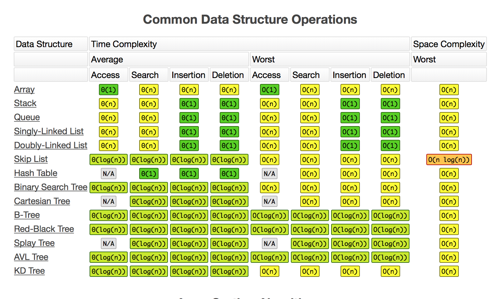
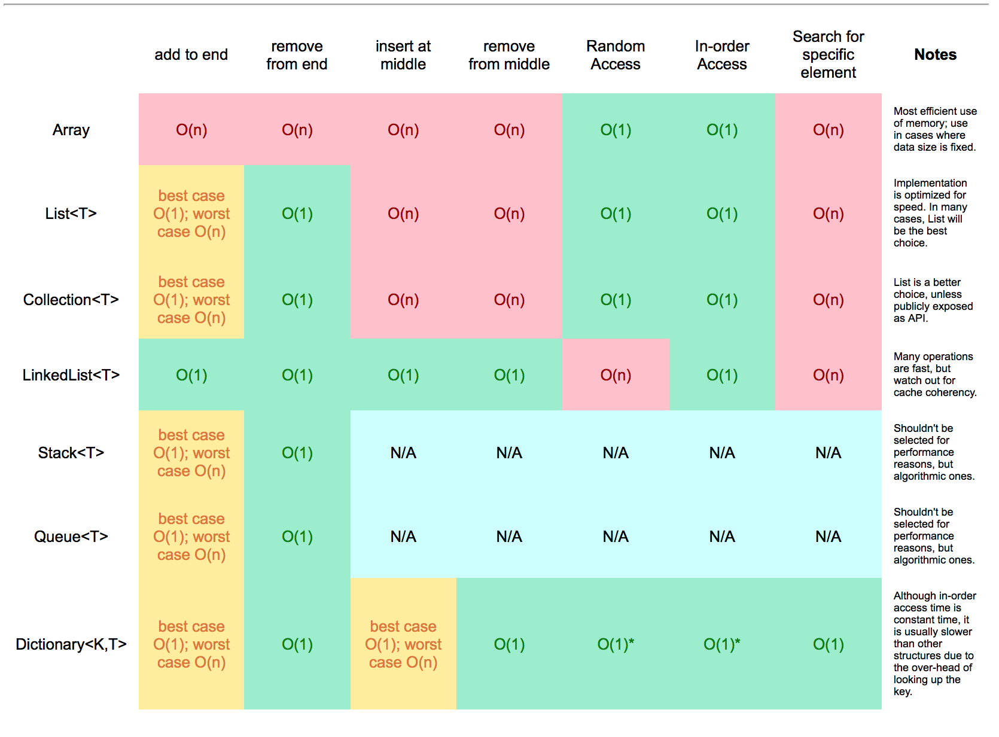
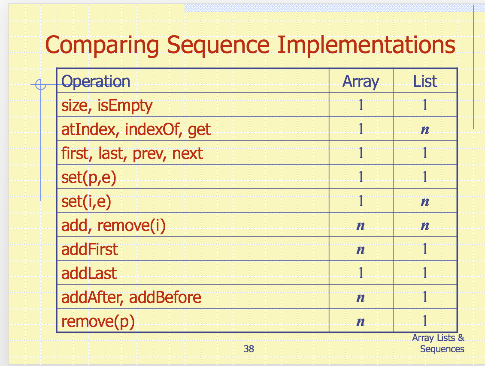

# General Data Structure Operation Complexity


# Java Centric ADT Operation Complexity


# ARRAY 

- PROS:
	- $O(1)$ for Random or Sequential Access.

- CONS:
	- Size must be defined *a priori*
	- $O(n)$ for most operations
	- Inflexible.
	
# LIST

## Implementations

### Fixed array:

- **O(1)** - Append, Lookup,
- **O(N)** - Insert (worst case), Prepend

### Dynamic Array:

- **O(1)** - Append (average), 
- **O(n)** - Append (worst), prepend

### Linked List

- **O(1)** Append, prepend, insert(head/tail), removeFirst
- **O(n)** lookup, get, search, insert (worst case), removeLast

# STACK

- Push/pop operations are O(1).

## Implementations

### Array

- Uses `top` variable to track insertion.
- New elements pushed to `A[top]`, and removed from `A[top]`

### Linked List

- Top element stored as the head.

# QUEUE

## Implementations

### Array based

- Enqueue operation is `O(1)`.
- But if `Q[0]` is at the front, every `dequeue` will be `O(n)`.

### Circular Array based

- `f,r` initialized to `0`
- ENQUEUE: 
	- Put in `Q[r]`, increment `r`
- DEQUEUE:
	- Remove from `Q[f]`, increment `f`.

- This improves `dequeue` performance to `O(1)`.
- Avoid `f,r > N` by implementing modular arithmetic.

### Linked List based

- ENQUEUE: 
	- Keep an index of last filled element, increment `i`, add new node at tail.
- DEQUEUE:
	- Remove head, make `head+1` new head. 

# DEQUE

- Conceptually similar to a queue, but insertion and removal supported at either end.
- Best implemented with a doubly-linked list. 

# LINKED LISTS

## Implementations

### Singly Linked List

- **O(n)**: Access, search
- **O(1)**: Insertion, Deletion

### Doubly Linked List

- **O(n)**: Access, search
- **O(1)**: Insertion, Deletion

- Using double links Gets tail removal down to O(1)

### Circular Linked List

- Can be singly or doubly linked, but avoids null pointers by 'wrapping around' back to the head when tail is reached.

# ARRAY LIST

- Like an array, but can hold arbitrary number of elements.

## Implementations

### Array-based ArrayList

- **O(1)**: get,set
- **O(n)**: add (worst case), remove (worst case)

- Use a variable `n` to keep track of number of elements.
	- `get` returns `A[i]`
	- `set` : `t=A[i]; A[i] = o; return t`

### Growable Array based ArrayList

- Improves `add(),remove()` to `O(1)`

# NODE LIST

- Uses the **Position** ADT to locate elements of the list.

# SEQUENCE

## Implementations

### Circular Array based

- **O(n)** - insert/removeAtRank,addBefore,addAfter,remove
- **O(1)** - replaceAtRank, first, last, prev,next
- Use a circular array with `f,l` for first, last respectively 

### Linked list based

- **O(n)** - Any *rank* based methods (elemAtRank,replaceAtRank,etc)
- **O(1)** - Any *position* based method



# TREES


## Vocabulary

|Term|Meaning|
|----|-------|
|Root|Node without parent|
|Internal Node|Node with at least one child|
|External Node / Leaf| Node without children|
|Ancestors| parent,grandparent,grand-grandparent, etc|
|Descendant| child, grandchild, grand-grandchild, etc|
|Depth|number of ancestors|
|Height|Maximum depth of any node|
|Siblings| Two nodes that are children of the same parent
|Edge| A connection between parent and child|
|Path|A sequence of nodes such that any two consecutive nodes form an edge|
|Subtree| Tree consisting of node and its descendants|

## Methods

|Method|Meaning|Complexity|
|------|-------|----------|
|`iterator()`|Returns an iterator of all elements stored at nodes of the tree|$O(n)$|
|`positions()`|Returns an iterable collection of all nodes of the tree||$O(n)$|
|`position root()`|Returns the root node|$O(1)$|
|`position parent()`|Returns the parent of p|$O(1)$|
|`Iterable children(p)`|Returns a collection containing all children of p|$O(c_n)$|
|`isInternal(p)`|Tests if node is internal|$O(1)$|
|`isExternal(p)`|Tests if node is external|$O(1)$|
|`isRoot(p)`|Tests if node is root|$O(1)$|
|`element replace(p,e)`|Replace the element at node `p` with `e` and return old element|$O(1)$|

## Tree Nodes

- Node objects implement the **Position** ADT

### General 

- Node:
	- Element
	- Parent Node
	- Sequence of children nodes

### Binary

- Node:
	- Element
	- Parent node
	- Left Child
	- Right Child


## Types of Trees

### Ordered Trees

- An **ordered tree** has a linear ordering defined for its children
	- e.g. Section 1 -> {Chapter 1, Chapter 2, Chapter 3}

### Binary trees

- Each internal node has **at most** 2 children.
	- Left child & right child

- Can be defined recursively as :
	- A tree consisting of a single node (base case)
	- A tree whose root has an ordered pair of children, each of which is a binary tree itself (recursive case)

- New methods:
	- left(p)
	- right(p)
	- hasLeft(p)
	- hasRight(p)

#### Properties of Binary Trees

|Symbol|Meaning|Associated Properties|
|------|-------|---------------------|
|`n`|number of nodes| $n = 2e-1 = 2i + 1$|
|`e`|number of external nodes| $e = i+1$, $e \leq 2^h$|
|`i`|number of internal nodes| $ i \geq h$|
|`h`|height of tree| $h \leq \frac{n-1}{2}$, $ h \geq log_2(e)$, $ h \geq log_2(n+1) - 1$|

#### Subtypes of Binary Tree

##### Arithmetic Expression Tree

- Each internal node is an **operator**	
- Each external node is an **operand**

##### Decision Tree

- Flowchart with yes/no answers
- Internal nodes: **questions with Y/N answer**
- External nodes: **decisions**

#### Implementation

##### List

- All operations are $O(1)$ except `Iterator` and `positions`  
- Since there are at most two children of any node, `children` is reduced to $O(1)$.

##### Array

- Nodes stored in an array `A`
	- Node `v` stored at `A[rank(v)]`
	- `rank(root) = 1`
	- If **left** child: `rank(node) = 2 * rank(parent(node))`
	- If **right** child: `rank(node) = 2 * rank(parent(node) + 1)`
	 
- All operations are $O(1)$ except `Iterator` and `positions` 

## Traversal


### Preorder

- RESULT : $1 \rightarrow 2 \rightarrow 4 \rightarrow 5 \rightarrow 3$

- Root visited first. **Root, Left, Right.**
	- Subtrees rooted as its children traversed recursively, left to right 

- Algorithm:
	1. Check if node is empty/null
	2. Access data part of current node
	3. Traverse the left subtree by recursively calling the preorder function.
	4. Traverse the right subtree by recursively calling the preorder function.

	
### Postorder

- RESULT : $4 \rightarrow 5 \rightarrow 2 \rightarrow 3 \rightarrow 1$

- Bottom left visited first. **Left, Right, Root.**
	- move right until no more children, then move up one level
	- go back to deepest level and continue
	- Root node is counted last

### Level numbering

- RESULT : $1 \rightarrow 2 \rightarrow 3 \rightarrow 4 \rightarrow 5$

- Start at root
	- Visit all nodes at depth `d`
	- visit all nodes at depth `d+1`, etc

#### In Order

- RESULT : $4 \rightarrow 2 \rightarrow 5 \rightarrow 1 \rightarrow 3$

- **Left, Root, Right.**
- An **inorder** traversal visits a node:
	- **after** its left subtree
	- **before** its right subtree


#### Euler Tour

- An **Euler Tour** walks around the tree and vists each node **three times**
	- On the left: preorder
	- From below: inorder
	- On the right : postorder

- Euler tour is $O(n)$

# Priority Queues

- Stores a colletion of prioritized elements, referred to as **values**
- Insertion is arbitrary, removal is **prioritized**
- Each entry is a key-value pair

## Properties and Subclasses

|Method|Action|
|------|------|
|`insert(k,v)`|Insert an entry `(k -> v)` into PQ, and return the entry storing them.|
|`removeMin()`|Removes and returns the entry with highest priority (smallest key)|
|`min()`| Returns (but does not remove) the entry with highest priority (smallest key)|

### Total Order Relations

- Two distinct entries in a PQ can have the same key.
	- Therefore, a comparison rule needs to be robust

- Three properties:
	- **Reflexive**: $ k \leq k$
	- **Antisymmetric**: $(k_1 \leq k_2) \land (k_2 \leq k_1) \rightarrow k_1 = k_2$
	- **Transitive**: $(k_1 \leq k_2) \land (k_2 \leq k_3) \rightarrow k_1 \leq k_3$

### Entry ADT

- The **Entry** ADT is a key-value pair, with methods `getKey`,`getValue`

### Comparator ADT

- A comparator encapsulates the action of comparing two objects according to a given total order relation.

```
int compare(a,b): // returns integer i s.t.
	i < 0 if a<b;
	i = 0 if a == b;
	i > 0 if a>b;
```

## Sorting

- We can use a PQ to sort a set of **comparable** elements
	1. Insert the elements one after the other with `insert`
	2. Remove the elements in sorted order with a series of `removeMin`

### Selection Sort
1. Insert the elements into the PQ with `n` `insert`s : **O(n)**
2. Remove the elements in sorted order with `n` `removeMin`s: **O(n^2)**

- Total time complexity is **O(n)**

### Insertion Sort

#### External

1. Remove an element from the input data
2. Insert the element into the correct position in the already-sorted list
3. Repeat until no input elements remain

- Total time complexity:
	- If sequence is already sorted: **O(n)**
	- Otherwise: **O(n^2)**

### In Place

- Use swaps instead of a second list

## Implementations

### Unsorted List

- **O(1)** - `insert`
- **O(n)** - `removeMin,min`

### Sorted List

- **O(n)** - `insert`
- **O(1)** - `removeMin,min` (since the smallest key is at the beginning)


