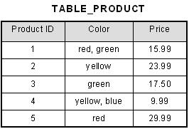

<!-- markdownlint-disable -->
[gimmick: math]()

<script type="text/javascript">
$(function(){
            $(".innerlist").css({"padding-left": "15px"})
            $(".innerlist > li").css({"padding-bottom": "5px"})

            $("dt").css({"font-weight":"bold","color":"green"})
            $("dd").css({"margin-left": "10%"})
            
});
</script>
<!-- markdownlint-enable -->
<!--markdownlint-disable MD013 MD033 -->

# COMP 353 Final Summary

## Functional Dependencies

Definition: A **functional dependency** is a constraint derived from *meaning* and *interrelation* of attributes.

- A set of attributes \\(X\\) functionally determines a set of attributes \\(Y\\) if whenever 2 tuples have same value for \\(X\\), they **must have** the same value for \\(Y2\\).
  - \\( X \rightarrow Y \\) is called a functional dependency because there is a function that takes each attribute in \\( X \\) and returns at most one value for the attributes in \\( Y \\).

- More formally:
  - Suppose \\(R\\) is a relation schema, and \\(X,Y \subset R\\).
  - A **functional dependency** on \\(R\\) is a statement of the form \\(X\rightarrow Y\\):
    - *For every valid instance \\(r\\) of \\(R\\), and for all pairs of tuples \\((t1,t2)\\), if \\((t1,t2)\\) agree on the values in \\(X\\), then \\((t1,t2)\\) agree also on the values in \\(Y\\).

- Functional dependenceis can be **trivial** or **non-trivial**.
  - An FD \\(X \rightarrow Y \\) is said to be **trivial** if \\( Y \in X \\), e.g. \texttt{\{title,year\} \\( \rightarrow \\) title}

## FDs - Deriving additional functional dependencies

### Method 1: Using inference rules

- Given relation schema \\(R\text{ and subsets } X,Y,Z\\):

|Axiom|Meaning|
|-----|-------|
|Reflexivity|If \\(Y \subset X,\text{ then } X \rightarrow Y\\)|
|Augmentation|If \\(X \rightarrow Y,\text{ then } XZ \rightarrow YZ,\text{ for every } Z\\)|
|Transitivity|If \\(X \rightarrow Y \text{ and } Y \rightarrow Z,\text{ then } X\rightarrow Z\\)|
|Union|If \\(X \rightarrow Y \text{ and } X \rightarrow Z,\text{ then } X\rightarrow YZ\\)|
|Decomposition|If \\(X \rightarrow YZ,\text{ then } X \rightarrow Y, X \rightarrow Z\\)|
|Pseudotransitivity|If \\(X \rightarrow Y \text{ and } WY \rightarrow Z,\text{ then } XW\rightarrow Z\\)|

### Method 2: Closure test

Definition: - The **closure of F** (denoted by \\(F^+\\), is the set of every FD such that \\( X \rightarrow Y\\).

- \\(Y\\) is a set of attributes, as is \\(Y^+\\).

Example: Given \\(R(X,Y,Z,W)\\) with FDs \\(W\rightarrow Y, X \rightarrow Z\\), prove or disprove \\(F |= WX \rightarrow Y \\).

|Step|Action|Result|
|----|------|------|
|Basis step| Assume the closure of a given attribute contains itself.|\\(WX^+ = WX\\)|
|Inductive step|<ul><li>Find FDs with LHS \\(X\\) containing members of \\(Y^+\\).</li><li> If \\(X\rightarrow A\text{, add }A\text{ to } Y^+\\)</li></ul>|<ul><li><ul><li>\\(W\rightarrow Y\\), so add Y to RHS: \\(WX^+ = WXY\\)</li><li>\\(X\rightarrow Z\\), so add Z to RHS: \\(WX^+ = WXYZ\\)</li></ul></li><li>\\(Y \in WX^+\text{ , so } WX \rightarrow Y\\) is implied.</li></ul>|

## FDs - Superkeys and Keys

- Definition: Given \\( X \rightarrow R \\), \\(X\\) is a **candidate key** of \\(R\\) if:
    1. The attributes of \\(X\\) functionally determine **all** of the attributes in \\(R\\)
    2. No proper subset of \\(X\\) is a key itself (i.e. it's minimal)

- A **superkey** determines all attributes of a relation.

- To determine if \\(A\\) is a superkey:
    1. Compute the closure of \\(A = A^+\\).
    2. If \\(A+\\) is equal to the full set of attributes, it **is** a superkey.

- To determine if \\(A\\) is a key:
    1. Confirm \\(A\\) is a superkey.
    2. If any subset of \\(A\\) is a superkey, then it's **not** a key.

## Canonical cover

Definition: A **canonical cover** is a simplified set of FDs that has the same closure as the original set.

Formal definition: A set \\(G\\) is a canonical cover of \\(F\\) satisfying:

### Algorithm to find the canonical cover, given a set of FDs

1. Use the **union rule** e.g., (\\( X \rightarrow Y, X \rightarrow YZ \equiv X \rightarrow YZ)) to combine any dependencies that share a LHS.
2. Find a FD \\(X \rightarrow Y \\) with an extraneous attribute on either side and remove it.
3. Continue until the set starts changing.

- Consider the set \\( F = \{ A\rightarrow BC, B \rightarrow C, A \rightarrow} B, AB \rightarrow C\} \\):
  - \\(A \rightarrow BC, A \rightarrow B \\) share a LHS and can be combined to get just \\(A \rightarrow BC \\)
  - \\( AB \rightarrow C \\) has an extraneous attribute, because even after removing it from the set we get the same closures (because \\( B \rightarrow C \\) is already a part of F).
  - C is extraneous in \\(A \rightarrow BC \\), because \\( A \rightarrow B \\) and \\( B \rightarrow C \\).
  - After this, we can continue repeating the process, but the set stops changing.
  - We're left with \\( F_c = \{ A \rightarrow B, B\rightarrow C \} \\), which is the required canonical cover for \\(F\\).

## Decomposition

Definition: A decomposition of a relation \\(R\\) is a set of two (or more) non-empty relations \\(R_1 \cup R_2 ... \cup R_n = R\\).

## Decomposition Property : Lossless-join

- Decomposition of a relation R into R1 and R2 is said to be a **lossless-join decomposition** if at least one of the following functional dependencies are in F+ (Closure of functional dependencies), i.e.:
  - \\ R_1 \cap R_2 \rightarrow R_1 \exists F^+ \\), or
  - \\ R_1 \cap R_2 \rightarrow R_2 \exists F^+ \\)

- A decomposition is guaranteed to be lossless-join if \\(R_1 \times R_2 = R\\)

### Verifying binary lossless-join decomposition:

Three conditions must hold:
1. The **union** of the attributes of \\( R_1 \\) and \\( R_2 \\) must be equal to the attributes of \\(R\\): \\( Attr(R_1) \cup Attr(R_2) = Attr(R) \\)
2. The **intersection** of the attributes of \\( R_1 \\) and \\( R_2 \\) must not be be NULL: \\( Attr(R_1) \cap Attr(R_2) \neq \emptyset \\)
3. Common attribute(s) must be a key for at least one relation: \\( Attr(R_1) \cap Attr(R_2) \rightarrow Attr(R_1)\\), or \\( Attr(R_1) \cap Attr(R_2) \rightarrow Attr(R_2) \\)

### Verifiying n-ary lossless-join decomposition:

Example: Given relation \\(R(A,B,C,D)\text{ with FDs } F=\{A\rightarrow B, B \rightarrow C, C \rightarrow D\} \\), is \\(R_1(A,B), R_2(A,C), R_3(A,D) \\) a lossless decomposition?

1. \\(R_1 \cup R_1 \cup R_3) = (A,B,C,D) = R\\), so condition 1 holds.
2. \\(R_1 \cap R_1 \cap R_3) = (A), so condition 2 holds. 
3. \\(A\\) is a key for \\(R_1\\), since \\(A\rightarrow B \\), so condition 3 holds. 

### Decomposition Property : Dependency preserving

If we decompose a relation \\(R\\) into relations \\(R_1,R_2\\), all dependencies of \\(R\\) must either be part of \\(R_1,R_2\\) or deriable from the combination of their FDs.

## Normal Forms

- Normal forms exist to minimize redundancy.

|Form|Requirements|
|----|------------|
|1NF | <ul><li>All column entries are atomic/indivisible</li><li>There are no repeating groups (e.g. multiple columns with identical data types</li></ul>|
|2NF | <ul><li>Is in 1NF</li><li>All non-key attributes are fully functionally dependent on primary key</li></ul>|
|3NF | <ul><li>Is in 2NF</li><li>There is no transitive functional dependency</li></ul>|
|BCNF| <ul><li>Is in 3NF</li><li>For each FD \\(X \rightarrow Y \\), \\(Y\\) is a subset of \\(X\\).</li><li>For each FD \\(X \rightarrow Y \\), \\(X\\) is a superkey.</li></ul>

(examples, images from 1keydata.com)

### First normal form (1NF)



This table is not in first normal form because the [Color] column can contain multiple values. For example, the first row includes values "red" and "green."

To bring this table to first normal form, we split the table into two tables and now we have the resulting tables:


### Second normal form (2NF)


This table has a composite primary key [Customer ID, Store ID]. The non-key attribute is [Purchase Location]. In this case, [Purchase Location] only depends on [Store ID], which is only part of the primary key. Therefore, this table does not satisfy second normal form.

To bring this table to second normal form, we break the table into two tables, and now we have the following:


### Third Normal Form (3NF)


In the table above, [Book ID] determines [Genre ID], and [Genre ID] determines [Genre Type]. Therefore, [Book ID] determines [Genre Type] via [Genre ID] and we have transitive functional dependency, and this structure does not satisfy third normal form.

To bring this table to third normal form, we split the table into two as follows:


Now all non-key attributes are fully functional dependent only on the primary key. In [TABLE_BOOK], both [Genre ID] and [Price] are only dependent on [Book ID]. In [TABLE_GENRE], [Genre Type] is only dependent on [Genre ID].

#### Decomposition to 3NF (synthesis)

1. Get minimal cover \\(F_c \\) of \\(F\\).
2. For each FD \\(X \rightarrow Y\\) in \\(F_c \\), add \\(XY\\) to decomposition.
3. If the decomposition is not lossless, add an extra relation containing any key of R. 

### Boyce-Codd Normal Norm (BCNF)

#### Decomposition to BCNF:

  1. Find a nontrivial FD \\(X \rightarrow Y \\) where X is not a superkey. 
  2. Split into two tables:  
    - One with attributes X,Y (all attributes from the dependency)
    - One with X attributes, together with the remaining attributes from the original
  3. Repeat until all tables are in BCNF.

## Advanced SQL queries

### Set operations

- All below keywords can be suffixed with `ALL` to retain duplicates.
- `UNION` : the union of both sets.
- `INTERSECT` : the intersection of both sets.
- `EXCEPT` : the difference of both sets.

### Subqueries

- By placing parentheses around a query, its result can be used to compare values to a second collection of values. 

- Keywords:
  - `EXISTS (<subquery>)` : True if and only if `<subquery>` is not empty.
  - `S IN (<subquery>)` : True if and only if `S` is equal to one of the values in `<subquery>`.
  - `S NOT IN (<subquery>)` : True if and only if `S` is not equal to one of the values in `<subquery>`.
  - `S > ALL(<subquery>)` : True if and only if `S` is greater than every value in `<subquery>`.
  - `S > ANY(<subquery>)` : True if and only if `S` is greater than at least one of the values in `<subquery>`.

### Views

- A **view** is a relation defined in a database that is computed when needed, but not permanently stored, and can be queried like a regular relation.
- Views can also rename attributes. 

```sql
CREATE VIEW ParamountMovie(MovieTitle,PublicationYear) AS
SELECT title,year
FROM Movie
WHERE studioName = 'Paramount';
```

- A view can be **updated** if it refers to only one base table

### Domains

- A **domain** is a user defined data type, like a `typedef`.

e.g.

```sql
CREATE DOMAIN MovieTitle AS VARCHAR(50) DEFAULT 'unknown';
```

### SQL particularities

### NULL

- If a variable x resolves to NULL, then x + 3 = NULL.
- However, NULL is not a literal and will fail if used in this context.

#### Booleans

- SQL has 3 valued logic : `TRUE`, `FALSE`, and `UNKNOWN`
- This can cause issues, e.g. if `x = UNKNOWN`, `x OR NOT x` = UNKNOWN, not TRUE as we would expect. 

#### JOIN

- Given R, S:

|Join type| Result|
|---------|-------|
|R FULL OUTER JOIN S| Pads with NULLs the dangling tuples of R, S|
|R LEFT OUTER JOIN S| Pads with NULLs the dangling tuples of R only|
|R RIGHT OUTER JOIN S| Pads with NULLs the dangling tuples of S only|

## SQL - Constraints, Triggers, Referential Integrity

- Constraints include Primary key, Foreign key

### Referential integrity policies

- `REJECT`: throw a run-time error
- `CASCADE`: perform same operation on foreign keys
- `SET NULL`: sets the referencing attribute to null
- `SET DEFAULT`: returns to default value if one exists

- To use them on a case by case basis, add `ON [DELETE|UPDATE] [CASCADE|SET NULL | SET DEFAULT]` to a referenced key. 

### Attribute-based CHECK

- Provides a mechanism for more complex constraints, e.g. `(CHECK Salary >= 0)`

### Tuple-based CHECK

- May involve any attributes of the table
- Other attributes/tables may be involved but only in subqueries

### Assertions

- Boolean valued expressions that must always hold true. checked when a relation changes. 
- Defined outside table declarations. 

```sql
CREATE ASSERTION <assertion-name> CHECK(<condition>);
```

### Triggers (Event-Condition-Action)

```sql
CREATE TRIGGER NetWorthTrigger
AFTER UPDATE OF netWorth ON Exec -- [BEFORE|AFTER|INSTEAD OF] [INSERT|UPDATE|DELETE] (ON) <tablename>
REFERENCING
  OLD ROW as OldTuple
  NEW ROW AS NewTuple
FOR EACH ROW -- controls row-level or statement-level
WHEN( OldTuple.netWorth > NewTuple.netWorth)
BEGIN
  UPDATE EXEC
  SET netWorth = OldTuple.netWorth
  WHERE cert# = NewTuple.cert#;
END
```

- A **row-level trigger** is executed once for each tuple: `OLD ROW/NEW ROW`
- A **statement-level trigger** is executed only once for the entire statement: `OLD TABLE/NEW TABLE` (default)

## Datalog

- Extension of Prolog into the realm of databases.
- A Datalog program is a finite collection of rules and facts.
  - **Facts**: Concrete relation, e.g. `parent(Homer,Bart)`.
  - **Rules**: Indirect/derived relation, e.g. `parent(X,Y)`.

### Definitions

|Term | Definition|
|-----|-----------|
|Head | LHS of statement|
|Body | RHS of statement, separated with `AND`/`,` `OR`/`;` `NOT`|
|Atom | A formula of the form P(a,b,c...) on LHS|
|Local variable| Appears only in rule body. | 

### Comparison with Relational Algebra

Given R,S each containing `X,Y`.

| Type | Relational Algebra | Datalog |
|------|---------------|---------|
| Intersection | \\(A = R \cap S\\) | `A(X,Y) :- R(X,Y), S(X,Y)`|
| Union | \\( A = R \cup S \\) | `A(X,Y) :- R(X,Y).` `A(X,Y) :- S(X,Y).`|
| Difference | \\( A = R - S \\) | `A(X,Y) :- R(X,Y), NOT S(X,Y).` | 
| Projection | \\( A = \pi_{x}(R) \\) | `A(X) :- R(X,Y).` | 
| Selection  | \\( A = \sigma_{x > 10 AND y = 5}(R)\\) | `A(X,Y) :- R(X,Y), X > 10, Y = 5.` |
| Cartesian Product | \\( A = R \times S \\) | `A(X,Y,Z,W) :- R(X,Y), S(Z,W).`|
| Theta Join | \\( A = R \bowtie_{X>Z AND Y < W} S \\) | A(X,Y,Z,W) :- R(X,Y), S(Z,W), X > Z, Y < W.|
| Equijoin | \\(A = R \bowtie_{Y=Z} S\\) | `A(X,Y,Y,W) :- R(X,Y), S(Y,W).` | 
| Natural join | \\( A = R \bowtie S \\) | `A(X,Y,Z) :- R(X,Y), S(Y,Z).` |

### Safety

- Datalog can evaluate rules recursively, which can be very powerful.
- However, it is important to be rules to be *safe*, such that they terminate in finite time.
- For a rule to be safe:
  - If a variable X appears in the head, then X must appear in an 'ordinary' predicate in the body, or be equal to such a variable.

## ODL (Object Definition language)

- Every object is the instance of a **class**.

```java
class <name> { 
  //properties...
};
```

Example declaration of a class:

```java
class Movie (extent Movies key (title, year)) { 
   attribute string title;
   attribute integer year;
};
```

### ODL Collection types

  - `Set` : guarantees uniqueness.
    - e.g. `Set<integer>` declares a set of distinct integer numbers.
  - `Bag` : Allows duplicates.
    - e.g. `Bag<string>` declares a collection of strings, where some may have the same value.
  - `Array` : fixed list type
  - `Struct` : just like C. 
    - e.g. `Struct Address (string street, string city)`
  - `List` : growable list type
  - `Dictionary` : a key value store.

n.b. Collections cannot be nested, i.e. you can't have an `Array` of `List`, etc.

### Relation

- Relations can be added to a class definition with `relationship` and `inverse` keywords:

```java

class Movie {
  ...
  relationship Set<Star> stars
  inverse Star::starredIn;
}

class Star {
  ...
  relationship Set<Movie> starredIn
  inverse Movie::stars;
}
```

- By changing the type of relationship (e.g. `Set<Star>` vs `Star`) one can control whether it's a 1-1,1-M,M-1,or M-M relationship.

### Derived classes

- Multiple inheritance is possible.

```java
class HorrorMovie extends Movie {
  ...
};
```

