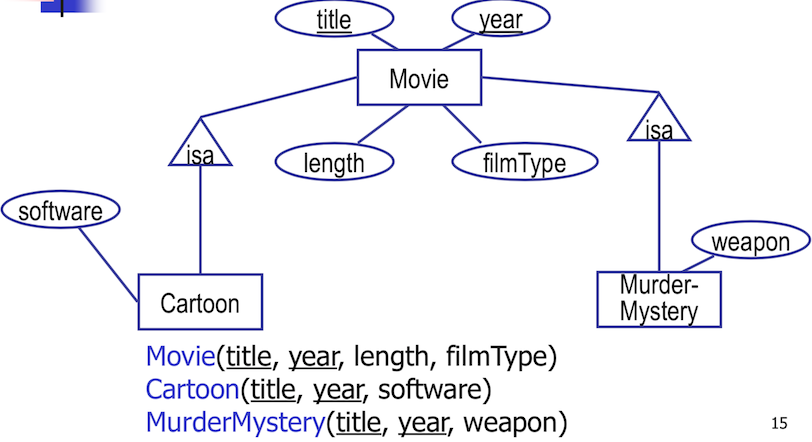
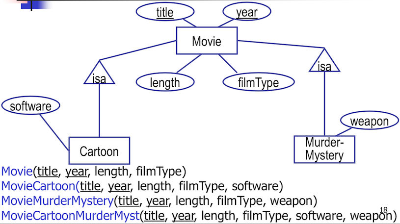

[gimmick: math]()


<script type="text/javascript">
$(function(){
            $(".innerlist").css({"padding-left": "15px"})
            $(".innerlist > li").css({"padding-bottom": "5px"})

            $("dt").css({"font-weight":"bold","color":"green"})
            $("dd").css({"margin-left": "10%"})
            
});
</script>


# COMP 353 Midterm Summary

## Introduction
### Various Definitions

|Term|Definition|Characteristics|
|----|----------|--------------|
|Database|Collection of organized data on persistent storage.||
|Database Management System (DBMS)| A complex software package to store and manage databases.|<dl><dt>Access &amp; Manipulation:</dt><dd>Convenient, efficient, and secure.</dd><dt>Programming interface:</dt><dd>Users can create, query, and modify data.</dd><dt>Persistent Storage:</dt><dd>Storage of data over long period of time.</dd><dt>Transaction management/recovery:</dt><dd>Controls access with ACID principles.</dd></dl>|
|Database System| Database + DBMS||
|ACID|Atomicity, Consistency, Isolation, Durability|<dl><dt>Atomicity</dt><dd>All transactions are committed completely, or not at all.</dd><dt>Consistency</dt><dd>Any transaction leaves the DB in a valid state. </dd><dt>Isolation</dt><dd>Concurrent transactions do not interfere with one another.</dd><dt>Durability</dt><dd>Once a transaction is commmitted, it is stored permanently.</dd></dl>|
|Instance| Current content of the database||
|Schema| Structure of the data, described by some model||
|Data Independence| Ability to modify definition of schema at one level, without affecting definitions at a higher level.|<dl><dt>Logical Data Independence</dt><dd>Ability to modify logical schema without requiring rewrite of programs</dd><dt>Physical Data Independence</dt><dd>Ability to modify physical schema without causing conceptual schema or applications to be modified.</dd></dl>|
|Cartesian Product| Set of all pairs \\((a,b)\\) such that \\(a \in R\\) and \\(b \in S\\)|`SELECT * FROM t1,t2`|
|Key|Attibute(s) that uniquely identify an entity within its entity set.||
|Weak entity set| An entity set without sufficient attributes to form a key.|Uses a set of attributes (*discriminator*) along with a key of a strong entity to form its key.|

### History

|System|Pros|Cons|
|------|----|----|
|File Processing Systems|<ul><li>Simple to implement</li><li>Leverages existing filesystem</li></ul>|<ul><li>Wastes space (stores fields in multiple files)</li><li>Inconsistent: Field may be updated in one file, but not another</li><li>No single coherent language</li></ul>|
|Database Systems|<ul><li>Minimizes data redundancy</li><li>Concurrent access</li><li>Centralized control</li><li>Security and authorization</li><li>Integrity and reliability</li><li>Data abstraction and independence</li></ul>||

### Models

|Model|Real-world example|
|-----|------------------|
|Entity-Relationship Model|<ul><li>Oracle</li><li>IBM</li><li>Informix</li><li>Microsoft</li><li>Sybase</li></ul>|
|Object-Oriented Data Model|<ul><li>ObjectStore</li><li>Postgres</li></ul>|
|Logical Data Model|<ul><li>Datalog</li></ul>|

### Levels of Abstraction

- Allows system to be simple to interact with, but complex enough to accomplish many tasks. 

|Name|Description|
|----|-----------|
|View (external)| Describes how users **see** the data|
|Conceptual| Defines the logical structure|
|Physical| Describes the storage structure and indices of data|

### DBMS Architecture

|Name|Responsibilities|
|----|----------------|
|Query Processor|<ul><li>Queries</li><li>Modifications (schema or data)</li></ul>|
|Query Optimizer|<ul><li>Find best plan to process query</li><li>Issue commands to storage manager</li></ul>|
|Storage Manager|<ul><li>Obtains requested information from storage</li><li>Modify the information on storage when requested</li></ul>|
|Transaction Manager|<ul><li>Ensure data consistency</li><li>Ensure simultaneous queries do not interfere with one another</li><li>Ensure data integrity under exceptional circumstances (power failure, etc)</li></ul>|

## SQL - Basics

### Revisions

- First developed at IBM (1976).
- Revised to first standard: SQL-86 (1986)
- Revised again to second standard: SQL-92 (1992)
- Latest standard: SQL-99/SQL3.

### Schema 

#### Attributes

|Attribute Type|Definition|
|----|----------|
|<ul><li>`INT`</li><li>`INTEGER`</li></ul>|Single integer number.|
|<ul><li>`REAL`</li><li>`FLOAT`</li></ul>|Single floating point number|
|<ul><li>`DECIMAL(n,d)`</li><li>`NUMERIC(n,d)`</li></ul>|`n` denotes total number of characters, `d` denotes number following decimal point.|
|<ul><li>`CHAR(n)`</li><li>`BIT(b)`</li></ul>| Fixed length character/bit string, padded if not enough characters.|
|<ul><li>`VARCHAR(n)`</li><li>`BIT VARYING(n)`</li></ul>|Variable length strings up to `n` characters.|
|<ul><li>`DATE`</li></ul>|`YYYY-MM-DD`|
|<ul><li>`TIME`</li></ul>|`HH:MM:SS`|

#### Attribute Properties

|Attribute Property|Definition|
|------------------|----------|
|`NOT NULL`| Must have a real value.|
|`DEFAULT`| Defines a default value for attribute, if it is not provided.|
|`UNIQUE`| Ensures all values in a column are different.|
|`PRIMARY KEY`|Combines `NOT NULL` and `UNIQUE`|
|`FOREIGN KEY`| Uniquely identifies a record in another table.|
|`CHECK`| Ensures values match a specific condition. Not implemented in MySQL.|

## SQL (DDL) - Creating, altering and deleting tables

```sql
CREATE TABLE Star (
    name CHAR(30),
    address VARCHAR(255),
    gender CHAR(1),
    birthdate DATE
);
```

### Altering existing tables

Example: Adding columns:

```sql 
ALTER TABLE Star 
ADD phone CHAR(16);
```

Example: Removing columns

```sql
ALTER TABLE Star
DROP COLUMN phone;
```

## SQL (DML) - Queries

### Selection

```sql
SELECT S1,S2,...,Sn
FROM T1,T2,....Tn
WHERE C1
GROUP BY A1,...,Ak
HAVING C2
```

- Conditions can be grouped:

```sql
SELECT ID
FROM Student
WHERE firstName = 'John' AND GPA > 3;
```

- A complex SQL query can be evaluated easily by splitting it into chunks:

|Evaluation Step|Result|
|---------------|------|
|Evaluate **FROM-WHERE**: apply \\(C1\text{ on } R1,...,Rn\\) ||
|**GROUP BY** attributes \\(a_1,...,a_k\\)||
|Apply **HAVING** condition \\(C_2\\) to each group||
|Compute aggregates in **SELECT**, return result.||

Hint: `WHERE` clauses contain conditions on **individual tuples**, whereas `HAVING` clauses contain condition on **aggregates**.

#### Qualifiers

- Following `WHERE`, comparison operators may be used:
    - Arithmetic comparisons: `=, <>, <, >, <=, >=`
    - Arithmetic operators: `+,-,*,/`
    - Boolean operators: `AND,OR,NOT`

- Make sure when comparing two tables to have title = title, year = year, etc., otherwise duplicates and stuff.
- When dealing with possible `NULL` values, one can use `IS NULL` and `NOT NULL` to avoid issues. 

- Pattern matching: Use `LIKE` operator on a string.
- Use `LIKE "something#%" ESCAPE '#'` to escape and search `something%`

|Character|Action|
|---------|------|
|`%`|Any sequence of zero or more characters|
|`_`|Any single character|

#### Modifying `WHERE`:

##### `ALL`: Find products more expensive than all products produced by G:

```sql
SELECT name
FROM   Product
WHERE  price > ALL(
  SELECT price
  FROM   Product
  WHERE  maker = ‘G’)
```

##### `ANY`: Find products more expensive than any **one product** produced by G:

```sql
SELECT name
FROM   Product
WHERE  price > ANY(
  SELECT price
  FROM   Product
  WHERE  maker = ‘G’)
```

##### `EXISTS` : Find products where there exists some product with the same price produced by G:

```sql
SELECT name
FROM   Product p1
WHERE  EXISTS (
  SELECT *
  FROM   Product p2
  WHERE  p2.maker = ‘G’
    AND  p1.price =         p2.price)
```


## SQL (DML) - Basic Aggregation:

- `NULL`s are ignored.

|Operator|Action|
|--------|------|
|`SUM`|Returns sum of all values in column|
|`AVG`|Returns \\( \frac{SumOfValues}{numOfValues} \\)|
|`MIN`|Returns smallest value in column|
|`MAX`|Returns largest value in column|
|`COUNT`|Returns number of values, including duplicates. Use `DISTINCT` to not count dupes.|

Examples:
```sql
SELECT AVG(netWorth)
FROM Exec
```

```sql
SELECT COUNT(DISTINCT name)
FROM Exec;
```

Note: `COUNT(*)` will count all rows in the table, whereas `COUNT(columnName)` will only count rows that do not have `NULL` in `columnName`.

#### `GROUP BY`

- `NULL`s are counted.
- Whatever aggregation used in the `SELECT` statement will be applied only within groups.
- Used to group the tuples according to the value of a column.
- Example: What is the total length in minutes of films produced by each studio?

```sql
SELECT studioName, SUM(length)
FROM Movie
GROUP BY studioName;
```

Warning: `GROUP BY` cannot use column aliasing!  

Hint: When using `GROUP BY` and aggregate functions, any items in the `SELECT` list not used as an argument to an aggregate function must be included in the `GROUP BY` clause.  

#### `HAVING`

- The `HAVING` keyword allows us to choose a group based on a property of the group.

Example: For those producers who made at least one film prior to 1930, list the total length of the films produced.

```sql
SELECT Exec.name, SUM(Movie.length)
FROM Exec, Movie
WHERE producerC# = cert#
GROUP BY Exec.name
HAVING MIN(Movie.year) < 1930;
```

Warning: Only attributes mentioned in `GROUP BY` can appear unaggregated in the `HAVING` clause!

#### `ORDER BY`

- Allows a grouping/relation to be displayed in a specified order.

Example: For those producers who made at least one film prior to 1930, list the total length of the films produced, in ascending order of name.

```sql
SELECT Exec.name, SUM(Movie.length)
FROM Exec, Movie
WHERE producerC# = cert#
GROUP BY Exec.name
HAVING MIN(Movie.year) < 1930
ORDER BY Exec.name ASC;
```

## SQL (DML) - Joining Relations:

```sql 
SELECT ...
FROM ...
<LEFT/INNER/RIGHT> JOIN table2 on table1.attr1 = table2.attr1;
```

|Type|Definition|Comments|
|----|----------|-------|
|`INNER JOIN`|Returns records that have matching values in both tables.|Works like set intersection.|
|`LEFT JOIN`| Returns all records from left table, and matched records from right table.|Always returns all records from left table, even if no matches on the right.|
|`RIGHT JOIN`| Returns all records from right table, and matched records from left table.|Always returns all records from right table, even if no matches on the left.|
|`FULL OUTER JOIN`|Returns all records when there is a match in either left or right table record.|Returns all rows from left and right tables.|

- Regular `JOIN`s/`INNER JOIN`s are same as S-F-W queries:

```sql
SELECT Product.name, Purchase.store
FROM   Product 
  JOIN Purchase ON Product.name = Purchase.prodName

// is equivalent to //

SELECT Product.name, Purchase.store
FROM   Product 
INNER JOIN Purchase ON Product.name = Purchase.prodName


// is equivalent to //

SELECT Product.name, Purchase.store
FROM   Product, Purchase
WHERE  Product.name = Purchase.prodName
```

## SQL (DML) - Inserting, Modifying, and Deleting values

Given schema: `StarsIn (title, year, starName)`

Example: Adding single elements:

```sql
INSERT INTO StarsIn (title,year, starName)
VALUES (’The Maltese Falcon’, 1942, ’Sydney Greenstreet’);

// OR //

INSERT INTO StarsIn
VALUES (’The Maltese Falcon’, 1942, ’Sydney Greenstreet’);
```

Example: Adding multiple elements

```sql
INSERT INTO StarsIn
VALUES (filmName1,date1,starName1),
       (filmName2,date2,starName2),
       ...,
       (fileNamen,daten,starNamen);

```

Example: Adding a full set

```sql
INSERT INTO Studio(name)
SELECT DISTINCT studioName
FROM Movie
WHERE studioName NOT IN (SELECT name
                         FROM Studio);
```

### Deletion

Example: **Deleting single elements**:

```sql
DELETE FROM StarIn
WHERE title = ’The Maltese Falcon’ AND
starName = ’Sydney Greenstreet’;
```

Example: **Deleting multiple elements** : Delete from `Studio` those studios not mentioned in `Movie`.

```sql
DELETE FROM Studio
WHERE name NOT IN (SELECT StudioName
FROM Movie);
```

### Updating

Example: Modify table Exec by attaching the title ‘Pres. ’ in front of the name
of every movie executive who is also the president of some studio.

```sql
UPDATE Exec
SET name = ’Pres. ’ || name 
WHERE cert IN (SELECT presC
                FROM Studio);
```

## Relational Algebra

|Name|Operator|SQL Equivalent|Action|Example|
|----|--------|--------------|------|-------|
|Select|\\(\sigma_p(r)\\)|`SELECT *...`|Selects tuples from relation \\(r\\) that satisfy a predicate \\(p\\)|\\(\sigma_{name="lemon"}(Cats)\\)|
|Project|\\(\pi\_{a_{n}}(r)\\)|`SELECT x,y...`|Selects columns from relation \\(r\\)that match \\(a_{n}\\)|\\(\pi_{name,breed}(Cats)\\)|
|Union|\\(\cup\\)|`UNION`| Joins two given relations.| \\(A \cup B\\)|
|Difference|\\(A - B\\)|n/a| Subtracts elements present in relation B from relation A.| |
|Cartesian Product|\\(A \times B\\)|`JOIN`|Combines information of two different relations together.| ||
|Theta join \\(\theta\\) | \\( R \bowtie_c S\\)| | Gets the set of all tuples from \\(R,S\\) fulfilling some condition \\(C\\) |
|Equijoin | \\( R \bowtie_c S\\)| | Special case of theta join that can only use \\( = \\) operator.|
|Natural join| \\( R \bowtie S\\) | | If \\(R,S\\) have common attributes, they are combined in output schema. |
|Rename | \\( \rho_{a/b}(R) \\) | | Used to copy schema of \\(R\\) with \\(a\\) renamed to \\(b\\) | 
|Rename | \\( \rho_{s}(R) \\) | | Used to copy entire relation \\(R\\) to \\( S \\) | |
|Division | \\( \div \\) | | |  

Constraints can be expressed in relational algebra in two ways:

1. \\(r = \emptyset \\) : where r is an expression, i.e. the result of r must be null.
2. \\(R \subset s \\): every tuple in the result of r is in the result of s.

## ER Model - Basics

Definition: The ER, or **Entity-Relationship model** is a graphical approach to data modeling, allowing *n-ary* relationships.

- The ER model does not deal with single entities, but **entity sets**.

### Primitives

 


- Sharp arrow: **at most one**
    - 
- Rounded arrow: **exactly one**
    - 

## ER Model - Relationships

Definition: Given two sets \\(A,B\\), a **relationship** is a subset of the *cross product* of the sets.

|Types|Representation|Meaning|
|-----|--------------|-------|
|A (many-one) B| \\(\Box \rightarrow \Box\\)| Each entity in \\(A\\) is related to **at most one** entity in \\(B\\).|
|A (one-one) B | \\(\Box \leftrightarrow \Box\\) | Each entity in \\(A\\) is related to **at most one** entity in \\(B\\), and vice versa.|
|A isa B| \\(A \triangleright B\\) | \\(A\\) inherits from \\(B\\)|

- Sometimes it is more appropriate to associate attributes with a relationship rather than an entity set.
- An inherited entity has whatever attributes any of its components have, and participates in whatever relationships its components participate in. 

### ER Model - Relationships to Weak Entity Sets

|Type|Characteristics|
|----|---------------|
|Many to Many| <ul><li>Convert relationship \\(R\\) to a weak entity set, joined by weak relatonships.</li><li>Add its own attributes and keys of the parent as attributes.</li></ul>|
|Many to One) | <ul><li>Convert relationship \\(R\\) to a weak entity set, joined by weak relationships. </li><li>Add the keys of the *many* side as key attributes, plus the attributes of \\(R\\).</li><li>On the *one* side, assign key(s) of many side as keys, and any keys of the one side as regular attributes.</li></ul>|
|One-to-One|<ul><li>Split relationship \\(R\\) into weak entity set and two weak relationships \\(R,WR1,WR2\\).</li><li>One of the two weak relationships will be one-to-one on both sides, and the other will be many to one.</li></ul>|

- To convert n-ary relationships:
    - Create a new connecting weak entity set to represent rows of a relationship set.
    - Many-one relationships from the connecting weak entity set to the others. 


### Constraints

- **Single-value** constraints are requirements that a value be unique.
    - e.g. The value for \\(A\\) must exist, if \\(A\\) is part of the key.
    - The value for \\(A\\) is optional otherwise.
- **Referential integrity** constraints are requirements that a value referred to must actually exist.
    - e.g. A movie studio must always exist in `Studio`
    - If someone is a CEO, the studio they run must exist in `Studio`
    - Looks like \\(\Box -\diamond \rightarrow \Box \leftarrow -\Box \\)
- **Relationship degree** constraints restrict the number of entities in the entity sets in the relationship.
    - e.g. A student may enroll in \\(\leq 5\\) courses, represented by writing the constraint along the relationship line.
- **Domain** constraints require that the value of an attribute must be within a specific set of values.

### Converting to Relational Data Model

1. For each entity set \\(E\\), create a **relation schema** with the same name and set of attributes.  
    - 
    - becomes:
    - Courses (__courseNumber__, name, credits)
2. For each relationship \\(R\\), create a **table** with the same name.
    - The set of attributes of the relation includes:
        - Key attributes of **each attached entity set**
        - Any attributes \\(R\\) may have
    - 
    - becomes: 
    - EnrolledIn(__ID__,__courseNumber__,grade)
3. For each weak entity set \\(W\\), create a **relation schema** with all the attributes of \\(W\\) as well as any key attributes of strong entity sets it's attached to. 
    - ===add img===

## ER Model - Determining the Key of a relationship

- If \\(R\\) is a binary relationship betweeen \\(E1,E2\\):
    - If \\(R\\) is Many-to-Many, the keys of \\(E1,E2\\) together form the key of \\(R\\).
    - If \\(R\\) is Many-to-One from \\(E1\\) to \\(E2\\), The key of \\(E1\\) is part of the key of \\(R\\).
    - If \\(R\\) is One-to-One from \\(E1\\) to \\(E2\\), then either the key of \\(E1\\) or the key of \\(E2\\) is part of the key of \\(R\\), but not both. 

## ER Model - Dealing with `isa` inheritance

|Method|Characteristics|Attributes|Illustration|
|------|---------------|----------|------------|
|Straight E/R|<ul><li>One relation per subclass</li></ul>|<ul><li>Key attributes of parents</li><li>Attributes of that subclass</li></ul>||
|Object-Oriented|<ul><li>One relation per subset of subclasses</li></ul>|<ul><li>Inherit keys and other attributes from parent</li></ul>||
|Null method|<ul><li>One single relation</li></ul>|<ul><li>Entities have `NULL` in attributes that don't belong to them.</li></ul>||


### E/R approach

- For each entity set \\(E\\), create a table \\(e\\) with attributes \\(a\\) such that:
    - \\(a\\) belongs to \\(E\\)
    - \\(a\\) is the key attribute of the parent relation

### Object oriented approach

===add contents===

### Null approach

- Use a single relation with all values of any attached entity sets.
- An object is represented by a typle that has `NULL` in each attribute that is not defined for that entity.
- May allow efficient query processing but wastes space.


