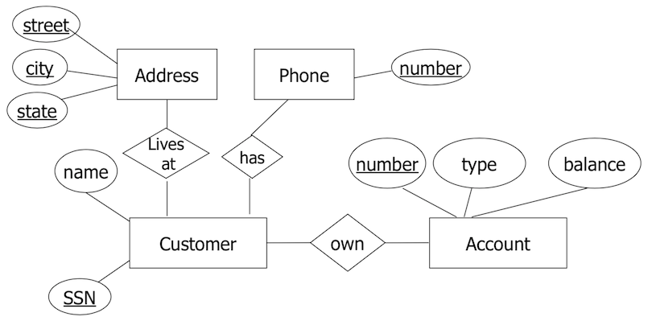

#Tutorial 1

##1.1
```sql
name address precsC# name address cert# netWorth
```
##1.2.1
```sql
select name
from MovieStar
where (gender = "Male" OR address like "%Montreal%");
```
## 2-3
```sql
SELECT movieTitle 
FROM Movie, StarsIn
WHERE (starName = "Harrison Ford" 
       AND title = movieTitle
       AND year = movieYear
       AND Movie.inColor = TRUE);
```

## 3-1
```sql
SELECT AVG(price) 
FROM Sells, Bars
WHERE (Sells.beer = "Molson Canadian"
       AND Bars.city = "Montreal"
       AND Sells.bar = Bars.name);
```

## 3-2
```sql 
SELECT COUNT(DISTINCT Bars.name)
FROM Bars,Likes,Sells
WHERE ( Bars.city = "Montreal"
        AND Likes.drinker = "Richard"
        AND Likes.beer = Sells.beer
        AND Bars.name = Sells.bar
        AND Sells.price < 5.00);
```

## 3-3

```sql
SELECT name 
FROM Bars
WHERE ( ((address = NULL) AND (phone <> NULL))
       OR ((address <> NULL ) AND (phone = NULL));
```

## 4-1

```sql
SELECT k1.child, k2.parent 
FROM Parents k1, Parents k2
WHERE k1.parent = k2.child;
```

## 5

```sql
CREATE TABLE Employee (
                        firstName VARCHAR(20),
                        lastName VARCHAR(20),
                        SIN INT PRIMARY KEY,
                        empNum INT UNIQUE,
                        birthdate DATE,
                        address VARCHAR(50),
                        gender CHAR(1),
                        salary DECIMAL(10,2));
```


## notes:
- Foreign key : attribute(s) in a table that match the primary key in another table

Example: 

```sql
CREATE TABLE Supplier (
                        supplier_id INT PRIMARY KEY,
                        supplier_name VARCHAR(30));

CREATE TABLE Product (
                        product_id INT PRIMARY KEY,
                        product_name VARCHAR(30),
                        supplier_name VARCHAR(30),
                        FOREIGN KEY (supplier_id) REFERENCES Supplier(supplier_id));
```


# Tutorial 2

## 1 

Layered architecture/levels of abstraction.

## 2

```sql
UPDATE Articles
SET text = headline
WHERE text IS NULL;
```

## 3
```sql
SELECT vendor_id
FROM Product
WHERE product_price >= 4
GROUP BY vendor_id
HAVING COUNT(*) >= 2;
```

## 4
###a
If you modify the WHERE clause
###b
No.

## 5
### a
```sql
SELECT DISTINCT movie.title
FROM movie,movie AS mov
WHERE movie.title = mov.title 
      AND movie.year <> mov.year;
```

### b : Total length of all movies for only those producers who made >= 1 film prior to 1950
```sql
SELECT producer, SUM(length)
FROM movie
GROUP BY producer
HAVING MIN(year) < 1950;
```


# Tutorial 3 : E/R Model

## 1-1 : Draw an E/R diagram to model a database for a bank.

- Customer : name, address, phone, SSN
- Accounts : numbers, type, balances
- Accounts can have several customers, customers can have multiple accounts.


## 4-1 : Change original design

- Customer can have a set of addresses (street,city,state) and a set of phone numbers.



## 5-1 : Include set of addresses. At each address, include set of phones.


# Tutorial 4 : Convert E/R to Relation

## 2: Convert E/R diagram to relational schemas.


## SQL

- PrimaryDomain(__name__)
- SecondaryDomain(__secondaryDomainName__,__primaryDomainName__)
- Host(__hostName__,__secondaryDomainName__,__primaryDomainName__)

### Basic tips

- Make sure when comparing two tables to have title = title, year = year, etc., otherwise duplicates and stuff.
- Can only use boolean conditions in WHERE clause

### HAVING,GROUP BY
- Only attributes mentioned in `GROUP BY` can appear unaggregated in the `HAVING` clause
- `GROUP BY` cannot use column aliasing.
- When using `GROUP BY` and aggregate functions, any items in the `SELECT` list not used as an argument to an aggregate function must be included in the `GROUP BY` clause. 
- `COUNT(*)` will count all rows in the table, whereas `COUNT(columnName)` will only count rows that do not have `NULL` in `columnName`.

### Pattern matching

- Use `LIKE` operator on a string.

|Character|Action|
|---------|------|
|`%`|Any sequence of zero or more characters|
|`_`|Any single character|


- Use `LIKE "something#%" ESCAPE '#'` to escape and search `something%`


## E/R

- Sharp arrow: at most one 
- Rounded arrow: exactly one 
- Try to avoid redundancy in design, both for your own sanity and for database integrity. 

### Converting n-ary relationships

- Create a new connecting weak entity set to represent rows of a relationship set.
- Many-one relationships from the connecting weak entity set to the others. 

### Relationships -> Weak Entity Sets

|Type|Characteristics|
|----|---------------|
|Many to Many| <ul><li>Convert relationship \\(R\\) to a weak entity set, joined by weak relatonships.</li><li>Add its own attributes and keys of the parent as attributes.</li></ul>|
|Many to One) | <ul><li>Convert relationship \\(R\\) to a weak entity set, joined by weak relationships. </li><li>Add the keys of the *many* side as key attributes, plus the attributes of \\(R\\).</li><li>On the *one* side, assign key(s) of many side as keys, and any keys of the one side as regular attributes.</li></ul>|
|One-to-One|<ul><li>Split relationship \\(R\\) into weak entity set and two weak relationships \\(R,WR1,WR2\\).</li><li>One of the two weak relationships will be one-to-one on both sides, and the other will be many to one.</li></ul>|

### Subclass -> Relation

|Method|Characteristics|Attributes|Illustration|
|------|---------------|----------|------------|
|Straight E/R|<ul><li>One relation per subclass</li></ul>|<ul><li>Key attributes of parents</li><li>Attributes of that subclass</li></ul>|||
|Object-Oriented|<ul><li>One relation per subset of subclasses</li></ul>|<ul><li>Inherit keys and other attributes from parent</li></ul>||
|Null method|<ul><li>One single relation</li></ul>|<ul><li>Entities have `NULL` in attributes that don't belong to them.</li></ul>||

## Functional Dependencies

- Constraints derived from **meaning** and **interrelation** of attributes
- A set of attributes \\(X\\) functionally determines a set of attributes \\(Y\\) if whenever 2 tuples have same value for \\(X\\), they **must have** the same value for \\(Y2\\).

- Examples:
  - SIN -> EmployeeName
  - ProjNumber -> ProjName,ProjLocation

### Superkeys

- \\(K\\) is a **superkey** for \\(R\\) if \\(K\\) functionally determines all the attributes in \\(R\\).
- Any superkey is also a key.
- No proper subset of a superkey is itself a superkey.

### Closure test

- \\(Y\\) is a set of attributes, as is \\(Y^+\\).
- Basis step: \\(Y^+ = Y)
- Inductive step:
  - Look for an FD with LHS \\(X\\) that is a subset of the current \\(Y^+\\)
  - If FD is \\(X\rightarrow A\\), add \\(A\\) to \\(Y^+\\).