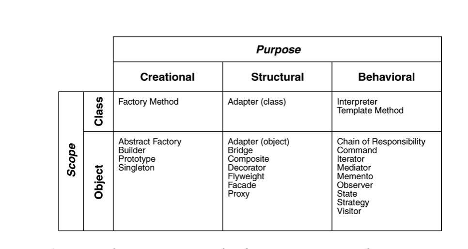

[gimmick: math]()
<link rel="stylesheet" href="data:text/css,li.con%20%7B%20list-style-image%3A%20url('pages/school/COMP354/images/icons8-minus-48.png');%20color%3Ared%20%7D%20li.pro%20%7B%20list-style-image%3A%20url('pages/school/COMP354/images/icons8-plus-48.png');color%3A%20green%20%7D" />

# Software Engineering

- "**Software engineering** is the systematic approach to development, maintenance, organization of software systems."

- Software costs dominate computer systems
- Maintenance costs may be much higher than development costs
- Need to balance 'dark forces', e.g. cost, time, competition

## Software Life Cycle Models

- In theory, development is linear. But in practice, usually much more chaotic.
- The **moving target** problem happens when requirements change during development. **No solution!**
- **Regression faults** occur when a change causes a fault somewhere else in the software
- **Miller's law** suggests that we can only focus on ~7 things at a time, so it pays to concentrate/specialize
    - **Stepwise refinement** allows all problems to be tackled, but in the order of current importance

- A 'software crisis' occurred as systems grew more and more complex, Software Development models are a response to that.

|Model|Characteristics|Pros| Cons|
|-----|---------------|----|-----| 
|Code and Fix| No design/specifications|**Easiest** to develop| **Hardest** to maintain|
|Waterfall| <ul><li>Linear model with feedback loops</li><li>Phase only completed when documentation and QA completed</li></ul>|Rigourously documented, so easier to maintain | Docs are long, detailed, boring|
|Rapid-Prototyping| Working model that is functionally equivalent to a subset of the product| <ul><li>Essentially linear </li> <li>Needs fewer feeback loops</li><li>Fast development</li></ul>| Lots of code discarded if needs aren't accurately gauged up front |
|Open-Source| <ol><li><b>First phase:</b> Individual or small group builds initial version and shares it</li><li>Second phase: Report defects, add functionality, create ports</li></ol>| <ul><li>Users can both submit defect reports and fix bugs</li><li>Releases early and often</li></ul> | <ul><li>Usually not as much testing</li><li>Restricted applicability</li><li>Doesn't always follow specs/design</li></ul>|
|Evolution tree| Baseline, artifacts | | | 
|Iterative-and-Incremental| <ul><li>No single requirements/design phase, but multiple instances</li><li>At different times, one workflow predominates</li><li>Like a set of mini-waterfalls</li></ul>|<ul><li>Allows mitigating risks early</li><li>Always have a working version</li></ul>||
|Spiral| <ul><li>Rapid prototyping + risk analysis at each phase</li><li>If risks can't be mitigated, project is terminated</li></ul>|<ul><li>Emphasizes alternatives and constraints to allow reuse of existing software</li><li>Incorporates software quality as a specific objective</li><li>No distinction from development/maintenance</li></ul>|<ul><li>Only works for large-scale projects</li><li>Only works for in-house software development</li></ul>|
|Agile| <ul><li>Based on iterative-incremental model</li><li>based on <b>stories</b> the client would like to support</li><li>Emphasizes <b>test-driven development</b> and <b> pair programming</b></li><li>No specialization, no overall design, all done while building</ul>|<ul><li>Constant communication with client</li><li>Responds quickly to change</li><li>Good for when requirements are vague or changing</li></ul>|<ul><li>Too soon to evaluate overall success</li><li>Refactoring costs</li></ul>|
|Synchronize-and-Stabilize|<ul><li>Microsoft's lifecycle model</li><li>Find most important features by interviewing clients</li><li>**Synchronize** at end of each day</li><li>**Stabilize** at end of each build</li></ul>|<ul><li>Repeated synchronization ensures components work together</li><li>Early insight into operation so requirements can be modified</li></ul>|&nbsp;|

### Other mentioned styles

#### Based on Waterfall

- **iterative feedback** : each step has a feedback loop to perform QA
- **B-Model**: shaped like a lower case `b`. Once initial development done, loop on eolutionary enhancement
- **Incremental**: Waterfall in 3d, kind of like spiral (z-axis contains a series of waterfalls)
- **V-model** : LHS is evolution of user requirements, RHS is integration and verification. Y-axis is level of decomposition from system level

#### Other

- **Wheel and spoke** :
    + Based on **Spiral**
    + Each successive stage goes around requirements to become a spoke on a wheel
- **Unified process model**:
    + Iterative in nature
    + Uses risk-management mainly like spiral
    + Also known as the **RUP** ,(Rational Unified Process) model

### Agile
#### Principles

1. Highest priority is to satisfy customer via early+continuous delivery  
2. Welcome changing requirements, even late in development  
3. Deliver frequently, prefer often  
4. Business people + developers must work together throughout the project  
5. Build projects around motivated individuals  
6. Most efficient and effective method of conveying information is face-to-face
7. Working software is the primary measure of progress
8. Agile processes promote sustainable development; pace should be unchanging
9. Continuous attention to technical excellence and design
10. Simplicity is essential
11. Best architectures, requirements, and designs emerge from self-organizing teams
12. At regular intervals, team reflects on how to become more effective

#### Dumb Agile Vocabulary

- **Pair programming:** One 'drives', the other 'navigates'
- **scrum**: iterative cycle of **sprints**
- **sprint**: (usually) 30 day cycle on development and testing -> one iteration

## Modeling

- Three types of requirements:
    + Usage requirements -> best served by **use cases** + **sequence diagrams**
    + Non-functional requirements -> best served by architectural phase of design
    + Domain requirements -> best served by **domain model**

### Domain Model

- Illustrates meaningful real-world concepts in a problem domain
    - A concept is an **idea**, **thing**, or **object**.
    - Divide by **concept**, not by **function**.
    - No information pertaining to how it is to be used by any system
- Shows **structure**, not **operations**
- Domain **analysis** requires understanding the problem domain and communicating with **domain experts**
- Not reflective of implementation:
    + Objects can has multiple or reciprocal inheritance
    + Not useful to have 'Controller' objects, just delineate relationships
    + Rules, constraints better left to formal definition

- "Pure" domain modelling based solely on facts from Domain Expert, "impure" approach uses other sources/abstractions

#### Determining conceptual classes

##### Conceptual class category list

|Concept Category | Example | 
|-----------------|---------|
| Tangible object| POS |
| Spec,design,description | ProductSpecification | 
| Place | Store|
| Transaction | Sale, Payment |
| Transaction line item | SalesLineItem |
| Roles of people | Cashier | 
| Containers | Store, bin | 

##### Noun-phrase identification

From textual description of use cases, identify nouns and noun phrases, e.g.

1. A **Customer** arrives at a **POS checkout** system
2. A **Cashier** starts a new sale.
3. **Cashier** enters **item identifier**.

##### Specification/Description Conceptual classes

- Allows us to represent data for a class of objects, rather than a shared/duplicated attribute.
- Add a specification/description concept when:
    + Deleting instances results in **loss of information**
    + Reduces **redundant or duplicated** information

- e.g. 

Rather than *Item* possessing `description`, `price`, `itemID`, define a conceptual `ItemDescription` class that contains these.

##### Associations

- An **association** is a relationship between concepts that indicates a meaningful or interesting connection. 
- Assocations should be named as `TypeName-VerbPhrase-TypeName` e.g. `POS-Captures-Sale`,`Sale-PaidBy-Payment`

| Category | Example | 
|----------|---------|
| `A` is a physical part of `B` | `Drawer` - `POS` | 
| `A` is a logical part of `B` | `SalesLineItem` - `Sale` | 
| `A` is physically contained in/on `B` | `POS` - `Store` | 
| `A` is logically contained in/on `B` | `ItemDescription` - `Catalog` | 
| `A` is a description of `B` | `ItemDescription` - `Item` | 
| `A` is known/logged/recorded/captured in `B` | `Sale` - `POS` | 

##### Multiplicity

- Also called **cardinality**, it defines how many instances of type `A` can be associated with how many instances of type `B`.

| Cardinality | Meaning | 
|--------|---------|
| `*` | zero or more|
| `1..*` | 1 or more |
| `1..n` | 1 to `n` |
| `n`    | Exactly `n` | 
| `n1,n2,n3` | Exactly `n1`,`n2`, or `n3` | 

##### Attributes

- An **attribute** is a logical data value
- The type of an attribute should typically not be a complex domain concept, such as `Sale` or `Airport`

## Requirements Analysis

Identify:

1. Functional requirements
2. Overall system goals
3. non-functional requirements (performance, reliability, etc)
4. Cost/schedule/deadline

Methods:

- Interviews (structured or unstructured)
- Surveys
- Analyzing existing forms

### Feasibility study

- Is budget adequate?
- Is it technically feasible? 
- Is the technology available to us?
- Do we have the hardware,staff,expertise to do it?

### Specification document

- Description of software function and non-functional requirements
- Constraints
- Cost
- Schedule
- Processing environment

- Must be **clear** to a client who is not specialized in the field
- Must be **precise** enough to be fault-free 

|Technique| Characteristics | Pros | Cons |
|---------|-----------------|------|------|
|Plain English |  | | <ul><li>Imprecise</li><li>Sometimes confusing</li><li>Cannot be checked for completeness</li></ul>|
|Pseudocode | Also called 'Programming Design Language' | Intentions are clear | May be confusing for non-technical readers | 
|Dataflow diagram | 4 Major Components: <ol><li>Process</li><li>Flow of Data</li><li>External entity</li><li>Data store</li></ol> |&nbsp; |
|Decision Table | <ul><li>A table with input and output conditions on Y and results on X</li><li>If completed, 2^n size where n = number of conditions </li></ul>|<ul><li>Allows checking completeness/contradictions</li><li>Easy to understand</li><li>Can perform automatic analysis</li></ul>|<ul><li>Can't recognize missing conditions</li><li>Many cases will be inconsequential</li><li>Only works when `n` is small</li></ul>|
|State Transition Diagram| <ul><li>A set of states (`s0`,`s1`,...)</li><li>Arrows between them represent transitions</li><li>From every state, there should be `n` outgoing transitions, where `n` is the number of inputs</ul>|<ul><li>Easy to learn</li><li>Allows automated analysis</li><li>Certain error types detectable</li></ul>|<ul><li>Does not scale well, only useful if `n` is low</li></ul>|
|Z-Specification | <ol><li>Given sets, data types, constants</li><li>State definition</li><li>Initial state</li><li>Operations</li></ol>|<ul><li>Can be checked for completeness</li><li>Can check that each state is reachable</li><li>Best for mission critical applications</li></ul>|<ul><li>Time consuming</li><li>Requires background in formal methods</li></ul>|

## Use Case Modeling 

- A **use case** captures a contract between **stakeholders** of a system about its behaviour
    - It describes the systems' behaviour under different conditions based on a request from a **primary actor**
    - It gathers different **scenarios** together
    - A powerful tool to understand who your users are and how they expect the system to function

### Use Case Specification Template
|||
|----------------|-------------|
| Number         | unique number|
| Name           | Brief verb-noun phrase            |
| Summary        | brief summary of major actions |
| Priority       | 1-5           |
| Preconditions  | What needs to be true **before** execution  |
| Postconditions | What needs to be true **after** execution  |
| Primary Actor(s)| a person or a system|
| Secondary Actor(s)| provides a service, usually a system |
| Trigger | | 
|Main Scenario | Step, Action | 
|  &nbsp;       | Description of steps      |
|  &nbsp;      |  in successful execution   |
|  &nbsp;      |  &nbsp;   |
|  &nbsp;      |  &nbsp;   |
| Extensions   | Step, Branching Action | 
|  &nbsp       | Optional path      |
|  &nbsp       |  or error path        |

- Each ellipse in a UML use case diagram represents a functional requirement, so it may in turn have an associated use case specification

## Sequence diagram

- A **System Sequence Diagram** describes interactions between **Actors**
- A **Sequence Diagram** describes interactions between **objects**

- Used to document interactions in a single **use case** or scenario
- Shows concurrent processes/activities. Emphasizes time ordering and logical flow
- `aObject: Object` is a particular instance of `Object`
- **Lifeline** runs vertically and has a solid bar around it when that object is acting
- **Dotted line** indicates return message
- **Triangle arrow head** : synchronous call (waiting for response)
- **Open arrow head** : async call (not waiting)
- Best practices rarely use loops/alt/else

### Sequence diagram from use case

1. Take each input message
    - Determine internal messages that result from that input
    - For that message, determine its objective
    - Needed information, class destination, source, and objects created as result
    - Double check for all required classes
2. Flesh out components for each message
    - Iteration
    - Guard-condition
    - passed parameters
    - Return values
    - etc.

### GRASP patterns

- General Responsibility Assignment Software Patterns

|  Pattern | When to use? | Characteristics | 
|----------|-----------------|-------|
| Expert | Assigns responsibility to class that has information necessary to fulfill it | <ul><li class="pro">Encapsulation</li><li class="pro">Promotes low coupling</li><li class="pro">Promotes high cohesiveness</li><li class="con">Can make class too complex</li></ul> | 
| Creator| When `B` **aggregates** or **contains** `A` objects | <ul><li class="pro">Promotes low coupling</li><li class="pro">Avoids external dependency</li>|
| Low coupling | When classes need to be easily reused | <ul><li class="pro">Easier maintenance</li><li class="pro">Easier reuse</li><li>Changes remain localized</li></ul>|
| High Cohesion| When classes start to become overly complex. Moderate responsibility but collaborates with other classes to fulfill tasks | <ul><li class="pro"> Easier Maintenance</li><li class="pro"> Easier to understand</li><li class="pro"> Often supports low coupling </li><li>Supports reuse</li></ul>|
| Controller | Decoupling event-receiving logic from objects that handling them. **Facade**, **role**, **use case** controllers all exist | <ul><li class="pro"> Decouples business logic and presentation implementation </li></ul>|
| Pure Fabrication | An artificial class supporting other GRASP patterns. Presents a generic reusable object | |
| Indirection | Intermediate object that mediates between components/services, so they remain uncoupled | &nbsp;| 

n.b. **Cohesion** refers to elements in the **same** module, whereas **coupling** refers to elements in **different** modules.

## Communication diagram

Like a combined sequence diagram and domain model. There are numbered steps between actors/objects that represent how they are sending/receiving information

# Cost Estimation

- **Consequences** of poor cost estimation: 
    + firefighting
    + overwork
    + cost overruns
    + schedule overruns

- **Causes** of poor cost estimation:
    + **Underestimating time/effort**
    + Imprecise/drifting **requirements**
    + **Resource** unavailability
    + Bias

- Harder to estimate for software since it is not uniform or necessarily commoditized
- Effort costs are hardest to predict

- Factors influencing productivity:  
    + Application domain experience
    + Process quality
    + Project size
    + Technology support
    + Working environment 

- Factor influencing cost estimation:
    + Market opportunity
    + Cost estimate uncertainty
    + Contractual terms
    + Requirements volatility
    + Financial health

## Process

| Step | Actions | 
|------|---------|
| 1) Establish Objectives| <ul> <li>Use objectives to drive the level of detail and effort required</li> <li>Re-examine and modify</li> </ul>|
| 2) Plan for required data + resources | <ul> <li>Estimate relative sizes for all parts</li> <li>Estimate size of total work</li> <li>Estimate speed of work</li> <li>Estimate duration</li> </ul> |
| 3) Pin down software requirements| <ul> <li>Eliminates ambiguity</li> <li>Requirements need <b>testability</b> to be cost-evaluated</li> <li>Needs to be done for the test phase anyway</li> </ul>|
| 4) Work out details | <ul> <li>The more detail, the more we understand technical aspects</li> <li>Increasing sample size reduces <b>variance</b></li> </ul> |
| 5) Use Independent techniques |<ul> <li>Avoids weaknesses of each single method</li> <li>Seven major methods for cost estimation</li> </ul>|
| 6) Compare and iterate |<ul> <li>Analyze the <b> difference </b> in estimates</li> <li>Some techniques relate size and complexity</li> </ul>|
| 7) Follow up | <ul> <li>Gather data and compare to estimates</li> <li>Provides better data for upcoming projects</li> </ul>|

## Cost Estimation Methods

| Estimation Method | Description | Characteristics |
|-------------------|-------------|-------------|
| Analogy | uses an existing project as an analysis | <ul><li class="pro">Based on actual experience</li><li class="con">Difficult to know if older project is representative</li> |
| Expert judgment| Consults 1+ experts | <ul><li class="pro">Factors in differences, interactions, and exceptional circumstances derived from experience</li> <li class="con">Might not be better than estimator</li> <li class="con">incomplete recall</li> <li class="con">human bias</li> </ul>|
| Algorithmic model | See below | <ul> <li class="pro">Objective and repeatable</li> <li class="pro">Calibrated to experience</li> <li class="con">Inputs are subjective</li> <li class="con">Calibrated to past experience</li> <li class="con">Can't handle exceptional circumstances</li> </ul>|
| Parkinsonian | "Work expands to fill available volume". Cost estimate based on available resources | <ul> <li class="pro">Correlates with experience</li><li class="con">Inaccurate</li> <li class="con">Reinforces poor practice</li> </ul>|
| Price-to-win | Estimate is calculated to the **price** to win the job | <ul><li class="pro">Usually gets contract</li> <li class="con">May result in poor functionality</li> <li class="con">Reinforces poor software dev practice</li> <li class="con">Must know how much client willing to pay</li> </ul>|
| Top-down | Estimate derived by global properties and **divided** to its components | <ul> <li class="pro">System level focus</li> <li class="pro">Efficient</li> <li class="con">Less detailed basis</li> <li class="con">Less stable</li> <li class="con">Needs lots of experience</li> </ul>|
| Bottom-up | Each component separately estimated and **summed** | <ul> <li class="pro">More detailed basis</li> <li class="pro">Fosters individual commitment</li> <li class="con">Overlooks **system level costs**</li> <li class="con">Requires **more effort**</li> </ul>|

### Algorithmic models

#### COCOMO

- "Constructive Cost Model"
- Effort (person/month) = \\( a \times (\text{size in kLOC})^{b} \times c \\)

|Project type| \\(a\\) | \\(b\\) |
|------------|---------|---------|
|Organic (small) | \\(2.4\\) | \\(1.05\\)|
|Semidetached (med) | \\(3\\) | \\(1.12\\)|
|Embedded (large) | \\(3.6\\) | \\(1.2\\)|

- The adjustment factor \\(c\\) is based on a number of different attributes (reliability, database size, experience, etc)

### Conclusion

- No method is better than any other, but Parkinson and Price-to-Win are unacceptable.
- Recommend: **top-down** with **expert judgment** and/or **analogy estimation**
- Recommend: **bottom-up** with **algorithmic model**

## Software Architecture

- **Architectural** design (high level) 
    + Main modules and their connections
    + Design that covers main use-cases
    + Addresses main non-functional requirements
    + hard to change

- **Detailed** design (low level)
    + Inner structure of main modules
    + May have to take PL into account
    + Detailed enough to be implemented in the target PL

- Design, unlike analysis, focuses on the **solution** domain
- Architectural design addresses:
    + Decomposition of a system into interacting parts
    + Emergent system properties
    + Rational
    + Envelope of allowed change

- Good architecture properties:
    +  Result of consistently applied principles/techniques, applied throughout all phases
    +  Resilient in face of changes
    +  Source of guidance throughout product lifetime
    +  Reuse of established knowledge

- Architecture contains:
    + **Components** (where computation happens)
    + **Connectors** (interactions between components)

## Architectural Styles

| Style | Components | Connectors | Examples | Characteristics| 
|-------|------------|------------|----------|----------------|
|Batch sequential | Independent Programs | Media (tape, disk) | periodic non-real time computation| each step happens only after previous step ends | 
|Pipe and filter | Independent programs | Data streams | Unix | Parallel but linear. <ul> <li class="pro"> Simple</li> <li class="pro"> Efficient</li> <li class="pro"> Reusable</li> <li class="con"> Must agree on lowest common denominator data format</li> <li class="con"> Only allows stateless data transformation</li> </ul> |
|Layered system| Programs or subprograms| RPC or System calls | OSI network model | <ul> <li class="pro"> Maintainable (can change things as long as layers are maintained)</li> <li class="pro"> Adaptable (can replace layers)</li> <li class="con"> Performance degratation with too many layers</li> <li class="con"> Can be difficult to assign responsibility to the right layer</li> </ul>|
|Process Control| Controllers,processes | Variables | Cruise control | <ul> <li class="pro"> Well suited to continunous processes even when control algorithm may change</li> <li class="con"> Not easily applicable to multiple interacting processess</li> </ul>|
|Event based/Implicit Invocation| Programs that *announce* + *register interest* in events | Event broadcasts and registration | Debugger |<ul> <li class="con"> Components have no guarantee of getting a response</li> <li class="con"> Components announcing events have no control over order of responses</li> <li class="con"> Difficult to reason about behaviour independent of registered components</li> <li class="con"> Inadequate for data exchange</li> </ul>|
|Blackboard (push) | Blackboard clients | Blackboard (shared data repository)| Chatroom transcript |<ul> <li class="pro"> Only one connector that everyone uses</li> <li class="con"> Bottlenecked with too many clients</li> <li class="con"> Data 'partitions' may cause confusion</li> </ul>|
|Repository (fetch)| Database + clients | Queries | | <ul> <li class="pro"> Clients are independent of one another</li> <li class="pro"> Data store is independent of clients</li> <li class="con"> Strong dependence on data store</li> </ul>|
|Hypertext| Documents | Hyperlinks | Web database |<ul> <li class="con"> Reliability</li> <li class="con"> Difficult to maintain context</li> <li class="con"> Needs sophisticated indexing</li> </ul>|
|Event based| Publisher, Subscriber | Bindings,Callbacks | | See below | 

### Event based architecutre

- Components generate **signals**
- Objects can receive events at **ports** or register for **event notifications**
- Best when delays are unpredictable (network, file system, UI)

- Components (objects, capsules, modules)
    - **Publisher**: individual components announce data they wish to share
    - **Subscriber**: individual components register their interest

- Connector (channel, binding, callback)
    + Offers 1-1, 1-many, many-1 bindings
    + Asynchronous broadcast
    + Synchronous broadcast and await reply (call->return)

- Disadvantages:
    + Components only generate events, the runtime handles dispatching.
    + Responses not ordered
    + Resource management can become challenging with shared context

### Model-View-Controller

- **Model** contains core functionality and data
- **View** displays information to user
- **Controller** handles user input
- Change-propagation mechnism (e.g. observer) ensures consistency between model + view

### Distributed systems

- **Classic Client/server**: Components are servers and clients

- **3-Tier Client/Server**:
    + Tier 1: UI tier
    + Tier 2: Servers act as 'business objects', encapsulate abstract integrated models
    + Tier 3: back-end,database applications providing services

- **Peer to Peer**:
    + Each node has the same capabilities/responsibilities
    + Pros: 
        * Heterogeneous
        * Scalable
    + Cons:
        * Difficult to debug (deadlock, starvation, race conditions)
        * Data marshalling/unmarshalling
        * Proxies + stubs for RPC

## Service Oriented Architecture

- Evolution from 3-tier architecture.
- Enables reuse of services, aggregation from multiple providers, virtualization of business resources
- A **service** is an act offered by one party to another. Independent of application.
    + Makes a reusable component available and accessible to others

- Service **consumer** expresses **intent**
- Service **provider** defines **offers**
- **Mediator** helps one find the other

### Principles

- Freedom to create contexts in which services are used and combined
- Service oriented systes are created by linking software services provided by different suppliers.
- Express intent rather than specific requests
- Based on XML-based standards
    + `SOAP` : Simple object access protocol
    + `WSDL` : Web Services Description Language
    + `UDDI` : Universal Description, Discovery, and Integration

- `EAI`: Enterprise application integration
- `EDI`: Electronic data interchange
- `B2B`: integrate data transmission between multiple enterprises
- `B2C`: Human users connect to businesses (e.g. Amazon)

## UML 

- Associated textual language called **OCL** (Object Constraint Language)

### Class Diagram Symbols

- **Aggregations** represent 'part-whole' relationships (e.g. the parts are 'part of' the aggregate)
- **Composition** is a strong kind of aggregation.
    + If aggregate is destroyed, then the parts are destroyed as well.
- **System domain Model** omits UI, architectural classes

### Making UML Class diagrams

1. Identify **candidate classes**
2. Add **assocations** and **attributes**
3. Find **generalizations**
4. List **main responsibilities**
5. Decide on **specific operations**
6. Iterate

- An **association** should exist if a class `____` some other class:
    + possesses
    + controls
    + is connected to
    + is related to
    + is a part of
    + has as parts
    + is a member of
    + has as members

- Create an **interface** instead of a **superclass** if:
    + Classes are dissimilar but share operations
    + Classes already have superclasses
    + Different implementations of same class might be available

## Diagram glossary

| Diagram type | Example | 
|--------------|---------|
| Domain Model |  |
| Illustrated Use Case|  |
| Sequence     |  |
| System Sequence     |  |
| Communication |  |
| UML Class    |  |

## Impact Analysis

- The process of **identifying potential consequences of a change**, or estimating what needs to be done to accomplish that change
    - A **side effect** is an undesirable behavior that results from a change
    - A **ripple effect** is when a small change affects many other parts
        + e.g. requirements, interface, environment, management&logistics

- Done by cross-referencing, program slicing, traceability on **software life-cycle objects** (SLOs)

- Automated impact analysis tools
    + Create models of relationships among SLOs
    + Capture these relationships in software/representations
    + translate a specific software change into the impacted relationships
    + trace relationships and reasonably bound the search for impactts
    + Retranslate the estimated affeted objects back into software objects

- **General Impact Analysis**: Based on assumption and analysis of source code
- **Static Impact Anaylsis**: Analyze source code -> call graph traversals, slicing. Results can be very large.
- **Dynamic Impact Analysis**: Results depend on input. Gives impact related to program use

## Regression Testing

- Occurs **after** software changes.
    + **corrective maintenance** : failure noted after release
    + **adaptive maintenance** : Continuing compatibility with target environment
    + **perfective maintenance** : improving/adding capabilities
    + **preventive maintenance** : increase robustness, maintainability, etc.

- A system **regresses** if:
    - a modified component fails
    - A new component causes failures via side effects

- A **baseline** version is one that has passed test suite
- A **delta** version has been changed and has not passed. 
    
- Who does regression tests:
    + **Devs**: at the unit level/integration
    + **Test Engineers**: at the function level
    + **QA/Test Engineers**: at the system level

- Models:
    + Control flow graph
    + State-based behavior diagram
    + scenario-based model
    + component-based model

- Test Suite Maintenance:
    + Test suites can **decay** or become obsolete as time goes on.
    + To avoid decay, pay close attention to decreases in coverage.

- Reduce a test suite:
    + **Systematic sampling** : select every *nth* baseline test case
    + **Random sampling** : produces a different test suite every time
    + **Coverage-based filtering**: eliminating tests that exercise the same components

- Retest risky use cases:
    + **Skip** : non-critical, low priority, or highly stable
    + **Retest**: 
        * Individually unstable or unproven resources
        * Resources that have not been shown to work together before
        * Implement complex business logic
        * Have a complex implementation
        * Subject to high churn during development
    + Consequences
        * Unsafe because no anaylsis of dependencies
        * Some tests that could be skipped may be repeated
        * Analysis is done without code analyzers
        * Can be applied in any circumstance & scope

- Retest by profile:
    + Use a budget-constraint operational profile
        * Determine how many test cases can be run
        * Distribute test cases in proportion to relative frequency of each use case (defined in profile)
        * e.g. test more common functionality more intensively
    + Consequences
        * Moderate risk of missing faults
        * Best suited to system scope testing 

- Evaluating test case
    + Calculate values by hand
    + Supply test inputs with known answers
    + Verify that output values fulfill certain properties (e.g √x^2 = x)
    + Compare against a well known implementation (Oracle)

### Automated regression testing

#### Requirements:
- **Version control**
- **Modular structure**
- **Smart comparison** : ignore output fields like timestamps
- **Shuffling** : vary sequence of tests, to reveal sequence-sensitive bugs
- **built-in**: test drivers packaged with a component

#### Advantages:
- **Repeatable tests**
- **Consistent capture and analysis**
- **Reduced costs** : pays for itself after a couple of dev cycles

#### Limitations:
- Skilled testers may be more precise with requirements. Combination of manual/automatic works better.
- If no need to repeat, cost of automation may not be justified
- Test suites must *also* be maintained

### System Configuration Management

- **Configuration item** (CMM) - aggregate treated as single entity
- **Soft. Configuration Item** (SCI) - Information that is created as part of the software engineering process.
    + Properties: Name, Description, Resources, Realisation
    + Basic or aggregated

- **Baseline**: a spec/product that has been formally reviewed that can only be changed by formal change control procedures

- Configuration management concerns managing evolving software systems
- The '**first law**' : no matter where you are in the life cycle, the system will change and desire to change it will persist

- An **SCM Repository** is a set of mechanisms and data structures allowing a software team to manage change effectively
    + Data Integrity
    + Information sharing
    + Tool integration
    + Data integration
    + Methodology enforcement
    + Document standardization

#### Repository Features

- **Versioning**: Saves and allows restoring previous revisions
- **Dependency tracking & Change Managment**: Manages relationships of data elements
- **Requirements tracing**: Track design, construction components, and deliverables from a specific requirement specification
- **Configuration Management**: Keeps track of configurations representing specific milestones or releases. 
    + **Version Management** provides needed versions
    + **Link Management** keeps track of interdependencies
- **Audit trails**: establishes information about when, why and by whom changes are made

- Configuration fragments/documents usually organized by hierarchical scheme with multi-level names
- **Derivation history** is a record of changes applied, rationale, when, etc. Using standard formats like JavaDoc allows it to be processed and added to documentation automatically.
- All configuration management should be held in a configuration database.
- Release management should not assume that all previous releases have been accepted, e.g. Windows 95 - Windows XP
- Release creation requires a list of files being used to create it so it can be reproduced

## Design Patterns

- A reuse of design expertise. Codifies good designs and explicitly names idioms
- Patterns provide **structure** to design
- Patterns represent a lower level of structure than **architecture**

### Gang of Four

#### Creational

| Name | When to use | 
|------|-------------|
|`Factory`| Emitting multiple types of similar objects | 
|`AbstractFactory` | Provide interface for making families of related objects, good for widgets in GUIs | 
|`Builder`/`ConcreteBuilder` | When number of options would give you a billion constructors | 
|`Prototype`,(`.clone()`) | Create a true copy of an object rather than initializing a new one | 
| `Singleton` | Global state where there was none before | 

#### Structural

| Name | When to use | 
|------|-------------|
|`Adapter`| Two classes/interfaces that aren't meant to talk to each other | 
|`Bridge` | Separate abstraction and implementation. Has `Implementor` interface that can vary at runtime|
|`Composite`| part-whole hierarchy share a `Component` interface. recursion,graphical widgets |
|`Decorator`| Each class derived from `Decorator` interface can dynamically add behaviour to an object instance | 
|`Facade`| Provide a simple interface to more complex subsystems | 
|`Flyweight`| Immutable value object that shares data with others of same type. Saves memory for repeated values. A `Factory` returns an existing reference rather than a new copy | 
|`Proxy`| Control access to another object through a shared interface |

#### Behavioural

| Name | When to use | 
|------|-------------|
|`Chain of Responsibility`|`Handler`s delegate work to `Receiver`s that derive from same external interface. Allows extending processing at runtime|
|`Command`| Command, receiver, invoker, client. Invoker does not know about a concrete command but only an interface | 
|`Interpreter`| Basically a domain specific language and an AST. `AbstractExpression` and context interface used to parse expressions |
|`Iterator` | Decouples algorithms from container |
|`Mediator` | Reduces coupling by both objects communicating with a mediator rather than each other directly |
|`Memento` | Saves an internal state of an object externally so it can be restored later | 
|`Observer` | monitor state, publish-subscribe, abstract coupling. data object changes -> tells views to update, MVC |
|`State` | `Context` holds a `State` interface object, allows change of object behaviour when its internal state changes on calling `State.action(this)` | 
|`Strategy` | Stores reference to a method or action that can be changed at runtime | 
|`Template`| Base class has shared code, variant implementations in derived classes | 
|`Visitor`| Adds new operations without changing other classes. Visitors declare `visit(element)` method, elements implement `accept`|

#### Frameworks

- **Frameworks** focus on reuse of concrete designs, algorithms, implementations for a particular domain
- **Infrastructure**: used internally within a software project
- **Middleware**: integrate existing applications/components
- **Enterprise**: focus on specific domain
- **Whitebox**: 
    + Extends functionality by **inheritance & dynamic binding**
    + Produces system tightly coupled to framework inheritance hierarchy
    + Changes to framework might require total recompile
- **Blackbox**:
    + Define interfaces that can be plugged into framework
    + Extends functionality by **interface conformity**
    + Generally **easier** to use, **harder** to develop
    + Harder to extend dynamically

- A **class library**, by contrast, provides more generalized reusable components that are less domain specific
- A **component** is a self-contained instance that defines a coheisve set of operations, less tightly coupled 

## Issue Tracking and Versioning

- Software repositories enable collaborative development and become sources of documentation and persistency
- Enables:
    + Version management
    + Configurations
    + Parallel builds
    + Change request tracking
    + Process support
    + Dependency tracking
    + Distribution

- **Change Management** systems record change requests, urgency, impact, etc.
    + Change tracking tools track status of bugs, feature rqs, etc.
    + Resolution tags : 
        * `FIXED` : a fix has been checked in and tested
        * `INVALID` : not a bug
        * `WONTFIX` : never be fixed
        * `LATER` : not fixed in this release
        * `REMIND` : probably won't be fixed but might be
        * `DUPLICATE` 
        * `WORKSFORME`
        * `RESOLVED` : Awaiting verification from QA
        * `VERIFIED` : QA agrees but is resolved
        * `CLOSED`

- Some systems implement voting for gauging impact

### Centralized Source Control

- Server with a database
- Each client has a working version

#### Issues with concurrency:

1. **Prevent it** (pessimistic) : allow only one writable copy (*SourceSafe*)
2. **Patch up** (optimistic) : *CVS,Perforce,SVN*

### Decentralized source control (Git)

- Every working checkout is a repository
- Version control even when detached
- Backups are trivial
- Merging is reduced (initially)
- Uses snapshots rather than delta storage

#### Git Structure

- Split into three trees

- `HEAD`: last commit snapshot, next parent
- **Index**: proposed next commit snapshot
- **Working directory**: Sandbox

## Architectural Views

### 4+1 View

| View | Characteristics | Contains |
|------|-----------------|----------|
|Use Case| Present architecturally significant use cases | |
| Logical| Conveys structure, interfaces, focuses on functional. |<ul><li>Components <ul><li>Classes</li><li>Modules</li><li>Packages</li><li>Subsystems</li></ul><li>Connectors<ul><li>Usage</li><li>Containment, aggregation</li><li>Inheritance, instantiation</li></ul></li><li>Structure<ul><li>UML2 Component diagrams</li><li>UML package + class diagrams</li></ul></li><li>Behaviour<ul><li>State diagrams</li><li>Interaction diagrams</li></ul></li></ul>|
| Process| | <ul><li>Components<ul><li>Groups of tasks</li><li>Control</li><li>Redundancy</li></ul></li><li>Interrelationships and Communication</li><li>Allocation of logical view components to tasks</li><li>Synchronization mechanisms</li></ul>|
| Implementation | Actual software organization | <ul><li>Components<ul><li>Libraries</li><li>Subsystems</li><li>Common top-level arch layers</li></ul></li><li>Connectors<ul>Containment</ul><ul>Dependencies</ul></li><li>Allocates logical components to implementation components</li></ul>  |
| Deployment | Physical model of project | <ul><li>Components<ul><li>Processors</li><li>Network nodes</li></ul></li><li>Topology</li><li>Process mapping</li></ul> |

## Software Quality

- Need to make quality measurable: what **factors** -> quantifiable **criteria** -> specific **measures**
- Different qualities can conflict, i.e. balancing security/performance
- Common measures of quality:
    + reliability
    + modifiability
    + understandability
    + usability
    + testability
    + protability
    + maintainability
    + reusability

- Different stakeholders have different views of quality
    + **Customer** : solves problems at acceptable cost
    + **User**: easy to learn
    + **Developer** : easy to design/maintain
    + **Project manager** : pleases customers while costing less

### Object Oriented Design Quality

- Measurable internal attributes:
    + Coupling (between classes, within a class)
    + Cohesion
    + Inheritance
    + Polymorphism
    + Size

### CK: Class-Oriented Metrics

| Characteristic | Description | Effects | 
|----------------|-------------|---------|
|**CBO**: Coupling between Object Classes | The number of distinct **non-inheritance** related class hierarchies on which a class depends | <ul><li>CBO &uarr; : higher sensitivity to changes in design</li><li>CBO &darr; : independent class, good for reuse</li></ul>|
|**RFC**: Response for Class | The count of all methods that can be invoked in response to a message | <ul><li>If many outcomes, it makes testing more difficult</li></ul> |
|**DIT**: Depth of Inheritance Tree | The number of ancestor classes | <ul><li>RFC &uarr; : more complex design</li><li>Should rarely be greater than 3-4</li></ul> |
|**NOC**: Number of Children | Number of derived classes | <ul><li>NOC &uarr; : more complex design</li></ul> |

- Recall: 

|&nbsp;| &nbsp;| 
|-------|--------|
| **Coupling** | <ul><li>Coupling &uarr; : Limited Reusability</li><li>How cleanly the modules are separated from one another </li></ul>|
| **Cohesion** | <ul><li>Cohesion &uarr; : simplicity, reusability</li><li>How closely the activities of a module are related to one another</li></ul>|

## Software Testing

### Vocabulary

| Term | Definition | Clarifications | 
|------|------------|----------------|
| **Failure** | A *misbehaviour* of the system | |
| **Fault** | An error that *causes* a failure | |
| **Fault Identification** | Process of discovering *which fault* caused a failure | |
| **Fault Correction** | Ensuring a failure does not recur | |
| **Defect** | Something that is incorrect or not correctly implemented | <ul><li>Defect from **specification**: something that is simply not implemented correctly or is missing</li><li>Variance from **expectation**: something that does not act in a DWIM fashion</li></ul>|

- Causes of **Failures**:
    + Requirements omitted or not implementable
    + Incorrect specification
    + Error in high-level design, low-level design, code

- Causes of **Defects**:
    + Miscommunication
    + Programming errors
    + Change of requirements
    + Missing requirements (60% of all defects)
    + Time pressure
    + Ego
    + Poor documentation
    + Bad SDKs
    + Bad dev process

### Categories of Errors

| Type | Description | Example | 
|------|-------------|---------|
|Error handling | Failure to anticipate and handle common errors | <ul><li>Divide by zero</li><li>Out of memory</li></ul> | 
|Boundary related | Failure to anticipate unexpected values | <ul><li>Passing an unsigned value to a `char`</li></ul> |
|Control flow| Program does the wrong thing next | |
|Initial/Later states | Runs fine initially but fails on later invocations | <ul><li>failure to initialize loop variable</li><li>Not clearing an error flag</li>| 
|Handling/Interpretation of data| Corruption or misinterpretation of data structure between modules | |
|Calculation | Errors in mathematical calculation| <ul><li>Improper rounding/truncation</li><li>Incorrect algorithms</li></ul>|
|Race conditions| When one thread finishes before another that is expected to finish first| |
|Hardware|&nbsp;|&nbsp;|
|Load condition| Failure under high volume/high stress| <ul><li>OOM</li></ul>|
|Incompatible versions/linking| Old problems reappear with differing versions of support libraries|&nbsp;|

### QA vs Testing

- QA : preventing bugs
- Testing: 
    + prototyping, reqs analysis, formal analysis, design, formal inspection
    + Must be applied at each stage of process
    + Helps discover defects, assess system usability

#### Static Testing

- **Static testing**: Concerned with analysis of static representation (code + docs) to discover problems
    + Analysis of source code by humans or software
    + Discovers errors early on
    + More than 60% of errors can be detected via informal inspection, 90% for more formal methods

#### Dynamic Testing

- **Dynamic testing**: Converned with exercising+observing behaviour
    + Tests for defects in *running* systems, i.e. what makes the program run anomalously
    + Only shows presence, not absence, of defects

#### Black-box and White-box testing

- **Black box**: The implementation is unknown, testing is performed on the system
- **White box**: The implementation is known, testing is performed based on the source
- Black box testing found to be more effective than white-box
- Tests software against specification of its external behaviour, without knowledge of implementation
- Goal is to derive sets of input conditions that exercise the external functionality
    + Input conditions vary on boundary, type, sequence, timing

##### Strategies for Black-Box Testing

|Strategy| Description | Example | 
|--------|-------------|---------|
|**Equivalence Partitioning** | <ul><li>Help to limit which test cases to actually run</li><li>Divide input domain into subdomains with common properties</li></ul> | For testing a number that needs to be \\(\geq 100 \\), throw out all values that are 1 or 2 digits | 
|**Boundary Value Analysis** | <ul><li>Use values close to boundaries to elicit which are more likely to fail</li><li>Helps catch logic errors, off by one errors, etc.</li></ul> | If a value takes \\( 200 \lt n \lt 700 \\), try \\(200,199,699\\),etc. | 
|**Decision Table Testing** | A truth table |&nbsp;|
|**State Transition Testing** | Outputs are triggered by changes to the input conditions | When the object can be modeled as a state machine | 
|**Graph-based Testing** | From an object graph, object relationships are identified and test cases are written |&nbsp;|

##### Strategies of White-Box Testing

|Strategy| Description | Example | 
|--------|-------------|---------|
|**Branch Testing**| Ensuring that all **branch alternatives** are followed at least once | |
|**Multiple Condition Testing**|Ensuring that all combinations of single condition outcomes are followed| <ul><li>For compound conditionals, e.g. `if(n1 && n2)`</li><li>Requires \\(2^n\\) combinations</li></ul>|
|**Path Testing** | Ensuring that every **path** will be executed at least once | <ul><li>Minimum \\(2^n\\) test cases</li><li>Compute cyclomatic complexity (number of enclosed areas + 1) </li><li>Cyclomatic Complexity &uarr; : more errors</li><li>Note: Programs with loops may have infinite number of paths. </li></ul> |

#### Integration Testing

- After unit testing, before validation testing

##### Types of Integration Testing 

| Type | Category | Description | 
|------|----------|-------------|
|**Big Bang** | &nbsp; | <ul><li>Components are all integrated together at once, then tested</li><li>Not good for larger projects</li><li>Tests interactions between units, not system as a whole</li></ul> | 
|**Top-down** | Incremental | <ul><li>Start with high levels, work your way down</li><li>Finds architecture related errors</li><li>May be difficult to develop stubs for other dependent modules</li><li>Defects in top-level modules of the architecture are tested last </li><li>Early prototyping not possible</li></ul> |
|**Bottom-up**| Incremental | <ul><li>Necessary for critical infrastructure components</li><li>Needs test drivers to be implemented</li><li>Does not find major design problems</li><li>Appropriate for OO systems</li></ul> | 
|**Sandwich** | Hybrid | <ul><li>Combines top-down, bottom-up</li></ul> | 

#### System Testing

| Type | Who? | Where? | Description | 
|------|------|--------|-------------|
| Function Testing | Testing team | Simulation | Compares **actual performance** and **functional requirements** | 
| Performance Testing | Testing team | Simulation | Compares **actual performance** and **non-functional requirements** | 
| Acceptance Testing | Client | Real world | Yields a functional,operational system from the clients POV | 
| Installation Testing | Client and testing team| Real world | When complete, system is delivered and operational | 

## Software Evolution

- Evolution used instead of 'maintenance'
- **Moving target problem:**
    + Requirements change while product is being developed
    + No solution!
- Software 'ages' in two ways:
    + **Lack of Movement** : product owner fails to modify it to meet changing needs
    + **Ignorant Surgery**: maintainers degrade original structure, introduce new bugs, etc. 

### Maintenance

- 60% avg cost overall
- 60% cost for enhancement 
- these two form the `60/60` rule

1. Establish maintenance process
2. Perform problem/modification analysis
3. Develop and test modification
4. Verify and validate modification

#### Maintenance Prediction

- Number of interfaces
- Number of volatile requirements
- Business practices used
- Avg time for impact analysis
- Avg time for implementation
- Number of outstanding reqs.

#### Change prediction

- Tightly coupled systems require changes whenever environment changes
- To estimate change difficulty:
    + Use work classification tables with historical size for recurring types
    + Have procedure which provides alternative techniques based on situation
    + Collect project characteristics and make history available for reuse
    + Develop application and organizational delivery rates

#### Types of Maintenance

|Type|When?|Characteristics|
|----|-----|---------------|
|Perfective| post-delivery | <ul><li>Improve performance,dependability,maintainability</li><li>Update documentation</li></ul> |
|Adaptive | development/migration| <ul><li>Adopt to new/upgraded environment</li><li>Incorporate new capabilities</li></ul>|
|Corrective| bug fixing | <ul><li>Identify and remove **defects**</li></ul>|
|Preventative| bug fixing | <ul><li>Identify and detect **latent faults**</li></ul>|
|Emergency Maintenance| bug fixing | <ul><li>Unscheduled corrective maintenace</li><li>Riskier; less testing</li></ul>|

### Traceability

- Track product ownership and heritage through supply chain
- Needed for verification/validation, maintenance, visibility, access, management
- History:
    + **70s**: matrices of manual links
    + **80s**: Model and standardize traceability. Models,schema, CASE tools, etc.
    + **90s**: Probabilistic information retrieval, latent semantic indexing

- CONS: <ul><li class="con">Very little automated support</li><li class="con">Expensive, time consuming</li><li class="con">Much of the benefit only comes late in lifecycle</li><li class="con">Huge range of different document types, tools, etc.</li></ul>

- Coverage:
    + Requirements <==> design, code, testcases
    + Links between requirements at different levels

- Traceability process:
    + Assign each sentence/paragraph a unique id
    + manually identify linkages
    + use manual tables to record linkages
    + use a database for project wide traceability

- Limitations of current tools:
    + Fail to track useful info
    + Lack of agreement
    + Informal communication
