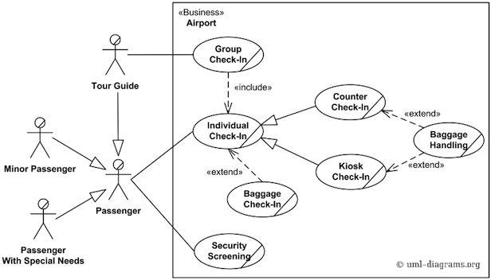
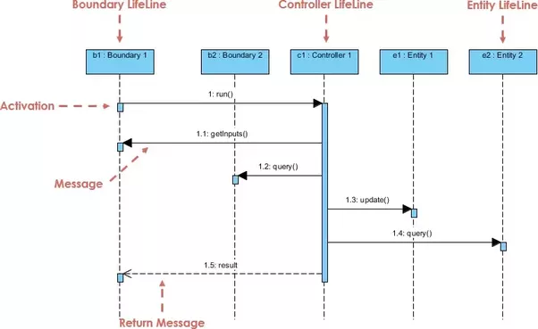

# Software Engineering

- "**Software engineering** is the systematic approach to development, maintenance, organization of software systems."

- Software costs dominate computer systems
- Maintenance costs may be much higher than development costs
- Need to balance 'dark forces', e.g. cost, time, competition

## Software Life Cycle Models

- In theory, development is linear. But in practice, usually much more chaotic.
- The **moving target** problem happens when requirements change during development. **No solution!**
- **Regression faults** occur when a change causes a fault somewhere else in the software
- **Miller's law** suggests that we can only focus on ~7 things at a time, so it pays to concentrate/specialize
    - **Stepwise refinement** allows all problems to be tackled, but in the order of current importance

- A 'software crisis' occurred as systems grew more and more complex, Software Development models are a response to that.

|Model|Characteristics|Pros| Cons|
|-----|---------------|----|-----| 
|Code and Fix| No design/specifications|**Easiest** to develop| **Hardest** to maintain|
|Waterfall| <ul><li>Linear model with feedback loops</li><li>Phase only completed when documentation and QA completed</li></ul>|Rigourously documented, so easier to maintain | Docs are long, detailed, boring|
|Rapid-Prototyping| Working model that is functionally equivalent to a subset of the product| <ul><li>Essentially linear </li> <li>Needs fewer feeback loops</li><li>Fast development</li></ul>| Lots of code discarded if needs aren't accurately gauged up front |
|Open-Source| <ol><li><b>First phase:</b> Individual or small group builds initial version and shares it</li><li>Second phase: Report defects, add functionality, create ports</li></ol>| <ul><li>Users can both submit defect reports and fix bugs</li><li>Releases early and often</li></ul> | <ul><li>Usually not as much testing</li><li>Restricted applicability</li><li>Doesn't always follow specs/design</li></ul>|
|Evolution tree| Baseline, artifacts | | | 
|Iterative-and-Incremental| <ul><li>No single requirements/design phase, but multiple instances</li><li>At different times, one workflow predominates</li><li>Like a set of mini-waterfalls</li></ul>|<ul><li>Allows mitigating risks early</li><li>Always have a working version</li></ul>||
|Spiral| <ul><li>Rapid prototyping + risk analysis at each phase</li><li>If risks can't be mitigated, project is terminated</li></ul>|<ul><li>Emphasizes alternatives and constraints to allow reuse of existing software</li><li>Incorporates software quality as a specific objective</li><li>No distinction from development/maintenance</li></ul>|<ul><li>Only works for large-scale projects</li><li>Only works for in-house software development</li></ul>|
|Agile| <ul><li>Based on iterative-incremental model</li><li>based on <b>stories</b> the client would like to support</li><li>Emphasizes <b>test-driven development</b> and <b> pair programming</b></li><li>No specialization, no overall design, all done while building</ul>|<ul><li>Constant communication with client</li><li>Responds quickly to change</li><li>Good for when requirements are vague or changing</li></ul>|<ul><li>Too soon to evaluate overall success</li><li>Refactoring costs</li></ul>|
|Synchronize-and-Stabilize|<ul><li>Microsoft's lifecycle model</li><li>Find most important features by interviewing clients</li><li>**Synchronize** at end of each day</li><li>**Stabilize** at end of each build</li></ul>|<ul><li>Repeated synchronization ensures components work together</li><li>Early insight into operation so requirements can be modified</li></ul>||

### Other mentioned styles

#### Based on Waterfall

- **iterative feedback** : each step has a feedback loop to perform QA
- **B-Model**: shaped like a lower case `b`. Once initial development done, loop on eolutionary enhancement
- **Incremental**: Waterfall in 3d, kind of like spiral (z-axis contains a series of waterfalls)
- **V-model** : LHS is evolution of user requirements, RHS is integration and verification. Y-axis is level of decomposition from system level

#### Other

- **Wheel and spoke** :
    + Based on **Spiral**
    + Each successive stage goes around requirements to become a spoke on a wheel
- **Unified process model**:
    + Iterative in nature
    + Uses risk-management mainly like spiral
    + Also known as the **RUP** ,(Rational Unified Process) model

### Agile
#### Principles

1. Highest priority is to satisfy customer via early+continuous delivery  
2. Welcome changing requirements, even late in development  
3. Deliver frequently, prefer often  
4. Business people + developers must work together throughout the project  
5. Build projects around motivated individuals  
6. Most efficient and effective method of conveying information is face-to-face
7. Working software is the primary measure of progress
8. Agile processes promote sustainable development; pace should be unchanging
9. Continuous attention to technical excellence and design
10. Simplicity is essential
11. Best architectures, requirements, and designs emerge from self-organizing teams
12. At regular intervals, team reflects on how to become more effective

#### Dumb Agile Vocabulary

- **Pair programming:** One 'drives', the other 'navigates'
- **scrum**: iterative cycle of **sprints**
- **sprint**: (usually) 30 day cycle on development and testing -> one iteration

## Modeling

- Three types of requirements:
    + Usage requirements -> best served by **use cases** + **sequence diagrams**
    + Non-functional requirements -> best served by architectural phase of design
    + Domain requirements -> best served by **domain model**

### Domain Model

- Illustrates meaningful real-world concepts in a problem domain
    - A concept is an **idea**, **thing**, or **object**.
    - Divide by **concept**, not by **function**.
    - No information pertaining to how it is to be used by any system
- Shows **structure**, not **operations**
- Domain **analysis** requires understanding the problem domain and communicating with **domain experts**
- Not reflective of implementation:
    + Objects can has multiple or reciprocal inheritance
    + Not useful to have 'Controller' objects, just delineate relationships
    + Rules, constraints better left to formal definition

- "Pure" domain modelling based solely on facts from Domain Expert, "impure" approach uses other sources/abstractions

#### Determining conceptual classes

##### Conceptual class category list

|Concept Category | Example | 
|-----------------|---------|
| Tangible object| POS |
| Spec,design,description | ProductSpecification | 
| Place | Store|
| Transaction | Sale, Payment |
| Transaction line item | SalesLineItem |
| Roles of people | Cashier | 
| Containers | Store, bin | 

##### Noun-phrase identification

From textual description of use cases, identify nouns and noun phrases, e.g.

1. A **Customer** arrives at a **POS checkout** system
2. A **Cashier** starts a new sale.
3. **Cashier** enters **item identifier**.

##### Specification/Description Conceptual classes

- Allows us to represent data for a class of objects, rather than a shared/duplicated attribute.
- Add a specification/description concept when:
    + Deleting instances results in **loss of information**
    + Reduces **redundant or duplicated** information

- e.g. 

Rather than *Item* possessing `description`, `price,`, `itemID`, define a conceptual `ItemDescription` class that contains these.

##### Associations

- An **association** is a relationship between concepts that indicates a meaningful or interesting connection. 
- Assocations should be named as `TypeName-VerbPhrase-TypeName` e.g. `POS-Captures-Sale`,`Sale-PaidBy-Payment`

| Category | Example | 
|----------|---------|
| `A` is a physical part of `B` | `Drawer` - `POS` | 
| `A` is a logical part of `B` | `SalesLineItem` - `Sale` | 
| `A` is physically contained in/on `B` | `POS` - `Store` | 
| `A` is logically contained in/on `B` | `ItemDescription` - `Catalog` | 
| `A` is a description of `B` | `ItemDescription` - `Item` | 
| `A` is known/logged/recorded/captured in `B` | `Sale` - `POS` | 

##### Multiplicity

- Also called **cardinality**, it defines how many instances of type `A` can be associated with how many instances of type `B`.

| Cardinality | Meaning | 
|--------|---------|
| `*` | zero or more|
| `1..*` | 1 or more |
| `1..n` | 1 to `n` |
| `n`    | Exactly `n` | 
| `n1,n2,n3` | Exactly `n1`,`n2`, or `n3` | 

##### Attributes

- An **attribute** is a logical data value
- The type of an attribute should typically not be a complex domain concept, such as `Sale` or `Airport`

## Requirements Analysis

Identify:

1. Functional requirements
2. Overall system goals
3. non-functional requirements (performance, reliability, etc)
4. Cost/schedule/deadline

Methods:

- Interviews (structured or unstructured)
- Surveys
- Analyzing existing forms

### Feasibility study

- Is budget adequate?
- Is it technically feasible? 
- Is the technology available to us?
- Do we have the hardware,staff,expertise to do it?

### Specification document

- Description of software function and non-functional requirements
- Constraints
- Cost
- Schedule
- Processing environment

- Must be **clear** to a client who is not specialized in the field
- Must be **precise** enough to be fault-free 

|Technique| Characteristics | Pros | Cons |
|---------|-----------------|------|------|
|Plain English |  | | <ul><li>Imprecise</li><li>Sometimes confusing</li><li>Cannot be checked for completeness</li></ul>|
|Pseudocode | Also called 'Programming Design Language' | Intentions are clear | May be confusing for non-technical readers | 
|Dataflow diagram | 4 Major Components: <ol><li>Process</li><li>Flow of Data</li><li>External entity</li><li>Data store</li></ol> | |
|Decision Table | <ul><li>A table with input and output conditions on Y and results on X</li><li>If completed, 2^n size where n = number of conditions </li></ul>|<ul><li>Allows checking completeness/contradictions</li><li>Easy to understand</li><li>Can perform automatic analysis</li></ul>|<ul><li>Can't recognize missing conditions</li><li>Many cases will be inconsequential</li><li>Only works when `n` is small</li></ul>|
|State Transition Diagram| <ul><li>A set of states (`s0`,`s1`,...)</li><li>Arrows between them represent transitions</li><li>From every state, there should be `n` outgoing transitions, where `n` is the number of inputs</ul>|<ul><li>Easy to learn</li><li>Allows automated analysis</li><li>Certain error types detectable</li></ul>|<ul><li>Does not scale well, only useful if `n` is low</li></ul>|
|Z-Specification | <ol><li>Given sets, data types, constants</li><li>State definition</li><li>Initial state</li><li>Operations</li></ol>|<ul><li>Can be checked for completeness</li><li>Can check that each state is reachable</li><li>Best for mission critical applications</li></ul>|<ul><li>Time consuming</li><li>Requires background in formal methods</li></ul>|

## Use Case Modeling 

- A **use case** captures a contract between **stakeholders** of a system about its behaviour
    - It describes the systems' behaviour under different conditions based on a request from a **primary actor**
    - It gathers different **scenarios** together
    - A powerful tool to understand who your users are and how they expect the system to function

### Use Case Specification Template
|||
|----------------|-------------|
| Number         | unique number|
| Name           | Brief verb-noun phrase            |
| Summary        | brief summary of major actions |
| Priority       | 1-5           |
| Preconditions  | What needs to be true **before** execution  |
| Postconditions | What needs to be true **after** execution  |
| Primary Actor(s)| a person or a system|
| Secondary Actor(s)| provides a service, usually a system |
| Trigger | | 
|Main Scenario | Step, Action | 
|  &nbsp       | Description of steps      |
|  &nbsp      |  in successful execution   |
|  &nbsp      |  &nbsp   |
|  &nbsp      |  &nbsp   |
| Extensions   | Step, Branching Action | 
|  &nbsp       | Optional path      |
|  &nbsp       |  or error path        |

- Each ellipse in a UML use case diagram represents a functional requirement, so it may in turn have an associated use case specification

## Sequence diagram

- A **System Sequence Diagram** describes interactions between **Actors**
- A **Sequence Diagram** describes interactions between **objects**

- Used to document interactions in a single **use case** or scenario
- Shows concurrent processes/activities. Emphasizes time ordering and logical flow

- `aObject: Object` is a particular instance of `Object`
- **Lifeline** runs vertically and has a solid bar around it when that object is acting
- **Dotted line** indicates return message
- **Triangle arrow head** : synchronous call (waiting for response)
- **Open arrow head** : async call (not waiting)
- Best practices rarely use loops/alt/else

### Sequence diagram from use case

1. Take each input message
    - Determine internal messages that result from that input
    - For that message, determine its objective
    - Needed information, class destination, source, and objects created as result
    - Double check for all required classes
2. Flesh out components for each message
    - Iteration
    - Guard-condition
    - passed parameters
    - Return values
    - etc.

### GRASP patterns

- General Responsibility Assignment Software Patterns

|  Pattern | When to use? | Characteristics | 
|----------|-----------------|-------|
| Expert | Assigns responsibility to class that has information necessary to fulfill it | <ul><li>+Encapsulation</li><li>+Promotes low coupling</li><li>+Promotes high cohesiveness</li><li>-Can make class too complex</li></ul> | 
| Creator| When `B` **aggregates** or **contains** `A` objects | <ul><li>+Promotes low coupling</li><li>+Avoids external dependency</li>|
| Low coupling | When classes need to be easily reused | <ul><li>+Easier maintenance</li><li>+Easier reuse</li><li>Changes remain localized</li></ul>|
| High Cohesion| When classes start to become overly complex. Moderate responsibility but collaborates with other classes to fulfill tasks | <ul><li>+ Easier Maintenance</li><li>+ Easier to understand</li><li>+ Often supports low coupling </li><li>Supports reuse</li></ul>|
| Controller | Decoupling event-receiving logic from objects that handling them. **Facade**, **role**, **use case** controllers all exist | <ul><li> +Decouples business logic and presentation implementation </li></ul>|
| Pure Fabrication | An artificial class supporting other GRASP patterns. Presents a generic reusable object | |
| Indirection | Intermediate object that mediates between components/services, so they remain uncoupled | | 

n.b. **Cohesion** refers to elements in the **same** module, whereas **coupling** refers to elements in **different** modules.

## Communication diagram

Like a combined sequence diagram and domain model. There are numbered steps between actors/objects that represent how they are sending/receiving information

# Cost Estimation

- **Consequences** of poor cost estimation: 
    + firefighting
    + overwork
    + cost overruns
    + schedule overruns

- **Causes** of poor cost estimation:
    + **Underestimating time/effort**
    + Imprecise/drifting **requirements**
    + **Resource** unavailability
    + Bias

- Harder to estimate for software since it is not uniform or necessarily commoditized
- Effort costs are hardest to predict

- Factors influencing productivity:  
    + Application domain experience
    + Process quality
    + Project size
    + Technology support
    + Working environment 

- Factor influencing cost estimation:
    + Market opportunity
    + Cost estimate uncertainty
    + Contractual terms
    + Requirements volatility
    + Financial health

## Process

| Step | Actions | 
|------|---------|
| 1) Establish Objectives| <ul> <li>Use objectives to drive the level of detail and effort required</li> <li>Re-examine and modify</li> </ul>|
| 2) Plan for required data + resources | <ul> <li>Estimate relative sizes for all parts</li> <li>Estimate size of total work</li> <li>Estimate speed of work</li> <li>Estimate duration</li> </ul> |
| 3) Pin down software requirements| <ul> <li>Eliminates ambiguity</li> <li>Requirements need <b>testability</b> to be cost-evaluated</li> <li>Needs to be done for the test phase anyway</li> </ul>|
| 4) Work out details | <ul> <li>The more detail, the more we understand technical aspects</li> <li>Increasing sample size reduces <b>variance</b></li> </ul> |
| 5) Use Independent techniques |<ul> <li>Avoids weaknesses of each single method</li> <li>Seven major methods for cost estimation</li> </ul>|
| 6) Compare and iterate |<ul> <li>Analyze the <b> difference </b> in estimates</li> <li>Some techniques relate size and complexity</li> </ul>|
| 7) Follow up | <ul> <li>Gather data and compare to estimates</li> <li>Provides better data for upcoming projects</li> </ul>|

## Cost Estimation Methods

| Estimation Method | Description | Pros | Cons | 
|-------------------|-------------|------|------|
| Analogy | uses an existing project as an analysis | Based on actual experience | Difficult to know if older project is representative | 
| Expert judgment| Consults 1+ experts | Factors in differences, interactions, and exceptional circumstances derived from experience | <ul> <li>Might not be better than estimator</li> <li>incomplete recall</li> <li>human bias</li> </ul>|
| Algorithmic model | See below | <ul> <li>Objective and repeatable</li> <li>Calibrated to experience</li> </ul>| <ul> <li>Inputs are subjective</li> <li>Calibrated to past experience</li> <li>Can't handle exceptional circumstances</li> </ul>|
| Parkinsonian | "Work expands to fill available volume". Cost estimate based on available resources | Correlates with experience | <ul> <li>Inaccurate</li> <li>Reinforces poor practice</li> </ul>|
| Price-to-win | Estimate is calculated to the **price** to win the job | Usually gets contract| <ul> <li>May result in poor functionality</li> <li>Reinforced poor software dev practice</li> <li>Must know how much client willing to pay</li> </ul>|
| Top-down | Estimate derived by global properties and **divided** to its components | <ul> <li>System level focus</li> <li>Efficient</li> </ul>| <ul> <li>Less detailed basis</li> <li>Less stable</li> <li>Needs lots of experience</li> </ul>|
| Bottom-up | Each component separately estimated and **summed** | <ul> <li>More detailed basis</li> <li>Fosters individual commitment</li> </ul>| <ul> <li>Overlooks **system level costs**</li> <li>Required **more effort**</li> </ul>|

### Algorithmic models

#### COCOMO

- "Constructive Cost Model"
- Effort (person/month) = \\( a*(\text{size in kLOC})^{b} * c \\)

|Project type| \\(a\\) | \\(b\\) |
|------------|---------|---------|
|Organic (small) | \\(2.4\\) | \\(1.05\\)|
|Semidetached (med) | \\(3\\) | \\(1.12\\)|
|Embedded (large) | \\(3.6\\) | \\(1.2\\)|

- The adjustment factor \\(c\\) is based on a number of different attributes (reliability, database size, experience, etc)

### Conclusion

- No method is better than any other, but Parkinson and Price-to-Win are unacceptable.
- Recommend: **top-down** with **expert judgment** and/or **analogy estimation**
- Recommend: **bottom-up** with **algorithmic model**

## Software Architecture

- **Architectural** design (high level) 
    + Main modules and their connections
    + Design that covers main use-cases
    + Addresses main non-functional requirements
    + hard to change

- **Detailed** design (low level)
    + Inner structure of main modules
    + May have to take PL into account
    + Detailed enough to be implemented in the target PL

- Design, unlike analysis, focuses on the **solution** domain

Architectural design addresses:
    - Decomposition of a system into interacting parts
    - Emergent system properties
    - Rational
    - Envelope of allowed change

- Good architecture properties:
    +  Result of consistently applied principles/techniques, applied throughout all phases
    +  Resilient in face of changes
    +  Source of guidance throughout product lifetime
    +  Reuse of established knowledge

- Architecture contains:
    + **Components** (where computation happens)
    + **Connectors** (interactions between components)

## Architectural Styles

| Style | Components | Connectors | Examples | Characteristics| 
|-------|------------|------------|----------|----------------|
|Batch sequential | Independent Programs | Media (tape, disk) | periodic non-real time computation| each step happens only after previous step ends | 
|Pipe and filter | Independent programs | Data streams | Unix | Parallel but linear. <ul> <li>+ Simple</li> <li>+ Efficient</li> <li>+ Reusable</li> <li>- Must agree on lowest common denominator data format</li> <li>- Only allows stateless data transformation</li> </ul> |
|Layered system| Programs or subprograms| RPC or System calls | OSI network model | <ul> <li>+ Maintainable (can change things as long as layers are maintained)</li> <li>+ Adaptable (can replace layers)</li> <li>- Performance degratation with too many layers</li> <li>- Can be difficult to assign responsibility to the right layer</li> </ul>|
|Process Control| Controllers,processes | Variables | Cruise control | <ul> <li>+ Well suited to continunous processes even when control algorithm may change</li> <li>- Not easily applicable to multiple interacting processess</li> </ul>|
|Event based/Implicit Invocation| Programs that *announce* + *register interest* in events | Event broadcasts and registration | Debugger |<ul> <li>- Components have no guarantee of getting a response</li> <li>- Components announcing events have no control over order of responses</li> <li>- Difficult to reason about behaviour independent of registered components</li> <li>- Inadequate for data exchange</li> </ul>|
|Blackboard (push) | Blackboard clients | Blackboard (shared data repository)| Chatroom transcript |<ul> <li>+ Only one connector that everyone uses</li> <li>- Bottlenecked with too many clients</li> <li>- Data 'partitions' may cause confusion</li> </ul>|
|Repository (fetch)| Database + clients | Queries | | <ul> <li>+ Clients are independent of one another</li> <li>+ Data store is independent of clients</li> <li>- Strong dependence on data store</li> </ul>|
|Hypertext| Documents | Hyperlinks | Web database |<ul> <li>- Reliability</li> <li>- Difficult to maintain context</li> <li>- Needs sophisticated indexing</li> </ul>|
|Event based| Publisher, Subscriber | Bindings,Callbacks | | See below | 

### Event based architecutre

- Components generate **signals**
- Objects can receive events at **ports** or register for **event notifications**
- Best when delays are unpredictable (network, file system, UI)

- Components (objects, capsules, modules)
    - **Publisher**: individual components announce data they wish to share
    - **Subscriber**: individual components register their interest

- Connector (channel, binding, callback)
    + Offers 1-1, 1-many, many-1 bindings
    + Asynchronous broadcast
    + Synchronous broadcast and await reply (call->return)

- Disadvantages:
    + Components only generate events, the runtime handles dispatching.
    + Responses not ordered
    + Resource management can become challenging with shared context

### Model-View-Controller

- **Model** contains core functionality and data
- **View** displays information to user
- **Controller** handles user input
- Change-propagation mechnism (e.g. observer) ensures consistency between model + view

### Distributed systems

- **Classic Client/server**: Components are servers and clients

- **3-Tier Client/Server**:
    + Tier 1: UI tier
    + Tier 2: Servers act as 'business objects', encapsulate abstract integrated models
    + Tier 3: back-end,database applications providing services

- **Peer to Peer**:
    + Each node has the same capabilities/responsibilities
    + Pros: 
        * Heterogeneous
        * Scalable
    + Cons:
        * Difficult to debug (deadlock, starvation, race conditions)
        * Data marshalling/unmarshalling
        * Proxies + stubs for RPC

## Service Oriented Architecture

- Evolution from 3-tier architecture.
- Enables reuse of services, aggregation from multiple providers, virtualization of business resources
- A **service** is an act offered by one party to another. Independent of application.
    + Makes a reusable component available and accessible to others

- Service **consumer** expresses **intent**
- Service **provider** defines **offers**
- **Mediator** helps one find the other

### Principles

- Freedom to create contexts in which services are used and combined
- Service oriented systes are created by linking software services provided by different suppliers.
- Express intent rather than specific requests
- Based on XML-based standards
    + `SOAP` : Simple object access protocol
    + `WSDL` : Web Services Description Language
    + `UDDI` : Universal Description, Discovery, and Integration

- `EAI`: Enterprise application integration
- `EDI`: Electronic data interchange
- `B2B` : integrate data transmission between multiple enterprises
- `B2C` : Human users connect to businesses (e.g. Amazon)

## UML 

- Associated textual language called **OCL** (Object Constraint Language)

### Class Diagram Symbols

- **Aggregations** represent 'part-whole' relationships (e.g. the parts are 'part of' the aggregate)
- **Composition** is a strong kind of aggregation.
    + If aggregate is destroyed, then the parts are destroyed as well.
- **System domain Model** omits UI, architectural classes

### Making UML Class diagrams

1. Identify **candidate classes**
2. Add **assocations** and **attributes**
3. Find **generalizations**
4. List **main responsibilities**
5. Decide on **specific operations**
6. Iterate

- An **association** should exist if a class `____` some other class:
    + possesses
    + controls
    + is connected to
    + is related to
    + is a part of
    + has as parts
    + is a member of
    + has as members

- Create an **interface** instead of a **superclass** if:
    + Classes are dissimilar but share operations
    + Classes already have superclasses
    + Different implementations of same class might be available

## Diagram glossary

| Diagram type | Example | 
|--------------|---------|
| Domain Model |  |
| Illustrated Use Case|  |
| Sequence     |  |
| Communication |  |
| UML Class    |  |
