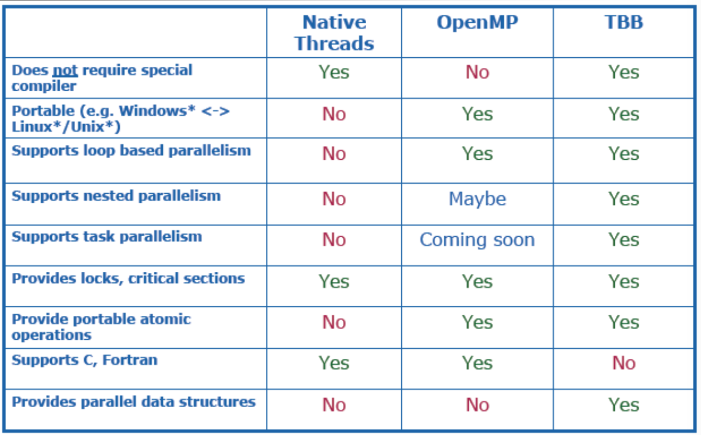
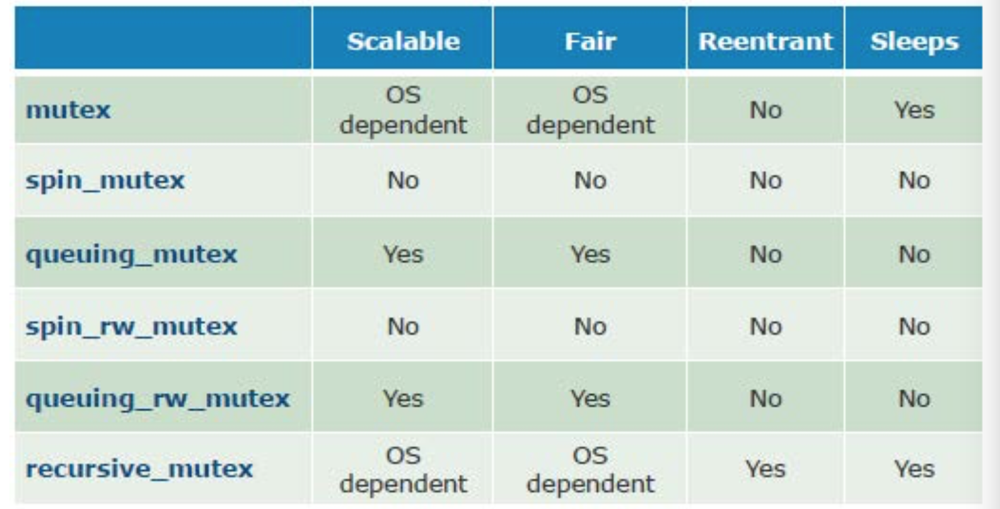
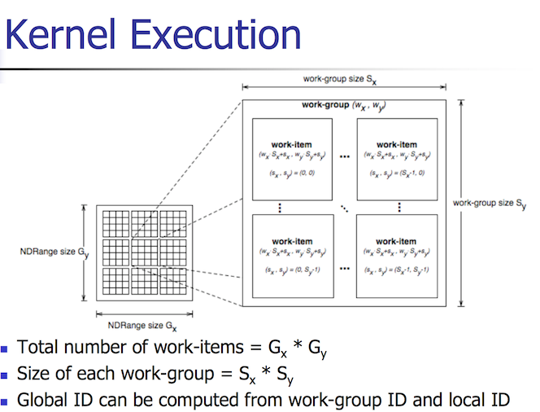
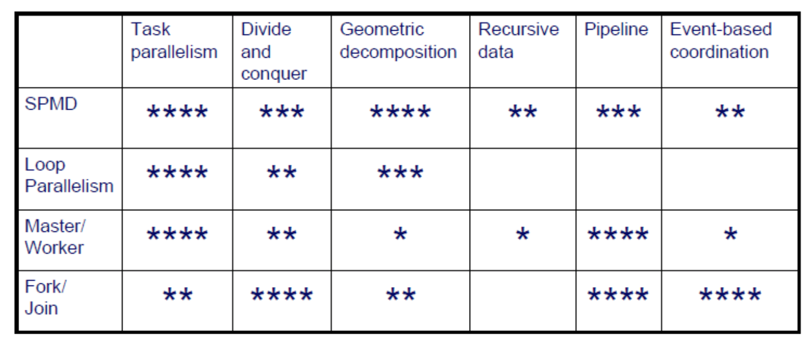

## Thread Building Blocks



- TBB is preferable if heavy use of C++ advanced functionality is required (such as highly OO or templated code)
- Does not support Fortran 
- Uses **task** paradigm, not **thread** paradigm. So the runtime decides te number of threads, task granularity, etc
- Can work together with other threading packages
- Adaptable threading to different systems without recompilation

### Scalability

- **Ideal**: performance proportional to number of threads
- **Acceptable**: performance proportional to `sqrt(numThreads)`
- Impediments:
    + Any code which executes once for each thread
    + Coding for a fixed number of threads
    + Data contention
- TBB prefers:
    + recursive tasks (logarithmic)
    + Use partial ordering to avoid needs for locking
- Oftentimes, performance should be tuned for a single core before multithreading

### Serial Decomposition

- e.g. Each thread does an equal part of the work on a given data set. Thread 0 : 0-3, Thread 1: 4-7, etc.
- Good cache locality
- May have load-balance issues
- May not be adequate for multi-dimensionsal spaces
- Does not for nested parallelism

### Recursive decomposition

- e.g. splitting data in halves, quarters, sixteenths
- Not limited to one-dimensional spaecs
- Good fit for 'divide and conquer'
- Maps to work-stealing
- Data locality and cache issues

### Programming

- TBB offers several built in generic parallel algorithms:

| Name | Type | Characteristics | 
|------|------|-----------------|
| `parallel_for`, `parallel_reduce` | Loop |  Load balanced parallel execution of fixed number of independent loop iterations | `parallel_scan` | Loop | Computes parallel prefix | 
| `parallel_sort` | Sort | \\(O(n log(n))) \\) | 
| `parallel_do` | Stream | useful when number of required iterations is unknown, or when your data structure is a linkedlist |
| `pipeline` | Stream |  You specify the max number of items that can be in flight at any given time | 

- Typically a TBB program must begin with the initialization of the task scheduler: `tbb::task_scheduler_init tbb_init`

#### parallel_for

```cpp
template <typename Range, typename Body, typename Partitioner> 
void parallel_for(const Range& range, const Body& body, const Partitioner& partitioner);
```

##### Required implementations for Body: 
- copy constructor
- destructor
- operator overload for (): `operator()(Range& subrange) const`, which applies the body to subrange only

##### Required implementations for Range:

TBB already provides `blocked_range` and `blocked_range2d` which should be adequate for most usages

- Copy constructor
- Destructor
- `bool Range::empty() const`
- `bool Range::is_divisible() const`
- Splitting constructor: `Range::Range(Range& r, split)` , which splits `r` into two subranges. This is the function called by the partitioner to spread tasks over range

##### Partitioning

- `simple_partitioner` takes a manual range
- `auto_partitioner` adjusts the range heuristically
- `affinity_partitioner` tries to replay previous invocation by storing 'affinity' information outside of the loop structure

#### Pipeline

- Linear pipeline of stages, so the programmer stipulates how many stages can be active simultaneously
- Each stage can be serial or parallel
- Uses cache efficiently, and is biased to finish aging items first

### Task Scheduler

- Engine that drives task-based programming
- To avoid pitfalls:
    + **Oversubscription**: uses one schedxuler thread per hardware thread 
    + **fair scheduling**: non-preemptive unfair scheduing
    + **high overhead**: programmer specifies tasks, not threads
    + **load imbalance**: work-stealing balances load

### Tasks

- A **Task** is a callable (function, functor, lambda) that represents some kind of work. 
- Tasks may depend on each other via a **task tree**
    + Can use `wait_for_all()` to block tasks while child tasks complete
- Execution orders of task trees:   
    + DFS:
        * Small space
        * Excellent cache locality
        * No parallelism
    + BFS:
        * Large space
        * Poor cache locality
        * Maximum parallelism

### Work stealing

- tl;dr: 
    + Work **depth first**
    + Steal **breadth first**
- Each thread maintains a deque of tasks
- A thread performs DFS and uses its own deque as a stack
- If it runs out of work: steal task from victim

### Synchronization

- All TBB mutex regions are protected by scoped locks
- Range of lock is determined by lexical scope
- Leaving lock scope calls destructor, so its released automatically when leaving scope, even if an exception is called
- Different kinds of mutexes:   
    + `spin_mutex` (fair, fast)
    + `queuing_mutex` (unfair)
    + `spin_rw_mutex`, `queuing_rw_mutex` : multiple reader, single writer; has `upgrade_to_writer()` to lock for writing
    + `recursive_mutex`: use when threading model requires that one thread can re-acquire a ock
    + Scoped wrapper of native mutex function (i.e. Win32 or `pthread`)



### Concurrent Containers

- C++ STL containers are not necessarily thread safe
- TBB provies fine-grained locking or lockless implementations
- Better scalability but worst single-thread compatibility
- Doesn't require the rest of the TBB library to be used

| Container | Characteristics | 
|-----------|-----------------|
|`concurrent_vector<T>` | Dynamically growable array, never moves elements until cleared | 
|`concurrent_queue<T>` | preserves local FIFO order, cache unfriendly | 
|`concurrent_hash_map<Key, T, HashCompare>` | Associative key-value store, reader locks coexist, writer locks are exclusive | 


## CUDA 

- Rise of increasingly programmable GPUs resulted in interest of using geometry + rasterization pipelines for general purpose computing
    + Geometry pipeline favours floating point operations, while rasterization favours integers
    + Instead of having a fragment shader output to the reasterization pipeline it can be fed back into global memory
    + G80: **Thread processors** (basically an ALU) are grouped into **streaming multiprocessors** that can communicate quickly ia **parallel data cache**
    + G80: each **streaming multiprocessor** has
        * 8x processing elements with their own registers
        * multithreading hardware
        * on-chip memory to be shared between threads in block
- CUDA abstracts the hardware away from the graphics APIs, so that computations can be done directly instead of by transforming programs into shaders and polygon calculations. However, data sharing with OpenGL objects is possible
- A CUDA compute device is a coprocessor to the host, with its own memory, and requires memory managment

### Vocabulary

#### Kernel
- A CUDA *kernel* is code that can be run on the coprocessor
- It runs on many of the stream processors in parallel (single-program, multiple data)
- Each kernel is executed sequentially, but is executed by multiple threads at a time (single instruction multiple thread)

#### Threads
- A CUDA *thread* is the execution of a kernel; each thread uses its index to access a specific subset of the data
- Threads are basically zero overhead, fast switching

#### Block

- A *block* is a group of warps, uses to organize them into manageable chunks
- Able to organize threads (via warps) into 1-3 dimensional arrangements
- Threads within a block can perform limited synchronization

#### Grid

- A *grid* is a group of blocks. 
- Able to organize blocks into 1-2 dimensional arrangements
- No synchronization possible.
- Each CUDA call generates a grid of blocks of threads

#### Warp

- Groups of 32 threads are called *warps*, which are primitive units of scheduling
- All warps:
    + are always executing same instruction
    + share instruction fetch/dispatch
- If code path diverges, some warps become inactive (i.e. if their result is not required or depends on the result of another warp)

#### Mapping

| Buzzword | Hardware | 
|----------|----------|
| Grid     | GPU/coprocessor | 
| Block    | multiprocessor\* | 
| Thread   | Stream processor | 
| Warp     | group of 32 threads that execute simultaneously | 

### Data-parallel programming

- Favours **massive numbers of threads** and **memory locality**
- Together with GPU, favours large data array processing, fine grain SIMD parallelism, low latency FP computation
- Whereas CPUs are great at *task* parallelism, GPUs excel at *data* parallelism
- GPUs have little creation overhead for threads

### API

- Has its own compiler, `nvcc`, which generates **Parallel Thread Execution** code, that is kind of like LLVM IR which gets further translated into specific GPU instructions

#### Thread life cycle

- Grid launched on SPA
- Thread blocks are serially distributed
- Each SM launches warps of threads (2 levels of parallelism)
- SM schedules and executes warps
    + Threads are assigned to SMs in block granularity (up to 8)
    + SM assigns/maintains TIDs
    + SM manages/schedules thread execution
- Each thread block is divided into 32 thread warps

#### SM warp scheduling

//TODO clarify

- SM hardware implements zero-overhead warp scheduling
    + Warps whose next instruction has its operands ready for consumption are eligible for execution
    + Eligible warps are selected for execution on a priortized scheduling policy
    + all threads in a warp execute the same instruction when selected
- 4 clock cycles needed to dispatch the same instruction for all threads in a warp in g80
    - if one global memory access is needed every 4 instructions, then a minimum of 13 warps are needed to fully tolerate 200 cycle memory latency

#### Thread batching

// TODO clarify

- kernel is executed as a grid of thread blocks which share memory space
- Blocks can cooperate by synchronizing execution and sharing data in low latency shared memory
- Threads from two different blocks cannot cooperate
- Threads and blocks have **IDs**:
    + Block ID : 1-2 dimensions
    + Thread ID : 1-3 dimensions
    + This simplifies memory addressing when processing multidimensional data 

### Memory Model

<table> 
    <tr>
        <th> Memory Type </th>
        <th> Characteristics </th>
    </tr>
    <tr>
    <td>Registers</td>
    <td>
        <ul>
            <li>on-chip</li>
            <li>fast access</li>
            <li>per thread</li>
            <li>limited amount</li>
            <li>32 bit</li>
        </ul>
    </td>
    </tr>
    <tr>
    Local Memory
    <tr>
        <ul>
            <li>in DRAM</li>
            <li>slow</li>
            <li>non-cached</li>
            <li>per thread</li>
            <li>relatively large</li>
        </ul>
    </tr>
    <tr>Shared Memory</tr>
    <tr>
        <ul>
            <li>on chip</li>
            <li>fast</li>
            <li>per block</li>
            <li>16kB</li>
            <li>synchronize between threads</li>
        </ul>
    </tr>
    <tr>Global Memory</tr>
    <tr>
        <ul>
            <li>in DRAM</li>
            <li>slow</li>
            <li>non-cached</li>
            <li>per grid</li>
            <li>communicate between grids</li>
            <li><b>Main means of communicating between host and device</b></li>
        </ul>
    </tr>
    <tr>Constant Memory</tr>
        <ul>
            <li>in DRAM</li>
            <li>cached</li>
            <li>per grid</li>
            <li>read-only</li>
        </ul>
    </tr>
    <tr>Texture Memory</tr>
    <tr>
        <ul>in DRAM</ul>
        <ul>cached</ul>
        <ul>per grid</ul>
        <ul>read-only</ul>
        <ul>managed by host code</ul>
        <ul>persistent across kernels</ul>
    </tr>
</table>

- GPU:
    + Per thread:
        + r/w registers
        + r/w local memory
    + Per block:
        + r/w shared memory
    + per grid:
        + r/w global memory
        + r/o constant memory
        + r/o texture memory

- Host:
    + r/w global
    + r/w constant
    + r/w texture

#### Memory Allocation

- `cudaMalloc(void** device_ptr, size_t size)`: Allocates memory
    + first param is the address of a pointer to the allocated object
- `cudaFree(void* device_ptr)`: frees object from device global memory
- `cudaMemcpy(void* dst, const void* src, size_t count, enum cudaMemcpykind)`: memory data transfer
    + last arg: `cudaMemcpyHostToDevice`, `cudaMemcpyDeviceToHost`
- `__syncthreads()`: synchronizes all thread in a block; allowed in conditionals only if conditional is uniform across thread block
- Below is an example of a 64*64 single point array:

```cpp

typedef struct Matrix {
    int w;
    int h;
    int p;
    float* data;
} Matrix;

const int BLOCK_SIZE = 64;
Matrix m, md;
int size = BLOCK_SIZE * BLOCK_SIZE * sizeof(float);

cudaMalloc((void**) &md.data, size);

// transfer m on host --> md on device

cudaMemcpy(md.data, m.data, size, cudaMemcpyHostToDevice);

// transfer md on device --> m on host
cudaMemcpy(m.data, md.data, size, cudaMemcpyDeviceToHost);

cudaFree(md.data);
```

- Common strategy: split data into subsets that will fit into shared memory
    + Allows faster access to individual blocks than global memory (~200x speed difference)
    + Load subset from global -> shared memory, then copy it back

#### Functions

- `__device__` : executed on device, called from device
    + No recursion
    + No static variable declarations inside function
    + No variadics w/ `va_list`
- `__host__`: executed on host, called on host
- `__global__`: executed on device, called by host
    + Kernels called via `KernelFunc<<<dim_grid_in_blocks, dim_blocks_in_threads>>>(args);`

### CUDA vs GPGPU
#### CUDA pros

- Byte addressable memory, accessible from anywhere 
- Shared memory per block
- Thread synchronization
- Compute only API, no graphics

#### CUDA cons

- Low precision
- Limited IEEE-754 floating point support 
- No recursion
- Hard to adapt to non-standard fork-join logic
- no concurrency between jobs

### G80 specific concerns

// TODO clarify
- Each SM in G80 has 16KB shared memory
    - For TILE_WIDTH = 16, each thread block uses 2*256*4B = 2KB of shared memory.
    - Can potentially have up to 8 Thread Blocks actively executing
    - This allows up to 8*512 = 4,096 pending loads. (2 per thread, 256 threads per block)
    - TILE_WIDTH 32 would lead to 2*32*32*4B= 8KB shared memory usage per thread block, allowing only up to two thread blocks active at the same time per SM
    - Using 16x16 tiling, we reduce the accesses to the global memory by a factor of 16
    - The 86.4B/s bandwidth can now support (86.4/4)*16 = 347.6GFLOPS!

### CUDA/GL Interop

```cpp
// Register an existing OpenGL buffer
// This locks it so OpenGL cannot write, need to unregister before rendering to it via OpenGL
cudaGLRegisterBufferObject(GLuint vbo);

// Map buffer object to CUDA memory, returns addr in global memory
cudaGLMapBufferObject(void** device_ptr, GLuint vbo);

// Launch a CUDA kernel
cuda_kernel<<<n,n/2>(...);

// Unmap before returning to OpenGL
cudaGLUnmapBufferObject(GLint vbo);

// If the buffer is going to be rendered to by OpenGL, unregister
cudaGLUnregisterBufferObject(GLuint vbo);
```

## OpenCL

- Optimized for heterogeneous computing
- Create portable code that can be run via multiple types of processors (CPUs, GPUs, DSPs, etc)
- Subset of C99
- Compiler built into the generated executable so it can be compiled for whatever platform
    - **Platform Layer API**: query, select, initialize compute devices
    - **Runtime API**: execute compute kernels, manage scheduling, compute, and memory
- Can be adapted to both data-parallel and task-parallel paradigms

### Devices

- A host has 1+ **compute devices**
- All CPUs are treated as a single device:
    + 1 **Compute Unit** per CPU core
    + 1 to `n` **processing elements** per CU, where `n` is SIMD width
- GPUs are each treated as their own device

### Memory

- Shared memory model
- Multiple distinct address spaces
    - **private**: private to a *work-item*
    - **local**: local to a *work-group*
    - **global**: accessible by all work-items in all work groups
    - **constant**: read only global space

### Kernel Execution 

- `NDRange` is an index space used to organize threads
- Kernel instance at a point in the index space is called a **work-item** and has a unique ID
- Work-items are divided into **work-groups** which also have their own unique ID



### Vocabulary

#### Platform

- query opencl version
- query devices and device information

#### Context 

- A *context* (`cl_context`) maintains states
- Kernels are executed in contexts defined by the host
- Contexts associate to 1+ devices
- Multiple contexts can be associated to same device
- `clCreateContext()`, `clCreateContextFromType()` returns handle to created context

#### Command queue

- A *command queue* (`cl_command_queue`) coordinates execution of kernels
    + kernel execution commands
    + memory copying/mapping commands
    + synchronization commands
- Stores a set of operations to perform
- Associated to a context
- Multiple queues if commands are independent
- **Execution model**:
    + Signals when commands are complete/data is ready
    + Can execute in order or out of order
- **Synchronization model**:
    + Signals to the host when commands are completed or other commands in queue
    + Some commands are blocking and will wait for completion
    + `cl_event` objects can be used to set up dependency before continuing executions

#### Buffer

- A *buffer* (`cl_mem`, usually) is a 1d collection of objects
- Can be builtins like scalar or vector types, as well as user defined structures 
- access via pointer in the kernel
- Image, sampler types describe 2 or 3 dimensional objects like images, FBOs

#### Kernel 

- Kernels (`cl_kernel`) encapsulate specific functions declared in an OpenCL program
- `clCreateKernel()`,`clCreateKernelsInProgram()` 
- Arguments set by `clSetKernelArg(Kernel k, int idx)` are passed by value, so usually pointers are better idea
- A kernel must be **enqueued** to the command queue to be run:
    + `clEnqueueNDRangeKernel()`
        * Data parallel execution mode
        * n-dimensional index space and workgroup space describe how the task will be run
    + `clEnqueueTask()`
        * Task-parallel execution
        * Equivalent to `clEnqueueNDRangeKernel` with `workgroup_size`, `work_dim` both = 1
    + `clEnqueueNativeKernel()`
        * Task-parallel execution
        * Executes a native C/C++ function, not an OpenCL one

#### Event

- An *event* (`cl_event`)  allows communication of the status of OpenCL commands
- Pro: Allows for finer grained control and convey more info than a barrier
- Pro: works between queues whereas barriers do not
- Allow for profiling (`CL_QUEUE_PROFILING_ENABLE`), which enables `clGetEventProfilingInfo`
- Last three args of `clEnqueueNDRangeKernel`:

```cpp
...(
cl_uint num_events_in_wait_list, // number of events this command is waiting to complete before executing
const cl_event* event_wait_list, // array of ptrs to events being waited on
cl_event* event); // pointer to event obj generated by this command
```

### Data Parallelism

- ND domain defines the total number of work items that execute in parallel
- Define an `n`-dimensional computation domain
    + Each element of execution in a ND domain is called a **work-item**
    + total qty of work-items that can execute in parallel: **global work size**
- Work items can be arranged in **work groups** which allow items in the same group to communicate/synchronize
- Execute multiple work groups in parallel
- **Unable to synchronize between workgroups**

### Basic structure

```cpp
const char[] cl_source = "...";
float src1[64],src2[64],dst[64];

/* fill up src arrays with data */

cl_device_id id;
cl_context ctx;
cl_command_queue cq;
cl_program prg;
cl_kernel k;

cl_mem cl_src1, cl_src2, cl_dst;

// n.b. if multiple OpenCL implementations are present, might need to set up a platform first
// this can occur if you have say an NVIDIA GPU 

/* PLATFORM */

// Set up a compute device
int err = clGetDeviceIDs(nullptr, gpu ? CL_DEVICE_TYPE_GPU : CL_DEVICE_TYPE_CPU, 1, &id, nullptr);

// Set up compute context
ctx = clCreateContext(0,1, &id, nullptr, nullptr, &err);

/* RUNTIME */

// Set up a command queue
cq = clCreateCommandQueue(ctx, id, 0, &err);

// set up program, compile, and create kernel 
prg = clCreateProgramWithSource(ctx, 1, (const char**) &cl_source, nullptr, &err);
err = clBuildProgram(prg, 0, nullptr,nullptr,nullptr,nullptr);
k = clCreateKernel(prg, "kernel_name", &err);

const size_t bufsize = sizeof(float) * 64;
// populate buffers on compute device

cl_src1 = clCreateBuffer(ctx, CL_MEM_READ_ONLY, bufsize, nullptr,nullptr);
cl_src2 = clCreateBuffer(ctx, CL_MEM_READ_ONLY, bufsize, nullptr,nullptr);
cl_dst = clCreateBuffer(ctx, CL_MEM_WRITE_ONLY, bufsize, nullptr,nullptr);

// copy data to input buffers

err = clEnqueueWriteBuffer(cq, cl_src1, CL_TRUE, 0, bufsize, src1, 0, nullptr, nullptr);
err = clEnqueueWriteBuffer(cq, cl_src2, CL_TRUE, 0, bufsize, src2, 0, nullptr, nullptr);

// set up args for compute kernel

err = clSetKernelArg(k, 0, sizeof(cl_mem), &cl_src1);
err = clSetKernelArg(k, 1, sizeof(cl_mem), &cl_src2);
err = clSetKernelArg(k, 2, sizeof(cl_mem), &cl_dst);
err = clSetKernelArg(k, 3, sizeof(int), 64)

// run dat kernel

size_t global = 64;
size_t local = 4;

err = clEnqueueNDRangeKernel(cq, k, 1, nullptr, &global, &local, 0, nullptr, nullptr);

// wait for sync
clFinish(cq);

// read back results
err = clEnqueueReadBuffer(cq, cl_dst, CL_TRUE, 0, bufsize, dst, 0, nullptr, nullptr);

clReleaseMemobject(cl_src1);
clReleaseMemobject(cl_src2);
clReleaseMemobject(dst);
clReleaseProgram(prg);
clReleaseKernel(k);
clReleaseCommandQueue(cq);
clReleaseContext(ctx);
```

### Work item synchronization

- `barrier()` function can be fed flags to ensure local or global memory is flushed or queued
- A work item that encounters a `barrier()` will wait until all work items reach the barrier
- If there is a branch, the branch must be taken either by **all** work items or none of them
- No easy way to guarantee where/hen a workgroup will execute
- Different work groups cannot exchange data or have barrier sync

### Kernel Language

- Limited subset of C99
    + No recursion
    + No function pointers
    + No pointers to pointers as arguments
    + No bitfields
    + No VLAs
    + Limited struct support
- Built in data types:
    + vector `float{2,3,4}`
    + images `image{2,3}d_t`,`sampler_t`
- Qualifiers:
    + `__kernel` 
    + `__global`, `__local`, `__constant`, `__private`
- Functions:
    + `get_work_dim()`, `get_global_id()`,`get_local_id()`, `get_group_id()`
- Extensions for 64bit+ FP types, atomics, etc
- 2.0 brings:
    + Shared virtual memory
    + Dynmaic parallelism
    + Generic address spaces
    + C++ style atomics

### OpenGL interop

- Images + textures

```cpp
cl_image_format fmt;
fmt.image_channel_data_type = CL_FLOAT;
fmt.image_channel-order = CL_RGBA;

cl_mem input_image;
cl_mem input_buffer;

cl_int w=640, h = 640, d =4 , err = CL_SUCCESS;

input_image = clCreateImage2d(ctx, CL_MEM_READ_ONLU, &fmt, w,h, 0, nullptr, &err);
input_buffer = clCreateBuffer(ctx, CL_MEM_READ_ONLY, sizeof(cl_float) * d*w*h, nullptr, &err);
```

- Sampler type for manipulating textures is same as in OpenGL

### Optimization

- Largely like CUDA, dividing information intelligently and profiting from much faster private or memory will give big speedups. The results are not necessarily obvious so benchmarking is required, and may be implementation dependent. 
    + Otherwise matching the size of work items to the vector width of the processor is always going to be the most beneficial (alignment/struct padding, basically)
    + This can be done by using the builtin vector types in OpenCL

## Parallel Programming Patterns

- **Decomposition** (Amdahl's Law)
    + Identify where the computation will benefit from concurrent execution
    + Profiling and analysis before modification
- **Granularity** (how to assign)
    + What mechanisms are used to divide work amongst cores?
- **Locality**
    + *Temporal*: often same locations will be accessed multiple times in quick succession
    + *Spatial*: how data is laid out in memory can greatly performance

### PCAM

- **Partitioning**:
    + Breaking up computation into as many individual componenets as possible
    + *function* oriented or *data* oriented
- **Communication**:
    + Identify how and how much data flows in different parts of application
    + *Task dependency graph*: a DAG where nodes are tasks and edges are communications
- **Agglomeration** <sub>(platform dependent)</sub>:
    + Grouping tasks together to reduce communication burden
    + qty of groups should be **1 order of magnitude** bigger than qty of compute nodes
- **Mapping** <sub>(platform dependent)</sub>:
    + Pair groups of tasks and nodes to load balance and reduce communication overhead

### Four design spaces

#### Algorithm Expression
- Finding concurrency
- Algorithm structure (mapping tasks to processes)

#### Software Construction
- Supporting structures
- Implementation mechanisms

### Decomposition methods

- **Task** decomposition: find tasks who have little/no data dependency that can be executed concurrently instead
    + **Flexibility**: varying number and size of tasks
    + **Efficiency**: too many tasks cause overhead, so qty should be appropriate for workload
    + **Simplicity**: readability
    + easy targets: function calls, loop iterations
- **Data** decomposition: identify where the same computation has to occur to smaller subsets of data
    + **Flexibility**: size, qty of data chunks should support wide range of executions
    + **Efficiency**: data chunks should generate comparable qtys of work
    + **Simplicity**: if decompositions become overly complex, may become harder to wrangle
    + identify where same/similar operations are done to a data structure, e.g. splitting arrays into blocks or trees into subtrees
- **pipeline** decomposition: identify producer-consumer chains
    + data flow **sequential**: favour pipeline
    + data flow **non-sequential**: favour event based coordination (careful for deadlocks)
    + concurrency in pipeline is limited by number of stages and bottleneck width
    + favoured by real-time applications, within latency limits

### Reengineering existing code

- Define a testing protocol
- Identify hotspots via profiling, dynamic & static analysis
- recursive data structures favour divide and conquer
- Example (n-body gravitation):                                                    
    + naive serial implementation is an \(n^2\) for-loop over time and elements respectively
    + Each iteration of the inner loop corresponds to updating an entity. 
    + What data is shared between the entities?

### Program Structure Patterns

#### Globally Parallel, Locally Sequential (GPLS)

- multiple tasks concurrenty, but each task running sequentially
- **SPMD**
    + single source code image that runs on each processor, differentiated between id & input data
    + unique identifier per thread (e.g. `get_thread_id()`)
    + execution path diversified based on ID
- **MPMD**
    + Fails when memory requirements are too high, or heterogeneous platforms are involved
- **Master-worker**
    + useful when tasks have no dependencies
    + good for embarrassingly parallel tasks, implicit load balancing
- **Map-reduce**
    + *map*: apply a function on data -> set of partial results
    + *reduce*: collect partial results and derive complete ones

#### Globally Sequential, Locally Parallel (GSLP)

- Application executes sequentially, with individual parts running in parallel on request
- **fork/join**
    + parent task creates new tasks and waits until they complete
- **loop parallelism**
    + Good for refactoring/migration legacy code
    + limited scalability

