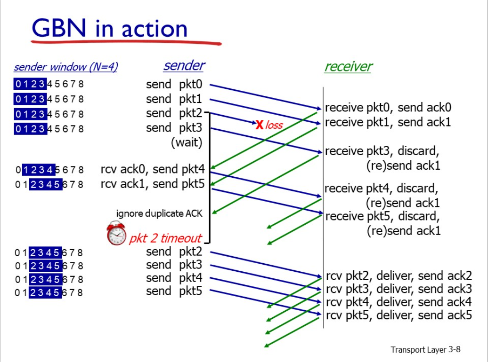
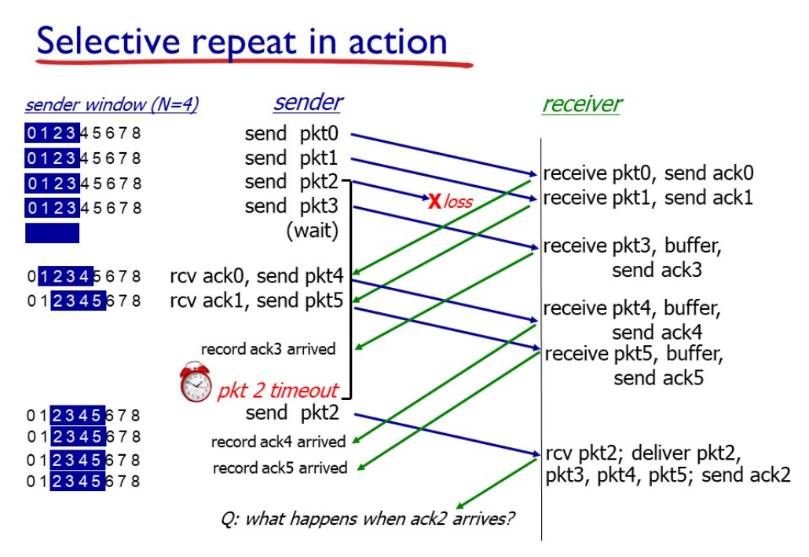
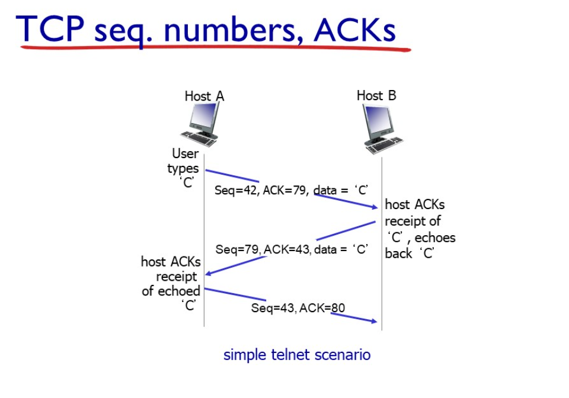
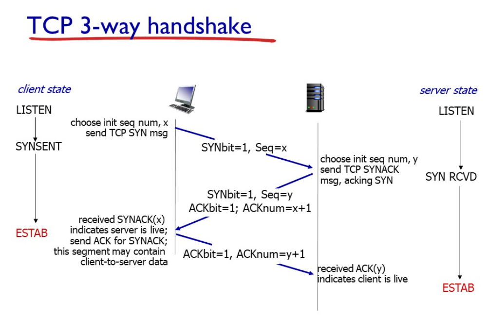
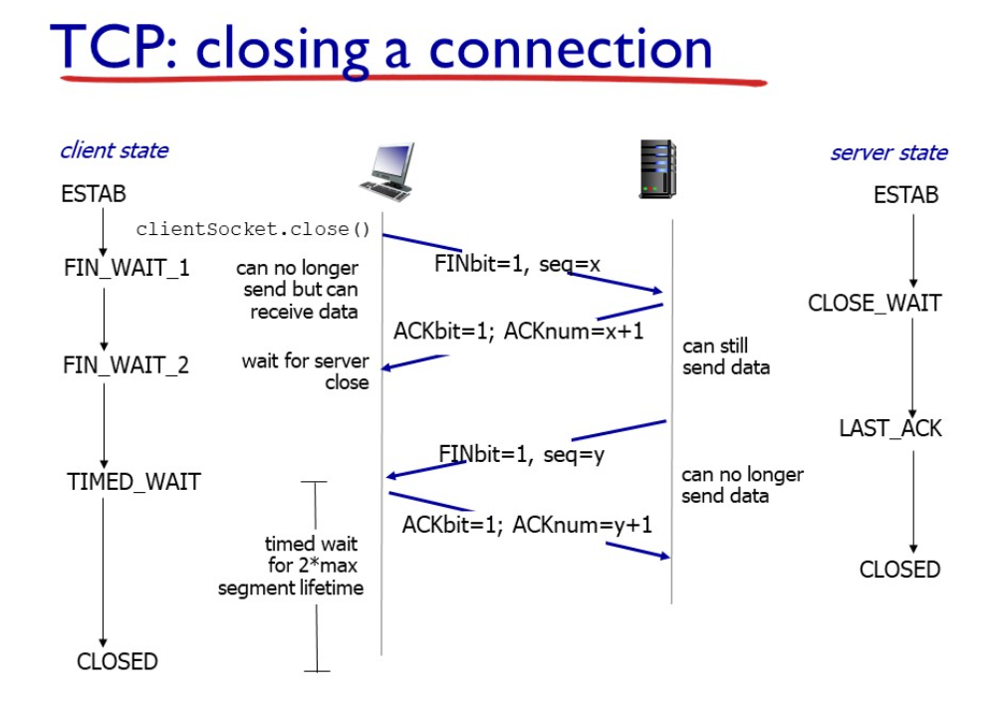
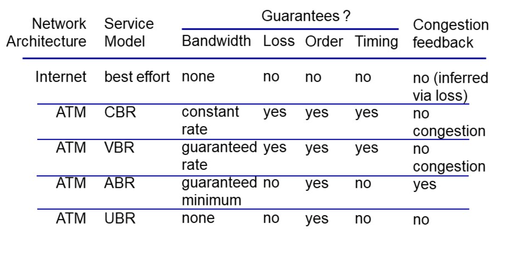
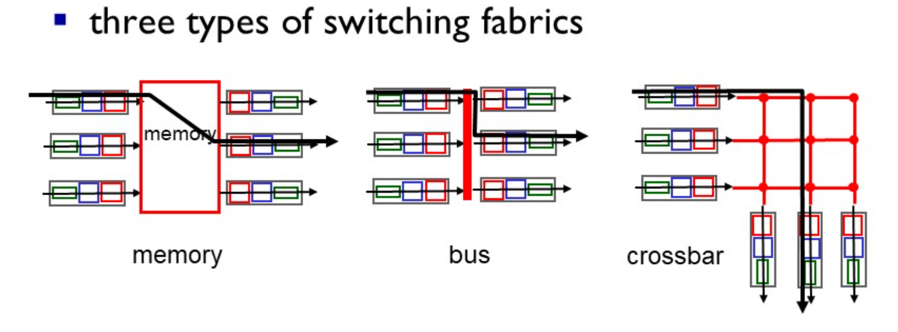
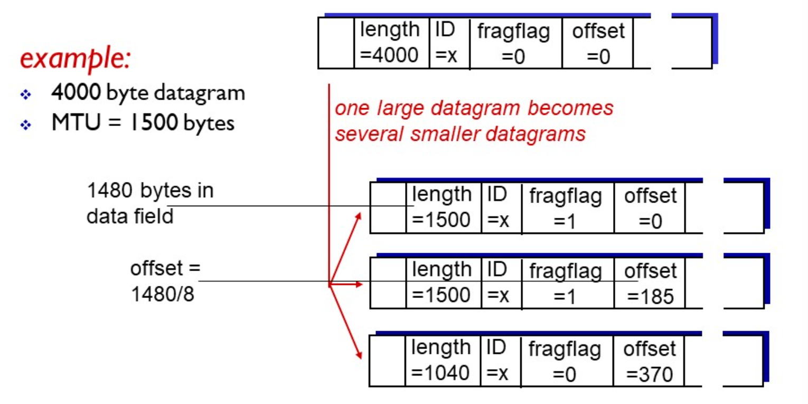
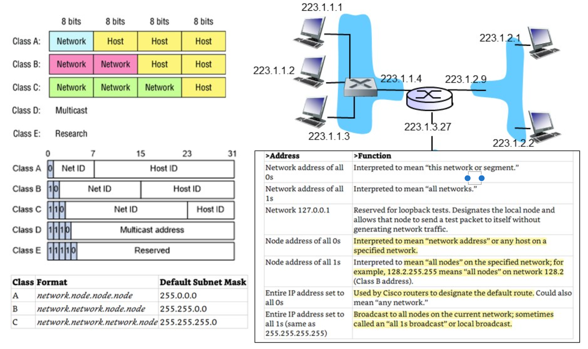
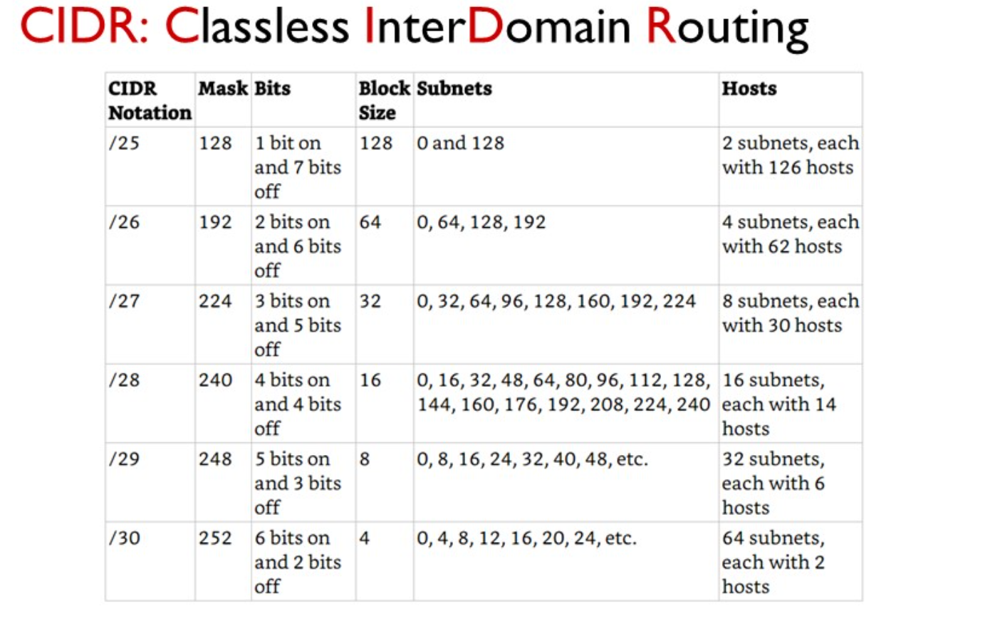

[gimmick: math]()

## Transport layer 

### Pipelining

#### Go-Back-N

- Sender: 
	+ up to `n` unACKed packets
	+ keeps timer for oldest unacked packet
	+ when timer expires, retransmit all unACKed packets
- Receiver: 
	+ Only sends **cumulative ACK** if no gaps, otherwise doesn't send

#### Selective Repeat

- Sender: 
	+ up to `n` unACKed packets
	+ Maintains timer for each packet
	+ Retransmits unACKed packet only
- Receiver: 
	+ individual ACK for each packet

WARNING: Window size needs to be **less than half** of maximum sequence number:  \\[WindowSize <= 0.5*MaxSeqNumber\\]

### TCP

- Properties:
    - 1 sender, 1 receiver
    - Bytestream (no boundaries)
    - Pipelined
    - Full duplex
    - Connection-oriented
    - Flow-controlled
    - Fair: congestion control throttles rate
- **Acknowledgements**: sequence number of next byte expected from other side
- Implementor defines handling OoO segments

#### RTT, Timeout

- Timeout **too short**: premature timeout, unnecessary retransmissions
- Timeout **too long**: slow reaction to segment loss

\\[ \textbf{SampleRTT} \text{ : measured time from segment transmission until ACK} \\] 
\\[ \textbf{EstimatedRTT}: (1- \alpha)  \times EstimatedRTT + \alpha \times SampleRTT , \text{ typically 0.125 } \\]
\\[ \textbf{DevRTT}: (1- \beta ) \times DevRTT + \beta \times | SampleRTT - EstimatedRtt| \text{ , typically 0.25 } \\]
\\[ \textbf{TimeoutInterval}:  EstimatedRTT + 4\times DevRTT\\]

#### Reliable Data Transfer

- **Fast Retransmit**: if sender receiver 3 `ACK` for same data, resent unACKed segment with smallest sequence number

#### Flow Control

- Receiver advertises free buffer space in `rwnd` value
- Sender limits amount of unACKed data to `rwnd` value

#### Handshake

- 2 way handshake fails b/c:
    + variable delay
    + message loss
    + message reordering

#### Closing

- Client, server each send TCP segment with `FIN` bit on
- Respond to `FIN` with `ACK`

#### Congestion

- Output link capacity: \\(R\\)
- when arrival rate approaches capacity, \\( R \rightarrow \infty \\)
- Handling congestion:
    + **Additive increase**: increase `cwnd` by 1 MSS
    + **Multiplicative decrease**: cut `cwnd` in half after every loss

##### Slow Start

- Double `cwnd` every RTT
- **Loss by timeout**: 
    + Reset `cwnd` to 1 MSS
    + Grow window **exponentially** until **threshold**, then **linear**
- **Loss by 3xACK**:
    + `TCP RENO`
    + Cut `cwnd` in half, regrow **linear**
- **TCP Tahoe**:
    + Always sets `cwnd` to 1, whether timeout or 3x`ACK`
- Switch exponential to linear when `cwnd` gets to **half** of value before timeout

##### Throughput

- \\( W \\): window size
- Average TCP throughput: \\( \frac{3}{4} \frac{W}{RTT} bytes/sec \\)
- Throughput in terms of segment loss probability: \\( \frac{1.22 \times MSS}{RTT \sqrt{L}} \\), needs very low loss rate

## Network Layer

- Roles:    
    + **Forwarding**: move packets from input to appropriate output
    + **routing**: determine route taken by packets from source -> destination
- Transport segment from sending to receiving host
- **sender**: encapsulate segment into **datagrams**
- **receiver**: deliver segment to transport layer

### Data Plane

- Local, **per-router**
- Determine how datagram is forwarded from input to output

### Control Plane

- **Network-wide** logic
- Determine how datagram is routed among routers
- **traditional routing algorithms**: implemented in **routers**
- **Software-defined networking**: implemented in **servers**
- A **logically centralized** control plane has a distinct **controller** (control plane) interacting with local **control agents** (data plane)

### Service models

### Router architecture

- **Routing/management control plane**: software, ms time frame
- **Forwarding data plane**: hardware, ns time frame
- **Destination-based forwarding**: forward based on destination IP
- **Generalized forwarding**: forward based **any header field values**

#### Longest Prefix Matching
- When looking for forwarding table entry for given destination, use **longest address prefix** that matches destination
- Uses **ternary content addressable memories**; retrieves address in \\(O(1)\\) time

#### Switching Fabrics

- **Switching rate**: switching rate of \\(N\\) times line rate desirable
- **Memory**:
    + Switching controlled by CPU
    + packets pass through system memory, so speed limited to memory bandwidth
- **Bus**:
    + Shared bus moves input->output
    + Limited by bus bandwidth (contention)
    + 32Gbps 
- **Interconnection network**:
    + Banyan, crossbar topologies from developments in multiprocessor designs
    + fragment datagram into fixed length cells
    + 60Gbps

##### I/O Queuing

- **Input**: 
    + **Head-of-line blocking**: queued datagram at front prevents others from moving forward
- **Output**:
    + **buffering** required from fabric faster rate, else packet loss due to congestion/overflow
        + traditional avg buffer: \\(RTT_{typical} \times LinkCapacity \\)
        + Modern avg buffer: \\(\frac{RTT \times LinkCapacity}{\sqrt{N}} \\)
    
##### I/O Scheduling
- **discard policy**: which packet to discard if queue is full?
    + tail drop (arriving), priority, random
- **Round Robin**
    + multiple scheduling classes
    + cyclically scan class queues, sending one complete from each class
- **Weighted Fair Queueing**:
    + generalized RR
    + Each class gets weighted amount of service per cycle
    
### IP

- TCP + IP = 40 bytes overhead
- Networks have maximum transfer unit (MTU) so datagrams may be fragmented, reassembled

#### IPv4

- Devices in same **subnet** can reach each other without intervening router
- ISP gets a block of IPs from ICANN
- Hierarchical addressing allows efficient advertising of routing information
- **CIDR Notation**: `a.b.c.d/x`, x=subnet portion of arbitrary length

##### DHCP

- Connection:
    - Client broadcasts `DHCP DISCOVER` \[optional\]
    - DHCP server responds with  `DHCP OFFER` \[optional\]
    - Client requests IP  `DHCP REQUEST`
    - DHCP server sends address `DHCP ACK`
- Other DHCP transmitted info:
    + Address of first-hop router
    + name/IP of DNS server
    + subnet mask

##### NAT

- WAN side address has ~60000 simultaneous connections
- Violates end-to-end argument
- Violates layers: routers should only process up to layer 3

#### IPv6

- Fixed 40 byte header, 128 bit addresses
    + **adds**: priority, flow label, next header
    + **removes**: options (now outside of header)
    + ICMPv6
- IPv6 packets can be tunneled over v4

#### Forwarding, SDN

- Each router has a **flow table** computed and distributed by logically centralized controller
- **OpenFlow**:
    + *flow*: defined by header fields
    + *pattern*: match values in packet header
    + *actions* for matched packet: drop, forward, modify, matched packet, send to controller
    + *priority*: disambiguate overlapping patterns
    + *counters*: nBytes, nPackets
    + **match+action** can replace multiple devices (router, firewall, switch, NAT)

### Routing Algorithms

#### Global

- **Link state** algorithms
- Expects all routers to have complete topology & link state

##### Dijkstra's Algorithm

- Computes least cost paths from one node to all other nodes
- After \\( k \\) iterations, the router knows the **least cost path** to \\(k\\) destinations
- \\(O(n^2)\\) naively, but \\(O(n log n) \\) is possible

//TODO : DIJKSTRA IMAGE

#### Local

- **Distance Vector** algorithms
- Each router only knows about connected neighbours

##### Bellman-Ford

- **Key Idea**: Asynchronous, iterative calculation of **distance vector** for each node.
    + Only sends messages when DV changes
    + When a node receives new DV estimate from neighbour, it updates its own. 
    + Eventually, converges to least cost path.
- **Count to Infinity problem**: 
    + Propagation can take many iterations before changing path
    + Mitigation-> **poisoned reverse**: interim host tells requests that distance to destination is infinite, so requester is forced to find another route

//TODO : BELLMAN-FORD IMAGE

// TODO : COMPARISON LS,DV ALGORITHMS 

### Autonomous Systems

- Aggregates of routers into domains/ASes
- Uses different systems inside and outside AS to optimize for performance, policy, scaling

#### Intra-AS : Open Shortest Path First

+ Almost same as IS-IS algorithm
+ Routes using Dijkstra
+ Router floods OSP link state advertismeents to all routers in AS directly over IP
+ **Features**: Authenticated, QOS, multiple same cost route
- **Hierarchical OSPF**:
    + Local area + backbone
    + *Area-border* routers: summarize distances to nets in area, advertise to other area-border routers
    + *Backbone* routers: Run OSPF, limited to backbone
    + *Boundary* routers: Connect to other ASes

#### Inter-AS : Border Gateway Protocol

- Used all over the Internet; helps subnets advertise that they exist.
- *eBGP*: Obtain subnet reachability info from neighbouring ASes
- *iBGP*: Propagate reachability to all AS internal routers
- Two BGP routers exchange messages, advertising paths to different destinations.
- Can specify policies for accept/decline, etc.
- `AS-PATH`: List of ASes which prefix advertisment has passed
- `NEXT-HOP`: indicates specific internal AS router to next hop AS
- **Hot Potato Routing**: Routers choose paths that have lowest **intra-domain** cost via iBGP

### SDN Control Plane

- More flexible **link weighting**, **load balancing**, **destination based forwarding**
- The **SDN controller** 
    + maintains network state info
    + Talks to 'northbound' **network control apps**
    + Talks to 'southbound' **network switches**

### OpenFlow

- TCP based protocol operating between switch and SDN controller, optionally encrypted
- **Controller to switch** messages:
    + Query features
    + Query configuration
    + Modify state
    + Packet out
- **Switch to controller** messages:
    + Packet in
    + Flow removed
    + Port status

### ICMP, SNMP

//TODO ICMP IMAGE

- **SNMP** is a management protocol that can use **request/response** or **trap** modes

## Link Layer

- Layer 2 packet is called a **frame**
- **Broadcast links**: Ethernet, HFC, WLAN
- **Point to Point links**: PPP
- Provides: 
    + Framing
    + Access Control
    + Reliable delivery
    + Flow control
    + Error detection/correction

### Error correction

- **Single bit parity**: detects single bit errors
- **Two dimensional bit parity**: Detect/correct single bit errors

#### Cyclic Redundancy Check

- View data bits \\( D \\) as a binary number
- Generate a bit pattern of length  \\(r+1\\) called \\( G \\), known to sender and receiver
- Choose \\( r \\) CRC bits \\(R\\), such that \\( G | <D,R> \\)
- If the receiver tries to divide and gets a non-zero result -> **error**

//TODO CRC IMAGE

### Multiple Access Protocols/Controls

- Describes how to share a single broadcast channel with bandwidth \\(R\\) between \\(M\\) clients

#### MAC : Channel Partitioning

- **TDMA**: Each sender gets a time slide
- **FDMA**: Each sender gets a frequency slide

#### MAC : Slotted ALOHA

- All nodes are synchronized and aware of collisions
- If **collision**, the node retransmits frame in each subsequent slot
- If **no collision**, node sends new frame in next slot
- Pros:
    + If only one node is active, full speed transmission
    + Highly decentralized, simple
- Cons:
    + Many collisions
    + Clock synchronization
    + Idle slots
    + Best case 37% time efficiency
- Pure ALOHA is worse at 18%

#### MAC : Carrier Sense Multiple Access

- Listen, and don't transmit if someone else is talking
